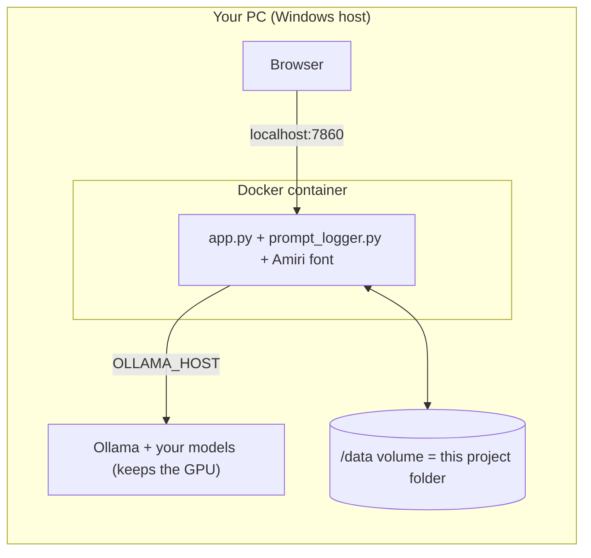
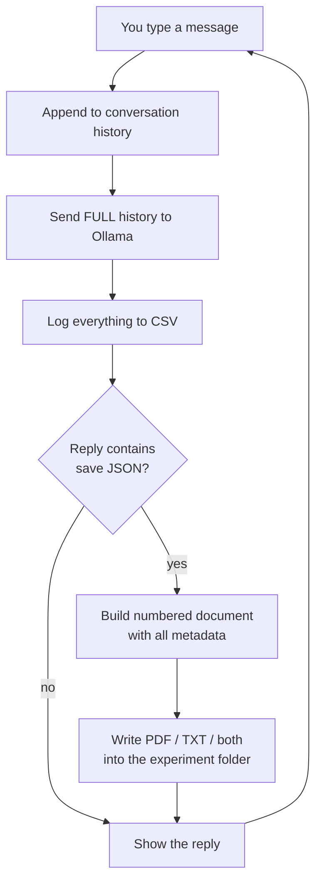

# 🧪 Mini Chatbot

A local LLM chat application that treats every conversation as an **experiment**: every prompt, response, parameter, and response time is logged to CSV, and the model itself can decide to save its answers as PDF or TXT documents — including full Arabic support.

Built during **Week 1, Day 4 (Prompt Patterns) of the AI Engineering Summer Training 2026**. It started as a single terminal script and grew into a tested, Arabic-capable, Dockerized web application. This README documents everything: the features, the architecture, the problems we hit along the way, and how to run it.

---

## ✨ What it does

- **Chat with any local Ollama model** — the model menu is fetched live from the Ollama server, with sizes shown. Pull a new model and it appears automatically.
- **Experiment tracking** — every session belongs to an experiment category (Role Prompting, Few-Shot, Chain-of-Thought, Structured Output, General, or a custom name). Custom names have a typo shield: type `frw_shot` and it asks *"did you mean few_shot?"* instead of creating a duplicate folder.
- **Full CSV logging** — every exchange is appended to `prompt_log.csv` with 13 columns: experiment, timestamp, prompt, response, response time, model, and all sampling parameters. Run the same prompt on two models and the CSV becomes a side-by-side model comparison.
- **LLM-triggered file saving** — ask for a PDF, TXT, or both, and the model replies with a JSON instruction that Python detects and executes. This is a hand-built version of *function calling*: the LLM signals intent, the code acts.
- **Self-contained documents** — every saved file includes the experiment name, date, model, response time, all parameters, the prompt, and the response. Files are numbered sequentially (`001_`, `002_`, ...) with sanitized, Arabic-safe names.
- **Arabic support end to end** — readable Arabic in the terminal, correctly shaped right-to-left Arabic in PDFs, Arabic folder and file names.
- **Two interfaces, one engine** — a terminal CLI and a Gradio web GUI, both importing the same `prompt_logger.py` engine and sharing the same CSV and folders.
- **Self-healing resets** — delete `prompt_log.csv` or any experiment folder at any time (even while running); everything is recreated with proper structure on the next message.
- **Dockerized** — one command starts the whole thing in a container, with your data safely on your real disk.

---

## 🗂 Project files

| File | Role |
|---|---|
| `prompt_logger.py` | **The engine.** All the logic: model/experiment selection, chat loop, CSV logging, JSON parsing, PDF/TXT generation, Arabic handling. Run it directly for the terminal CLI. |
| `app.py` | **The web GUI.** A Gradio interface that imports `prompt_logger.py` as a library. Dropdowns for model and experiment, sliders for parameters. |
| `requirements.txt` | Pinned Python dependencies (the exact versions everything was tested on). |
| `Dockerfile` | Recipe for the container image: Python 3.12 slim + the Amiri font + dependencies + the two code files. |
| `docker-compose.yml` | One-command runner: port mapping, the data volume, host networking. |
| `.dockerignore` | Keeps data, caches, the venv, and docs out of the image build. |
| `Amiri-Regular.ttf` | The Arabic font (SIL Open Font License), shipped with the project so the Docker build never depends on a package server. |
| `prompt_log.csv` | **Your data** — the experiment log. One row per message. |
| `saved_responses/` | **Your data** — one folder per experiment, containing the generated PDFs and TXTs. |
| `TEST_CASES.md` | The manual test plan: 6 sessions, 40+ cases covering every branch of the code. |
| `PROMPT_TEMPLATES.md` | Four detailed prompt-engineering templates (Role, Few-Shot, CoT, Structured Output) with worked examples. |
| `MINI_LOGGER.md` | Day-4 training notes — the starting point this project grew from. |
| `__pycache__/` | Python's auto-generated bytecode cache (appears when `app.py` imports the engine). Harmless; kept out of git. |

---

## 🚀 Quick start

Three ways to run it. All three share the same data.

### Option 1 — Terminal CLI

```bash
pip install -r requirements.txt
python prompt_logger.py
```

Startup walks you through: **model menu** (Enter = llama3.2) → **experiment menu** (Enter = General) → **parameters** (Y = defaults, or press Enter per field to keep each default). Then chat. Type `exit` or `quit` to leave.

### Option 2 — Web GUI, no Docker

```bash
pip install -r requirements.txt
python app.py
```

Open `http://localhost:7860`. Model and experiment are dropdowns, parameters are sliders under **Settings**. The experiment dropdown accepts typed custom names too.

### Option 3 — Docker (recommended for daily use)

Prerequisites: Docker Desktop installed and running, **Ollama running on the host**.

```bash
docker compose up -d --build   # first time
```

Open `http://localhost:7860`.

---

## 🐳 Docker: daily use and important notes

### The commands

| Command | What it does |
|---|---|
| `docker compose up -d` | Turn **on** (background — terminal comes right back) |
| `docker compose down` | Turn **off** (stops and removes the container) |
| `docker compose logs -f` | Watch live logs — every save prints a `[prompt-logger] saved: ...` line |
| `docker compose up -d --build` | Rebuild + start — **only needed after editing the `.py` files** |

Docker Desktop's **Containers** tab has ▶ start / ⏹ stop buttons that do the same thing.

### When do I need to rebuild?

The image is frozen code; your data never lives in it. Two mechanisms guarantee that: `.dockerignore` excludes the CSV and `saved_responses/` from the build, and the volume in `docker-compose.yml` mounts your real project folder as `/data`, so the container reads and writes the **same files your CLI uses**.

| You do this | Rebuild? |
|---|---|
| App creates files/folders during use | No — they land on your disk through the volume |
| Delete the CSV / experiment folders to reset | No — self-heals live, headers included |
| `ollama pull` a new model | No — just restart the container so the dropdown re-fetches |
| Edit `app.py` or `prompt_logger.py` | Yes — seconds, thanks to layer caching |
| Edit `requirements.txt` | Yes — the slow kind (dependencies reinstall) |

### Important notes

- ⚠️ **Start Ollama before the container.** The model dropdown is fetched at container startup; if Ollama isn't up yet, you get a fallback list. Restart the container after starting Ollama.
- ⚠️ If messages fail with *"Could not reach Ollama"* from inside Docker: Ollama on Windows sometimes binds only to `127.0.0.1`. Fix: set the Windows environment variable `OLLAMA_HOST=0.0.0.0`, restart Ollama, restart the container.
- Home network access (e.g., another PC or phone): the container already binds `0.0.0.0`, so `http://<your-PC-IP>:7860` works from other devices on your Wi-Fi.

### Architecture



Ollama deliberately stays **outside** the container: it keeps GPU access and the models you already pulled. The container reaches it through Docker's special hostname `host.docker.internal`.

---

## 🔄 How it works

### The chat loop



Key mental model: **the LLM has no memory of its own.** The entire `messages` list — system prompt + every message so far — is re-sent on every turn. That's why `num_ctx` (context size) matters: if history outgrows it, the system prompt falls out and the save feature silently dies. (We learned this the hard way — see the problem log.)

### The save contract

Message #1 in every conversation is a system prompt telling the model: *respond normally, but when the user explicitly asks for a PDF/TXT/document, reply with ONE JSON object and nothing else:*

```json
{
    "save": true,
    "file_type": "pdf",
    "title": "a short title",
    "content": "the full document text"
}
```

`parse_json_response()` inspects every reply. It tolerates the ways small models mess this up: markdown fences, chatter before the JSON, and real newlines inside strings (`json.loads(..., strict=False)`). When it finds `"save": true`, Python takes over — the LLM never touches the disk; it only *signals intent*. This is the same pattern behind real function calling and agent frameworks, built by hand.

After a save, the raw JSON is swapped out of the conversation history for the clean text, so the model doesn't learn to answer *everything* in JSON.

### Where things are stored

- One shared `prompt_log.csv` for all experiments (the Experiment column distinguishes them).
- One folder per experiment inside `saved_responses/`, named with a sanitized slug:

| Menu choice | Folder |
|---|---|
| Role Prompting | `role_prompting` |
| Few-Shot | `few-shot` |
| Chain-of-Thought | `chain-of-thought` |
| Structured Output | `structured_output` |
| General | `general` |

- Files are numbered per folder: `001_title.pdf`, `002_title.txt`. A "both" save produces a matching pdf+txt pair sharing one number.
- Arabic titles produce Arabic filenames — the sanitizer is Unicode-aware.

---

## 🌍 Arabic support

Three separate problems, three separate fixes:

**1. The terminal showed Arabic reversed and disconnected.** Windows terminals don't implement bidirectional text or Arabic letter shaping. Fix: `display_text()` pre-shapes the model's replies in software — `arabic-reshaper` joins the letters into their connected forms, `python-bidi` reorders them for a left-to-right renderer, then lines are wrapped and right-aligned. ⚠️ Known limitation: **your own typing still looks scrambled while you type** — the terminal renders keystrokes before Python ever sees them. The data is stored perfectly (check the CSV); only the live echo is affected. The web GUI has no such problem: browsers do bidi natively, including your typing.

**2. PDFs showed black boxes instead of Arabic.** ReportLab doesn't do shaping either, and its default font has no Arabic glyphs. Fix: register a real TTF font (`ARABIC_FONT_CANDIDATES` tries Tahoma/Arial/Times/Segoe on Windows, and the bundled Amiri on Linux/Docker), shape each Arabic line, and render right-aligned with RTL word-wrapping. English lines in the same document keep the normal font — the choice is made per line.

**3. llama3.2 answered Arabic questions with Thai words mixed in.** Arabic is not on llama3.2's supported-language list; it improvises, badly. That's a model limitation, not a code bug — the logger faithfully records it. Fix: use **`qwen2.5:7b`** (`ollama pull qwen2.5:7b`) for Arabic sessions. It also follows the JSON save contract far more reliably.

---

## 🔁 Resetting your data

Delete freely — everything self-heals:

- Delete any experiment folder → recreated on the next save, numbering restarts at `001`.
- Delete `prompt_log.csv` → recreated **with its header row** on the very next message, even mid-session, in both CLI and GUI.
- Want to archive instead of destroy? Rename: `prompt_log.csv` → `prompt_log_run1.csv`. The app only looks for the exact original name.
- ⚠️ Don't keep the CSV open in **Excel** while chatting — Excel locks the file and logging will fail. View it in VS Code during sessions; open Excel afterwards.

---

## 🐛 Problems we hit (and how we fixed them)

The honest engineering log. Every one of these actually happened.

| # | Symptom | Root cause | Fix |
|---|---|---|---|
| 1 | Typos created duplicate experiment folders (`few_shot` vs `frw_shot`) | Free-text experiment names | Fixed menu of categories + fuzzy "did you mean?" matching (difflib) for custom names |
| 2 | Saving silently stopped working after a few messages | `num_ctx: 1024` — growing history pushed the system prompt out of the context window | Raised to 4096 |
| 3 | Documents cut off mid-sentence | `num_predict: 200` max tokens | Raised to 800 |
| 4 | Valid-looking saves not detected | Model wrapped JSON in \`\`\` fences, added chatter, or put real newlines in strings (illegal in strict JSON) | Hardened parser: fence stripping, `{...}` extraction, `strict=False` |
| 5 | PDF generation crashed on `&`, `<`, `>` | ReportLab parses Paragraph text as mini-HTML | `xml.sax.saxutils.escape()` on every line |
| 6 | Model started answering *everything* in JSON | Raw save-JSON stayed in conversation history as its "previous answer" | Replace the history entry with the clean document text |
| 7 | `saved_responses/` kept appearing at the repo root | Relative paths resolve against the terminal's location, not the script's | `BASE_DIR` anchoring via `__file__` |
| 8 | Arabic reversed/disconnected in terminal; black boxes in PDFs; Thai in replies | See the Arabic section | See the Arabic section |
| 9 | Custom parameter input like `0..7` crashed the app | Unvalidated `float()` calls | Per-field prompts where Enter/garbage keeps the default |
| 10 | App crashed when Ollama wasn't running | No error handling around `chat()` | try/except + `messages.pop()` to keep history consistent |
| 11 | Gradio rejected `type="messages"` | Gradio 6 removed the parameter (that format became the only one) — the API changed under our feet | Introspected the installed v6 API and coded against reality |
| 12 | GUI chatted fine but never saved | llama3.2 ignoring the JSON contract (small-model instruction following) | Switch to qwen2.5:7b; phrase requests explicitly ("save it as a PDF file") |
| 13 | Docker build failed on the font install layer | `apt-get` package availability in the base image | Vendored `Amiri-Regular.ttf` into the repo (its license permits this) and `COPY` it — the network dependency is gone entirely |
| 14 | GUI showed خطأ (error) on saves, though the file WAS created | The `{"text", "files"}` return dict broke Gradio 6's UI rendering path — it passed function tests, normalization tests, even the API route, and still failed in the browser | Return a plain string (the format every normal message already proves). Boring is a feature. |
| 15 | A deleted CSV came back *without headers* in the GUI | `create_csv()` only ran at CLI startup | Self-healing `log_to_csv()`: recreates the CSV with headers before every write |
| 16 | Pylance warned "import could not be resolved" | pip names ≠ import names (`arabic-reshaper` → `arabic_reshaper`), or the wrong interpreter selected | Install in the `.venv`, select the `.venv` interpreter in VS Code |

Lessons that generalize: test the **full round trip**, not just your function (see #14); pin your dependencies (see #11); fewer moving parts in a Dockerfile means fewer ways to fail (see #13); and when a small model misbehaves, suspect the model before the code (see #12).

---

## 🧰 Tech stack

### Python libraries (pinned in `requirements.txt`)

| Library | Version | Purpose |
|---|---|---|
| `ollama` | 0.6.2 | Client for the local Ollama server (chat + model listing) |
| `gradio` | 6.20.0 | The web GUI (`ChatInterface`) |
| `reportlab` | 4.4.10 | PDF generation |
| `arabic-reshaper` | 3.0.1 | Joins Arabic letters into their connected forms |
| `python-bidi` | 0.6.11 | Reorders shaped text for left-to-right renderers |

Standard library doing heavy lifting: `csv`, `json`, `difflib` (typo matching), `re`, `textwrap`, `shutil`, `xml.sax.saxutils`.

### VS Code extensions used along the way

- **PDF viewer** — renders the generated PDFs inside VS Code. Gotcha we hit: an already-open tab doesn't re-render, and PDFs may open in the text editor showing raw bytes. Fix: right-click the tab → **Reopen Editor With...** → pick the PDF viewer → "Configure default editor for `*.pdf`" to make it permanent.
- **CSV viewer** — makes `prompt_log.csv` readable as a table instead of comma soup (and unlike Excel, it doesn't lock the file).
- **Python + Pylance** — language support; remember to select the `.venv` interpreter (`Ctrl+Shift+P` → *Python: Select Interpreter*).

### Models

- `llama3.2` — the default; fine for English chat, unreliable at the JSON save contract, no Arabic support.
- `qwen2.5:7b` — **recommended**; solid Arabic, reliable instruction following. `ollama pull qwen2.5:7b`.

---

## ⚙️ Configuration reference

Environment variables (all optional — sensible defaults outside Docker, set automatically inside it):

| Variable | Default | Meaning |
|---|---|---|
| `OLLAMA_HOST` | `http://localhost:11434` | Where the Ollama server lives. The Docker image sets `http://host.docker.internal:11434` to reach the host. |
| `GRADIO_SERVER_NAME` | `127.0.0.1` | Interface Gradio binds to. Docker sets `0.0.0.0`. |
| `PROMPT_LOGGER_DATA` | the script's own folder | Where the CSV and `saved_responses/` live. Docker sets `/data` (the mounted volume). |

Default sampling parameters (editable at startup in the CLI, sliders in the GUI): temperature 0.7, top_p 0.9, top_k 40, repeat_penalty 1.1, max tokens 800, context size 4096, seed 42.

---

## 🧫 Testing

[`TEST_CASES.md`](Prompt_Logger/Helpful_Notes/TEST_CASES.md) is the manual test plan: **6 sessions, 40+ checkbox cases** covering startup validation, every experiment-creation path (including Arabic folder names and the typo shield), all four save paths, the parser stress cases, Arabic display and documents, model selection, and the failure paths (Ollama down, unknown file types). Tick the boxes in VS Code's markdown preview.

[`PROMPT_TEMPLATES.md`](Prompt_Logger/Helpful_Notes/PROMPT_TEMPLATES.md) has four reusable prompt-engineering templates — Role Prompting, Few-Shot, Chain-of-Thought, and Structured Output — each with placeholders, a worked example, and expected output.

---

## 📜 Project timeline

1. **The CLI script** — Ollama chat + CSV logging + JSON-triggered PDF/TXT saving.
2. **Code review & hardening** — the typo shield, parser fixes, context-size fix, error handling, and the `main()` refactor that made the file importable as a library (which quietly enabled everything after).
3. **The test plan** — 40+ manual cases.
4. **Path anchoring** — outputs follow the script, not the terminal.
5. **Arabic** — terminal display, PDF fonts and shaping, and the model-choice lesson.
6. **Live model selection** — the menu asks Ollama what's installed; the CSV becomes a model-comparison tool.
7. **The web GUI** — Gradio front-end reusing the engine untouched; two interfaces, one dataset.
8. **Docker** — containerized app, host Ollama, volume-mounted data, vendored font, pinned dependencies.
9. **This README.**

---

Built by **Ali** ([koko2haru](https://github.com/koko2haru)) during the AI Engineering Summer Training 2026 — pair-programmed and debugged with Claude. 🤝