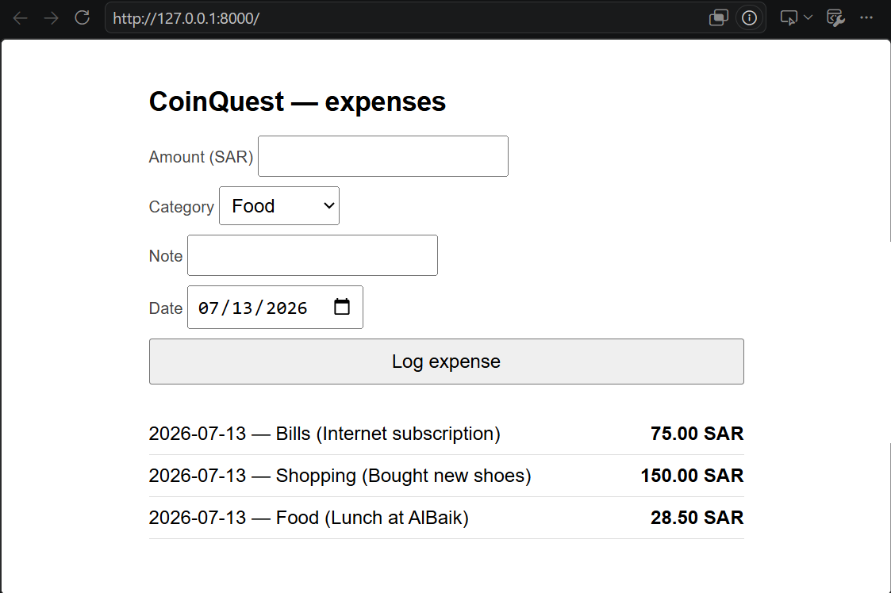

# 🪙 CoinQuest v0.1 — Skeleton Build Log (Day 2)

> 🎮 **Week 2 — AI-Assisted Development · Day 2: Building with an AI Partner**
> Author: Ali · Date: 13 Jul 2026 · Status: ✅ **v0.1 complete and verified**
> Spec: [`SPECS.md`](/Week-2-AI-Assisted-Development/Day-1-Vibe-Coding-Start/SPECS.md) · One-page spec (PDF): [`CoinQuest-PDF`](/Week-2-AI-Assisted-Development/Day-1-Vibe-Coding-Start/CoinQuest%20—%20one-page%20software%20specification.pdf)

---

## 🎯 The outcome first



By the end of Day 2, CoinQuest v0.1 exists and works: an (intentionally ugly) HTML form posts an expense to a FastAPI backend, the backend writes it to SQLite, the list re-renders from the database, and the data survives a full server restart. That is the entire "thin vertical slice" the day demanded — one working path through every layer, nothing more.

Three real expenses are already in it, including a 28.50 SAR lunch at AlBaik 🍗 that has now achieved immortality as the project's first-ever database row.

📄 **Demo:** [`../CoinQuest-v0.1-demo.pdf`](/Week-2-AI-Assisted-Development/Day-2-Building-with-an-AI-Partner/demo-slides.pdf)

---

## 🤖 Two AIs, two different jobs

This build used two Claude instances in deliberately different roles:

| | 🧠 **Claude (Pro chat)** — the architect | 🔨 **Claude Code (VS Code extension)** — the builder |
|---|---|---|
| Role | Planning, scoping, judgment calls | Reading, planning, writing, and testing the code |
| Contributions | Helped choose the project, co-wrote the spec, drafted `CLAUDE.md`, set the Day 2 plan, and answered the one architecture question that came up mid-build | Did reconnaissance, proposed the file structure, generated all three files one at a time, and verified the slice end to end |

The important part is the *handoff medium*: not copy-pasted context, but **files in the repo**. The architect's output (`SPECS.md`, `CLAUDE.md`) became the builder's input. Day 1's "spec-then-generate" lesson, executed literally.

---

## 🧭 How the AI was guided before any code existed

**1. 📜 Standing orders in `CLAUDE.md`.** Claude Code automatically reads a `CLAUDE.md` file in the project folder at the start of a session. Ours acted as a scope fence:


The three load-bearing rules: *v0.1 only — no HP bar, no XP, no AI, do not build ahead*; a fixed stack (FastAPI, stdlib sqlite3, vanilla JS); and *"keep code simple and readable — a beginner reviews every line of it tomorrow."* That last line is why the generated code has no clever tricks in it.

**2. 🗺️ One opening prompt, in Plan mode.** The entire session started from this:

```
Read CLAUDE.md in CoinQuest-Skeleton, then read the spec at
Week-2-AI-Assisted-Development/Day-1-Vibe-Coding-Start/SPECS.md.
We are building only v0.1, the core slice, entirely inside
CoinQuest-Skeleton. Propose the file structure and a step-by-step
build plan.
```

Plan mode matters: it forces Claude Code to describe what it will do and wait for approval before touching anything. A mode is a guarantee; a polite request is just a suggestion.


**3. 🔍 What it did on its own — reconnaissance.** Before proposing anything, Claude Code read `CLAUDE.md`, glob-searched for and read `SPECS.md`, listed the repo root and the skeleton folder, checked `.gitignore` (confirmed `*.db` was covered), and queried the venv to confirm FastAPI 0.139.0, uvicorn 0.51.0, and pydantic 2.13.4 were already installed. It gathered facts instead of assuming them — the exact behavior you want from an agent.

**4. ❓ It asked instead of guessing.** Mid-plan, it raised one genuine architecture question: *how should the FastAPI backend serve `index.html`?* — serve it from FastAPI itself, or open the file directly in the browser (which introduces CORS). I took that question to the architect Claude in chat, got the verdict (**FastAPI serves it** — keeps "run one command" true, avoids CORS entirely), and fed the answer back. Two AIs, one human routing between them.

---

## 📐 The plan it proposed

```
CoinQuest-Skeleton/
├── CLAUDE.md              (existing)
├── main.py                # FastAPI app: routes + startup, mounts static/
├── database.py            # sqlite3 connection, init_db(), insert_expense(), get_expenses()
├── static/
│   └── index.html         # form + list, vanilla JS fetch()
└── coinquest.db           # created at runtime, already gitignored
```

Two details in its reasoning were better than what I would have asked for:

- 🧩 **Two Python files, not one.** Its own words: `database.py` isolates all SQL so `main.py` stays pure routing — and it's *"the natural seam for Day 3's review and Day 4's planted integration bug."* The AI structured today's code around the rest of the week's plan.
- 🛑 **It refused to over-engineer.** No routers, models, or service layers — "that's over-engineering for two endpoints." The scope fence in `CLAUDE.md` held.

It then committed to building one file at a time, pausing after each — and ended the plan with a question ("Want me to start with database.py?") rather than a wall of generated code.

---

## ⚙️ How the code was actually generated

Approved the plan, and it went file by file, explaining each before moving on:

1. 🗄️ **`database.py` (49 lines).** A `get_connection()` helper with `sqlite3.Row`, `init_db()` creating the `expenses` table exactly per spec §5.2 (`id, amount, category, note, spent_on, created_at`), `insert_expense()` returning the inserted row, and `get_expenses()` ordered newest first (`ORDER BY spent_on DESC, id DESC`). It explicitly *skipped* the `settings` table — that belongs to v1.0's budget feature, out of scope today.
2. ⚡ **`main.py` (38 lines).** A startup hook that calls `init_db()`, a Pydantic `ExpenseIn` model, the two endpoints, and one subtle correctness detail it called out itself: `StaticFiles` is mounted **last**, so `/api/*` routes take priority over the static catch-all.
3. 🎨 **`static/index.html` (87 lines).** The form (amount, a category `<select>` with Food/Transport/Shopping/Bills/Other, note, date defaulting to today), the list, and two `fetch()` calls — POST on submit, then re-fetch and re-render. Inline CSS only. Ugly on purpose.

Then it tested its own work without being asked: started uvicorn on a scratch port, `curl`-POSTed the AlBaik expense, confirmed the GET returned it, confirmed `/` served the page with a 200 — then **killed the server, started a fresh process, and confirmed the row survived the restart**, which is the spec's acceptance check for persistence, and verified `coinquest.db` existed on disk and was gitignored.


---

## 🙋 Where the human was still needed

The honest part of the log — three moments from the session where the AI's code was fine but *I* had to catch up to it:

- 📁 **I ran uvicorn from the repo root** and got `Error loading ASGI app. Could not import module "main"`. Claude Code diagnosed it instantly: the command has to run from inside `CoinQuest-Skeleton`, because the `main` module and `static/` are resolved relative to the working directory. Lesson: *where* you run a command is part of the command.
- 👻 **A mysterious `GET /favicon.ico 404`** appeared in the logs. Answer: every browser requests a tab icon automatically; we don't have one; the 404 is correct and harmless. Lesson: not every red line in a log is a problem.
- 💾 **"How do I know the expense is really in the database?"** It showed me three levels of proof — refresh (re-reads SQLite every request), restart-then-refresh (rules out caching), and querying `coinquest.db` directly with a one-liner — and ran the direct query live, showing my "Bought new shoes" row sitting on disk next to its AlBaik test row.

These questions are the actual point of the week: the AI wrote every line, but I had to be able to run it, question it, and verify it.

---

## 🚧 Deliberately left rough

Per the `CLAUDE.md` rules, v0.1 has **basic input handling only** — no hardening, no defensive error handling, no polish. That's not an oversight; it's tomorrow's raw material. Day 3's assignment is to review this exact code line by line and log five genuine improvements in `REVIEW.md`, so naming the rough edges here would be cheating on my own homework.

---

## 🚀 How to run v0.1

```powershell
cd Week-2-AI-Assisted-Development\Day-2-Building-with-an-AI-Partner\CoinQuest-Skeleton
..\..\..\.venv\Scripts\python -m uvicorn main:app --reload
# then open http://127.0.0.1:8000
```

---

## 📦 Artifacts

- 📄 Demo PDF: [`../CoinQuest-v0.1-demo.pdf`](/Week-2-AI-Assisted-Development/Day-1-Vibe-Coding-Start/CoinQuest%20—%20one-page%20software%20specification.pdf)
- 🖼 Screenshots: [`screenshots/v01-app-running.png`](/Week-2-AI-Assisted-Development/Day-2-Building-with-an-AI-Partner/CoinQuest-Skeleton/screenshots/v01-app-running.png), [`screenshots/claude-md-context.png`](/Week-2-AI-Assisted-Development/Day-2-Building-with-an-AI-Partner/CoinQuest-Skeleton/screenshots/claude-md-context.png), [`screenshots/claude-code-plan-session.png`](/Week-2-AI-Assisted-Development/Day-2-Building-with-an-AI-Partner/CoinQuest-Skeleton/screenshots/claude-code-plan-session.png), [`screenshots/v01-file-tree.png`](/Week-2-AI-Assisted-Development/Day-2-Building-with-an-AI-Partner/CoinQuest-Skeleton/screenshots/v01-file-tree.png)
- 📋 Full specification: [`SPECS.md`](/Week-2-AI-Assisted-Development/Day-1-Vibe-Coding-Start/SPECS.md)
- 🤖 Standing orders given to the builder: [`CLAUDE.md`](/Week-2-AI-Assisted-Development/Day-2-Building-with-an-AI-Partner/CoinQuest-Skeleton/CLAUDE.md)

**Next:** 🗡️ Day 3 — copy this code into the Day-3 folder, review it line by line, and harden it into v0.2.