# 🐛 CoinQuest — Day 4 Report: Debugging with AI

> (screenshots referenced from `screenshots/` in this same folder)

---

## 🗓️ What we did today

Day 4's task: introduce **3+ deliberate bugs** into working code, then debug and
fix them **with Claude Code** — feeding it *symptoms only*, never the bug locations.

**The setup:**

1. 📋 Copied the improved Day-3 code (`CoinQuest-v02`) into
   `Day-4-Debugging-with-AI/CoinQuest-v02-Debugger/` — same snapshot trick as Day 3, so the
   clean version stays untouched.
2. 🎭 Designed a **difficulty grid**: 3 bugs per file across 3 levels —
   🟢 **Easy** (even a non-programmer sees it), 🟡 **Medium** (needs experience),
   🔴 **Hard** (easy to miss). 8 planted in total (one Easy skipped — explained below).
3. 📸 Screenshotted every planted bug *before* debugging, then ran the sessions
   file by file and screenshotted Claude Code's detections and fixes.

**The bug grid:**

| File | 🟢 Easy | 🟡 Medium | 🔴 Hard |
|------|---------|-----------|---------|
| `main.py` | `return` → `retrun` (SyntaxError) | `Field(gt=0)` → `Field(lt=0)` (all saves rejected) | `date: date` → `date: str` (validation silently gone) |
| `database.py` | `expenses` → `expensess` in SELECT (list breaks) | `category`/`note` swapped in INSERT columns (data lands in wrong fields) | `conn.commit()` deleted (expense confirms… then vanishes 😈) |
| `static/index.html` | *(skipped — see notes)* | `parseFloat` → `parseInt` (decimals silently eaten) | `getMonth() + 1` → `getMonth()` (date shows June instead of July) |

---

## 🐍 Round 1 — `main.py`

**Planted:**

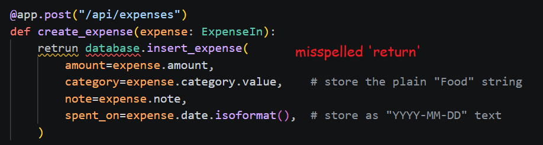
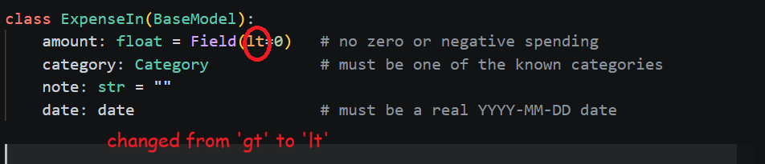
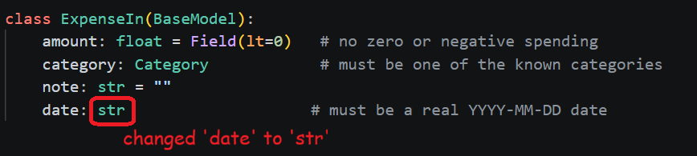

**The session:** ran the app → instant crash with a `SyntaxError` traceback:

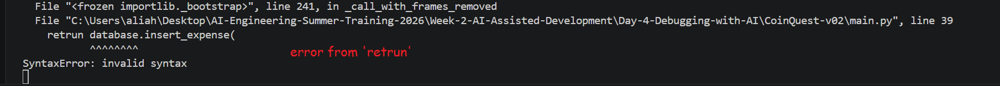

Told Claude Code only: *"it is giving me syntax error, fix that."* It read the
file, found `retrun` on line 39, and proposed the one-word fix:

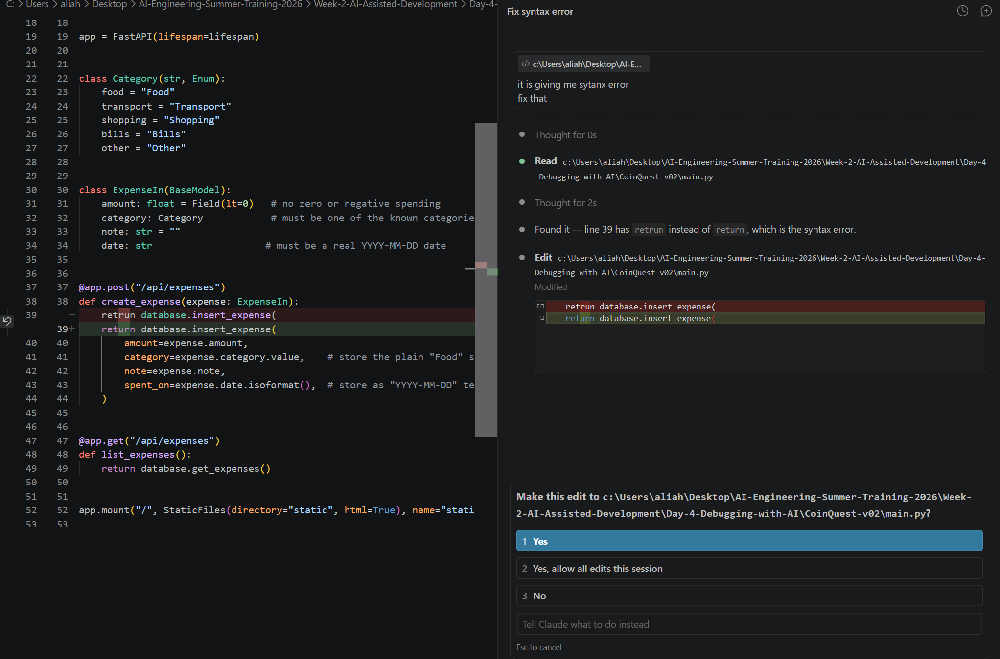

**😲 The surprise:** while fixing the syntax error, it flagged the other two bugs
*on its own* — the flipped `lt=0` (contradicting the comment right next to it) and
the `date: str` that breaks `.isoformat()` on line 43:

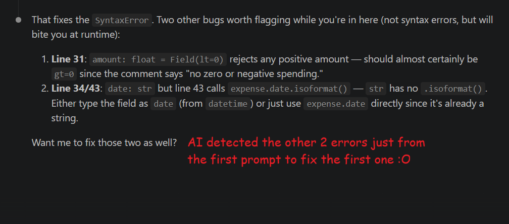
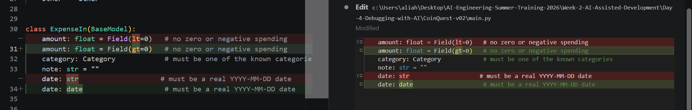

**Score: 3/3 found — 2 of them unprompted, from a single one-line prompt.** 🤯
The comments in the code actually helped it: "no zero or negative spending" sitting
next to `lt=0` is a contradiction an AI reads instantly.

---

## 🗄️ Round 2 — `database.py`

**Planted:**

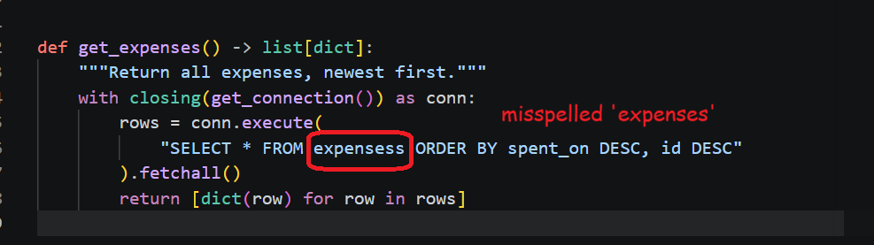
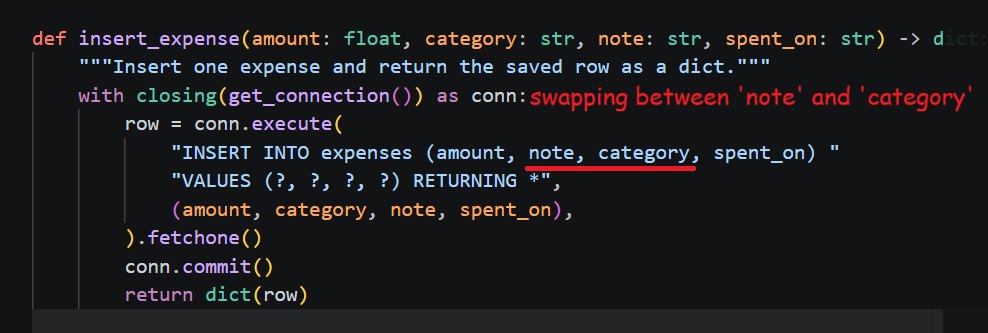
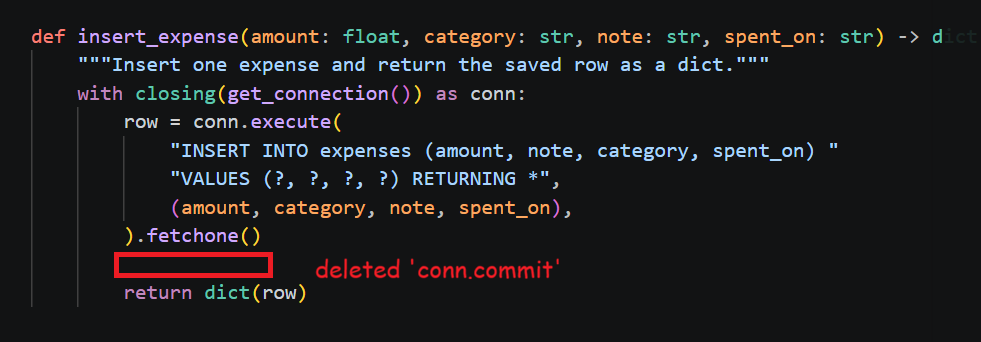

**Session, first run:** prompt was just *"I don't see the table anymore"* (plus a
screenshot). It globbed the project, read `database.py`, caught the `expensess`
typo **and** the swapped column order in the same pass:

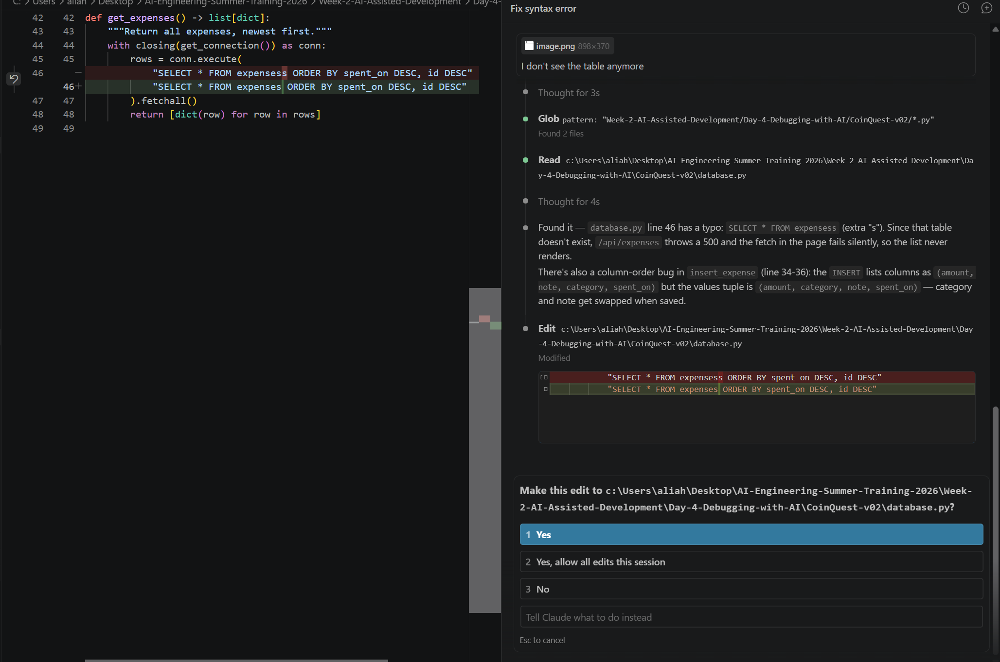
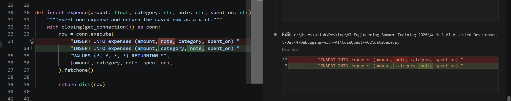

**But the hard one flew right past it.** 🕵️ No visible error, no crash — a
missing `commit()` produces an API response that *looks perfect* (the
`RETURNING *` hands the row back before the rollback). Nothing to see unless you
know what's missing.

**Second run:** reported the actual symptom — *"I added 'something' but it doesn't
appear."* Took it ~20–30 seconds of digging, but it reasoned it out: the INSERT
returns the row inside the transaction, the connection closes, SQLite rolls back,
the expense evaporates. Added the `conn.commit()` back:

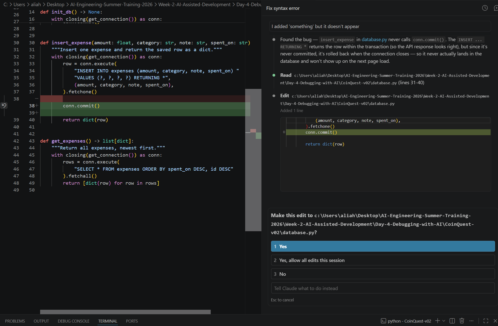

**Score: 3/3 — but the hard one needed the right symptom.** The AI can't debug
what produces no signal; the quality of the bug report *is* the debugging.

---

## 🖥️ Round 3 — `static/index.html`

**Planted (2 bugs, not 3):**

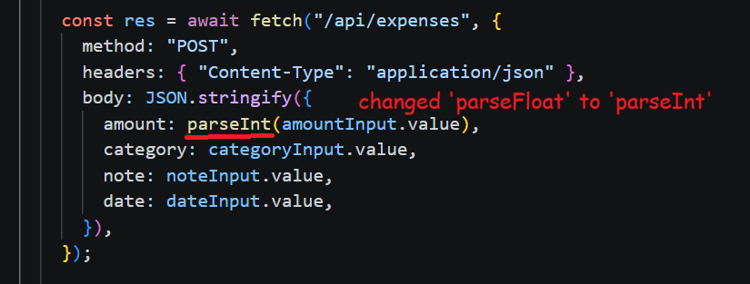
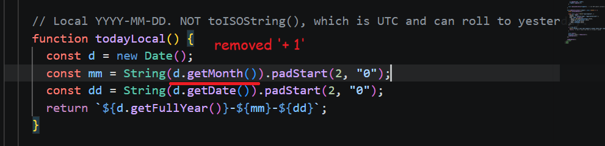

> 📝 The Easy one was skipped **on purpose** — in Round 1, fixing the easy bug made
> Claude Code discover the others for free. To avoid repeating that scenario and
> actually test the medium/hard bugs in isolation, this round started harder.

**Session:** ran the app — everything *looked* great (and I pretended not to notice
the month was wrong 😏). Added a decimal amount and… `999.999` saved as `999`.

**🎣 The deliberate misleading experiment:** the prompt said the value was
*"saved as 999"* — **saved**, not *shown* or *displayed*. That single word sent
Claude Code hunting through the backend: `main.py`, `database.py`, even poking at
the `.db` file — because "saved wrong" points at storage, not the UI. It took
**2–3+ minutes** (vs seconds in earlier rounds) before it reached `index.html` and
instantly spotted `parseInt` truncating the value *before* it was ever sent:

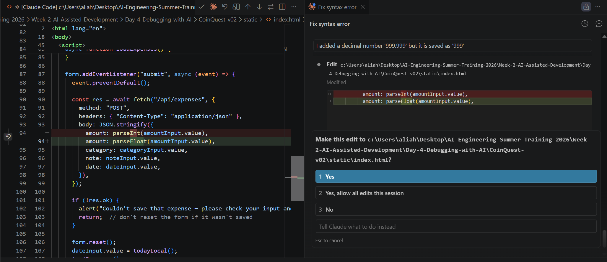

**Lesson learned the fun way: you have to be smart and specific with your
prompts.** ✍️ One imprecise word ("saved") multiplied the debugging time by ~10x.
The AI trusted my description of the symptom more than its own assumptions — which
is correct behavior, but it means *my words set its search space*.

**The month bug:** fixed `parseInt`, but the June date sailed past — exactly as
predicted. It's a niche logic error with no error message, sitting in a pre-filled
field nobody looks at; even human programmers miss `getMonth()` being 0-indexed.

So I nudged it — again deliberately vague: *"why do I see june?"* And here it did
the **smart thing**: instead of guessing, it **asked clarifying questions** — where
am I seeing June? In the app we're working on, or somewhere else? Once I confirmed
I meant the date in the app, it went straight to `todayLocal()` in the HTML,
recognized the missing `+ 1` on the 0-indexed `getMonth()`, and fixed it. ✅

**Score: 2/2 — one delayed by my misleading prompt, one requiring a nudge +
clarifying questions.**

---

## 🏁 Takeaways

1. 🤖 **AI debugging is shockingly good at *visible* bugs** — anything with a
   traceback, an error message, or a contradiction with nearby comments gets found
   in seconds, often along with neighbors you never mentioned.
2. 🕳️ **Silent bugs need symptoms, not vibes.** The missing `commit()` was
   invisible until the report described the actual behavior ("I added something
   but it doesn't appear"). No signal = no detection.
3. ✍️ **Your prompt sets the search space.** Saying "saved as 999" instead of
   "shown as 999" sent the AI to the database layer and cost minutes. Precise
   symptom language is a debugging skill.
4. ❓ **A good AI partner asks before assuming.** Faced with the vague "why do I
   see june?", Claude Code asked *where* — instead of burning time guessing. That's
   the behavior you want.
5. 👀 **Some bugs are just hard for everyone.** Off-by-one month, no error, in a
   field nobody reads — the AI missed it on the first pass for the same reason a
   human reviewer would.