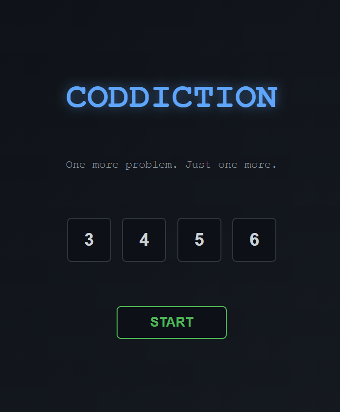
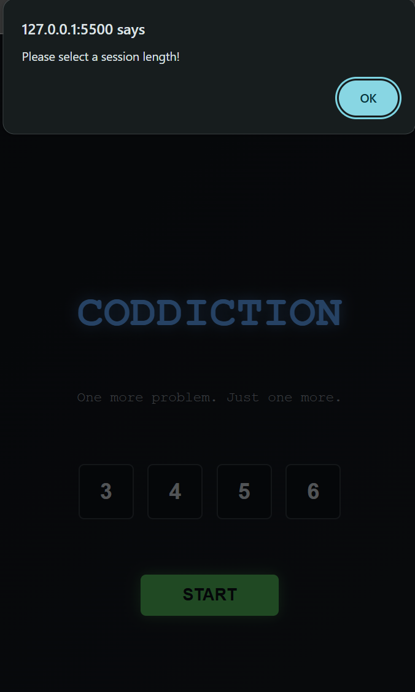
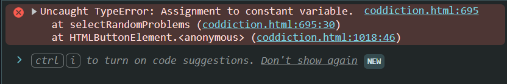
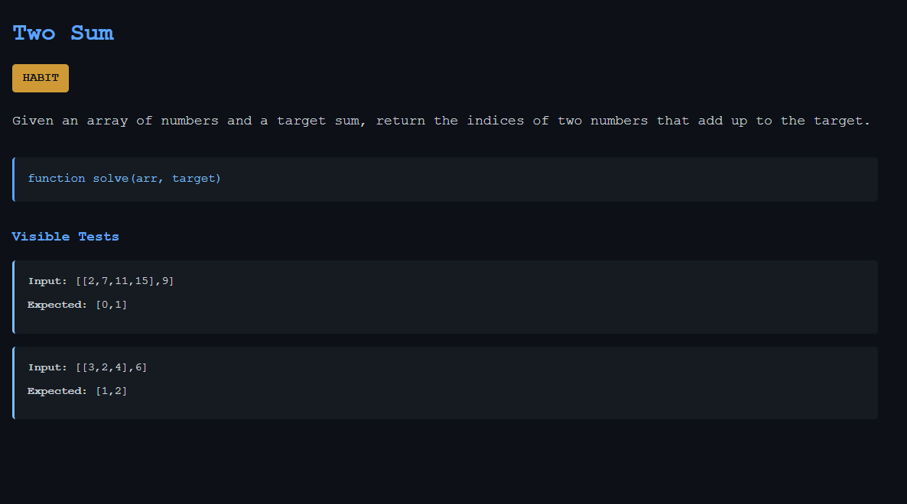
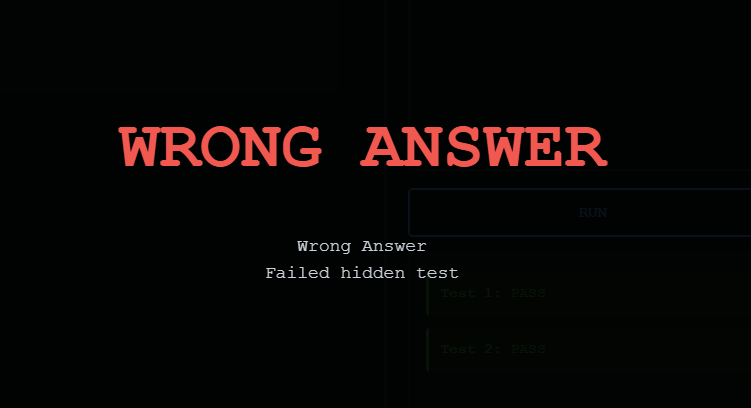
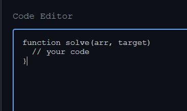
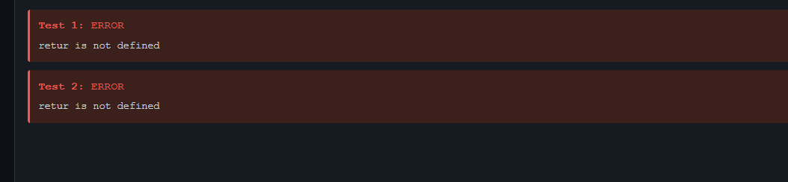
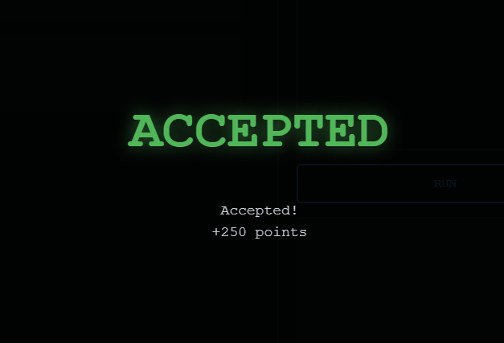

# Day 5 — Iteration Log 🧪

> Running record of every test iteration: score against SPEC.md §9's 14 acceptance
> criteria, tester notes, diagnosis, and the document change (if any) made in response.
> Rule of the day: **fix the documents, never the output.**

---

## Score Summary

| Iter | Score | Result | Diagnosis category | Doc change |
|------|-------|--------|--------------------|------------|
| 1 | 1/14 | ❌ Blocked at session start | (c) plain bug — `const` reassignment crash | none (error fed back to model) |
| 2 | ~10/16* | 🟡 Playable — 4 issues found | 1×(c) bug, 3×(a) spec gaps | SPEC.md §3.1, §4.1, §4.2, §9 updated |
| 3 | 🟡 | Fresh rebuild — 2 issues recurred | 2×(b) — docs clear, model ignored twice | SPEC §4.2 stub construction rule; system-prompt: mandatory executable test verification |
| 4 | ✅ | Both recurring issues fixed | direct prompt + forced node verification | none — output accepted as final |

\* checklist grew from 14 to 16 criteria after the iteration-2 spec fixes; TLE, Skip,
and Tab-indent were not yet exercised this round.

Diagnosis categories: **(a)** spec ambiguous/silent → edit SPEC.md · **(b)** spec clear
but model ignored it → strengthen system-prompt.txt · **(c)** plain bug → regenerate /
report error, no doc change.

---

## Iteration 1 — [`coddiction-v1.html`](https://koko2haru.github.io/AI-Engineering-Summer-Training-2026/Week-3-Writing-md-Files-to-AI/Day-5-Test-%26-Iterate/Testing/t1/coddiction.html)

**Setup:** fresh session, given [`system-prompt.txt`](/Week-3-Writing-md-Files-to-AI/Day-4-System-Prompts-&-Documentations/Prompt-&-Documentation/system-prompt.txt) + [`CONTEXT.md`](/Week-3-Writing-md-Files-to-AI/Day-2-Context-Engineering/Context/CONTEXT.md) + [`SPEC.md`](/Week-3-Writing-md-Files-to-AI/Day-3-Writing-Clear-Specs/Specifications/SPEC.md) +
kickoff message. Tested via Live Server (*`127.0.0.1:5500`*).

### Tester notes

- Start screen renders correctly: title, tagline, 3/4/5/6 length picker, Start button. Dark arcade theme as intended. 

  
- Length buttons glow on hover and stay highlighted when selected — selection state works visually.
- **BUG:** with a length selected, clicking **Start** does nothing. No screen change, no timer.
- Clicking Start with **no** length selected correctly triggers the validation alert "Please select a session length!" — so the click handler is attached and the guard branch works. 

  

### Criteria walk (14 total)

| # | Criterion | Result |
|---|-----------|--------|
| 1 | Opens with no console errors; start screen renders | ⚠️ renders; console not yet checked |
| 2 | Length picker 3/4/5/6; timer starts at 5 min × count | ❌ session never starts |
| 3–13 | All gameplay, judging, verdict, HUD, ending-screen criteria | 🚫 blocked — untestable, counted as fails |
| 14 | No external `<script>`/`<link>` imports | ⬜ to verify by searching the file |

### Diagnosis — CONFIRMED via console

```
Uncaught TypeError: Assignment to constant variable.
    at selectRandomProblems (coddiction.html:695:30)
    at HTMLButtonElement.<anonymous> (coddiction.html:1018:46)
```


A variable in `selectRandomProblems()` was declared `const` and then reassigned
(typical pattern: `const selected = [...]` followed by `selected = shuffle(...)`).
The crash occurs *after* the length-validation guard inside the Start handler — which
is exactly why the alert path worked while the happy path died silently.

**Category: (c) plain bug.** The spec is unambiguous that Start begins the session;
the model wrote syntactically valid but runtime-invalid code. Per the day's rule, no
document is edited for a category-(c) failure — the error is fed back to the model.

**Watch item:** if iteration 2 ships another crash on the core flow, this upgrades to
category (b) and system-prompt.txt gains a self-check rule (e.g. "trace the
start-to-first-problem flow before delivering"). One occurrence = bug; a pattern =
prompt problem.

### Action taken

Console error given back to the model in the same session (allowed for category (c) —
this is debugging the output, not changing the documents). Output saved as
**`coddiction-v2.html`** for iteration 2.

---

## Iteration 2 — [`Testing/t2/coddiction-v2.html`](https://koko2haru.github.io/AI-Engineering-Summer-Training-2026/Week-3-Writing-md-Files-to-AI/Day-5-Test-%26-Iterate/Testing/t2/coddiction-v2.html)

**Setup:** iteration-1 console error fed back to the same session (category (c)
debugging); complete corrected file saved as a new version, t1 left frozen.

### Tester notes

- Game is now fully playable: session starts, problems render with difficulty badges,
  Run/Submit work, HUD timer counts down and ends the game at 00:00, ending screen
  appears, **Play again** restarts without reloading the server.
- Wrong Answer verdict displays correctly, and hidden-test failures show only
  "Failed hidden test" without revealing the data — as specified.
- Runtime errors surface with the real message (e.g. `retur is not defined`).






### Issues found

| # | Issue | Category | Resolution |
|---|-------|----------|------------|
| 1 | Editor stub missing the opening `{` — had to type it manually | **(c)** bug — SPEC §4.2 shows the stub verbatim | feed back to model |
| 2 | Duplicate problems in a session — very frequent at length 6 (often 2+ repeats) | **(a)** spec gap — "drawn from the built-in set" never said *without repetition*; the model sampled with replacement without violating a written word | SPEC §4.1: draw without repetition; new §9 criterion (6 = 6 distinct) |
| 3 | A correct Two Sum solution (verified hash-map implementation) got Wrong Answer on a hidden test | **(a)** spec gap — spec never required tests to have a *unique* correct output or verified expected values; likely a hidden input with multiple valid answers, or a wrong expected value | SPEC §3.1: every test must have exactly one correct output, expected values verified by solving |
| 4 | A syntax error is repeated per test on Run ("retur is not defined" × N) | **(a)** spec design refinement — per-test errors were technically spec-compliant, but parse failures should show once | SPEC §4.2: single global error for parse/`solve`-undefined failures; new §9 criterion |

### Lesson of the iteration

Issue 2 is the thesis of the week in one bug: a human reads "drawn from the set" and
assumes no repeats; a model fills the unstated gap with the cheapest implementation.
Three of four issues were cured by editing *documents*, not code.

### Not yet exercised (carry into iteration 3)

`while(true){}` → TLE behavior · Skip button · Tab-indent in the editor · duplicate
check across many runs · external-import scan of the file.

---

## Iteration 3 — [`Testing/t3/coddiction-v3.html`](https://koko2haru.github.io/AI-Engineering-Summer-Training-2026/Week-3-Writing-md-Files-to-AI/Day-5-Test-%26-Iterate/Testing/t3/coddiction-v3.html)

**Setup:** fresh session, full rebuild from the updated documents ([`post-iteration-2 SPEC`](./t3/SPEC-MODIFIED-1.md)). No reuse of t1/t2.

### Result

The iteration-2 spec fixes held where they applied, but **two issues recurred**
despite a clean rebuild:

1. Editor stub still missing the opening `{`
2. The Two Sum problem still marks a verified-correct solution as Wrong Answer on a
   hidden test — **cause confirmed from v3 source:** hidden test
   `{ input: [[10,20,30,40], 50], expected: [0,3] }` has two valid answers
   (10+40 and 20+30); a correct hash-map solution returns `[1,2]` and is judged wrong.
   The "multiple valid answers" hypothesis from iteration 2 is proven.

### Decision: stop editing documents, switch to direct prompting

After the iteration-2 spec edits failed to prevent recurrence, the tester decided
iteration 4 is fixed by direct instruction to the model (patch v3 → v4) rather than
another doc-rebuild cycle — including an in-message demand to verify every test by
executing a reference solution with node and show the output, not just re-read them.

### Diagnosis

Both upgrade from their earlier categories to **(b): the documents were clear, the
model ignored them twice.** Per the log's own rule — one occurrence is a bug, a
pattern is a prompt problem — repeat failures are cured by making the instruction
impossible to satisfy accidentally, not by re-feeding errors:

- **Stub:** the model constructs the stub from the `signature` string and drops the
  brace. SPEC §4.2 now spells out the exact construction sequence and requires the
  stub to be syntactically valid JavaScript as pre-filled.
- **Bad hidden test:** a model *reading* "verified correct" believes its own numbers.
  system-prompt.txt now mandates **executable verification**: write a reference
  solution per problem, run it against every test (node), replace any test the
  reference fails or any input with multiple valid answers, and report that the
  check ran. Reading was optional; execution isn't.

### Action taken

SPEC §4.2 stub construction rule added; system-prompt.txt gains mandatory
test-verification and stub-parse-check rules. Iteration 4 = fresh session, full
rebuild in **`Testing/t4/`**.

---

## Iteration 4 — [`Testing/t4/coddiction-v4.html`](https://koko2haru.github.io/AI-Engineering-Summer-Training-2026/Week-3-Writing-md-Files-to-AI/Day-5-Test-%26-Iterate/Testing/t4/coddiction-v4.html) ✅

**Setup:** direct-prompt patch of v3 (not a rebuild): fix the stub brace, replace the
ambiguous Two Sum hidden test, then verify **every** test of **every** problem by
executing a reference solution with node — with the demand to *show* the execution
results, not just claim the check.

### Result

- Editor stub now pre-fills as valid JavaScript, opening brace included.
- The ambiguous hidden test (`[10,20,30,40]`, target 50 — two valid pairs) was
  replaced with a single-answer input; the previously "unsolvable" Two Sum now judges
  correctly — the known-correct hash-map solution receives **Accepted, +250 points**.
  

  
- All problem tests verified against executed reference solutions.

**`coddiction-v4.html`** accepted as the final build.

---

# Final Findings 🧾

**4 iterations: crash → playable-with-flaws → recurrence → accepted.**

**Failure categories encountered:**

| Category | Count | Examples | What fixed it |
|----------|-------|----------|---------------|
| (a) spec gap | 3 | duplicate problems ("drawn" never said *without repetition*), ambiguous test answers, repeated per-test error display | editing SPEC.md |
| (b) docs clear, model non-compliant | 2 | stub brace (×2), unverified test data (×2) | direct instruction + **forced executable verification** |
| (c) plain bug | 2 | `const` reassignment crash, stub brace (first occurrence) | feeding the error back |

**The three lessons of the week, as proven by this log:**

1. **Models fill unwritten gaps with the cheapest implementation.** "Problems are
   drawn from the set" produced sampling *with replacement* — no written word was
   violated. Precision isn't pedantry; it's the interface.
2. **A judge is only as correct as its test data.** A provably correct solution was
   rejected because one hidden input admitted two valid answers. Acceptance criteria
   must constrain the *data*, not just the code.
3. **Reading is optional; execution isn't.** Prose rules ("verify the tests") were
   ignored across a fresh rebuild. The failure only died when the instruction forced
   an artifact: run a reference solution with node and show the output. Instructions
   that produce evidence get followed; instructions that produce vibes get skimmed.

**Documents vs. prompting:** spec edits cured every category-(a) failure but not the
category-(b) ones — those needed direct, verification-demanding prompting. The
practical recipe that emerged: *specs for requirements, prompts for discipline.*