# AI Agent Skills — Developer Reference

> An in-depth engineering analysis of four Agent Skills: **when** each should fire, **why** it exists, **how** its trigger logic works, and **how** it improves an AI agent's performance.
>
> Written as implementation-grade documentation for developers building agent **skill-selection** systems — detailed enough to rebuild a similar router from scratch.

**Skills documented:** `product-manager-toolkit` · `experiment-designer` · `md-slides` · `caveman`
**Source:** [`alirezarezvani/claude-skills`](https://github.com/alirezarezvani/claude-skills) (MIT License). The `caveman` skill is in turn derived from [Matt Pocock's caveman](https://github.com/mattpocock/skills) (MIT).
**Audience:** engineers wiring skills into an agent runtime (Claude Code / the Agent Skills open standard).

---

## What a "skill" is (30-second primer)

A skill is a folder containing a `SKILL.md` (instructions + YAML frontmatter) and optional supporting files: reference docs, templates, and executable scripts. The agent runtime works by **progressive disclosure** in three levels:

1. **Level 1 — always loaded:** every skill's `name` + `description`. Cheap (a few tokens each). This is what the router matches against.
2. **Level 2 — loaded on selection:** the full `SKILL.md` body, read into context only once the skill is judged relevant or explicitly invoked.
3. **Level 3 — loaded on demand:** supporting files (references, scripts) are opened only at the moment they're needed.

A skill can be invoked **two ways**:

- **Automatic** — the agent reads the Level-1 descriptions and picks a match from a natural-language request. Description quality *is* trigger quality.
- **Explicit** — the user types `/skill-name`, forcing invocation regardless of the match score.

Every skill in this document exists to close the same gap: a task the agent *could* attempt by improvising, but performs more **reliably, cheaply, and reproducibly** with packaged instructions plus deterministic scripts.

---

## Conventions used throughout

This handbook rates and routes every skill using three shared instruments. They are defined once here and reused in each skill's chapter.

**Trigger-confidence bands** — how sure the agent should be before firing:

| Confidence | Action |
|---|---|
| **95–100%** | Always trigger |
| **70–95%** | Trigger unless a better-scoped skill matches |
| **40–70%** | Ask one clarifying question, then decide |
| **< 40%** | Do not trigger |

**Decision-matrix axes** — each skill is scored 1–10 (higher = better/cheaper/safer) on: **Speed**, **Accuracy**, **Cost**, **Complexity** (10 = simple), **Risk** (10 = low risk), **Reliability**.

**Signal vocabulary** — trigger reasoning is described as a pipeline: `detect intent → check ambiguity → verify constraints → compare vs siblings → decide priority → execute → return`.

> ℹ️ **Framing note.** These four skills are *domain* skills (documents, product management, statistics, communication style), not generic primitives like "web search." So "trigger conditions" here means *the agent choosing this skill over answering directly or over a sibling skill* — which is exactly the decision a skill-router must make.

---

## Table of Contents

**Per-skill references**

1. [product-manager-toolkit](#1-product-manager-toolkit)
2. [experiment-designer](#2-experiment-designer)
3. [md-slides](#3-md-slides)
4. [caveman](#4-caveman)

Each chapter follows the identical 19-section template: *Overview · Trigger Conditions · Decision Tree · Internal Logic · Input · Output · Example Requests · Comparison · Strengths · Weaknesses · Real-World Examples · Trigger Confidence · Priority · Flow Diagram · Sequence Diagram · Decision Matrix · Best Practices · Common Bugs · Summary.*

**Global chapters**

- [Complete Skill Comparison Matrix](#complete-skill-comparison-matrix)
- [Skill Interaction Graph](#skill-interaction-graph)
- [Agent Decision Pipeline](#agent-decision-pipeline)
- [Trigger Hierarchy](#trigger-hierarchy)
- [Common Prompt Patterns](#common-prompt-patterns)
- [Skill Taxonomy](#skill-taxonomy)
- [Architecture Overview](#architecture-overview)
- [Appendix — Licensing & Attribution](#appendix--licensing--attribution)

---
## 1. product-manager-toolkit

> **One-liner:** turns messy product inputs — feature lists, interview transcripts — into scored, defensible product decisions using RICE prioritization and structured research synthesis.

### 1.1 Overview

**What it is.** A multi-tool product-management skill bundling two deterministic scripts (`rice_prioritizer.py`, `customer_interview_analyzer.py`) plus reference frameworks (RICE, Opportunity Solution Tree, JTBD) and PRD templates.

**Why it exists.** Prioritization and research synthesis are the two most judgment-heavy, most-repeated PM tasks. Done ad hoc, they're inconsistent across people and weeks: everyone scores RICE slightly differently, and interview insights get lost. The skill freezes a *formula* and a *portfolio-analysis method* so the same inputs always yield the same ranking.

**What problem it solves.** It removes three failure modes: (1) opinion-driven roadmaps with no traceable math, (2) research that never gets synthesized into patterns, and (3) reinventing PRD structure every feature.

**Why an agent should use it instead of improvising.** An LLM can *describe* RICE from memory, but it will not compute a reproducible score, apply consistent effort→person-month conversions, run portfolio balance analysis, or emit machine-readable JSON/CSV for downstream tools. The script guarantees arithmetic correctness and a stable output contract; freelancing the math invites drift and hallucinated numbers.

### 1.2 Trigger Conditions

**Fire when the request involves:**
- Ranking / prioritizing a set of features or initiatives ("what should we build first?").
- Synthesizing user or customer research ("what are the themes in these interviews?").
- Producing requirement documentation (PRD, feature brief, epic).
- Shaping product strategy, discovery, or go-to-market planning.

**Strong signals:** presence of a feature *list* with any of reach/impact/effort language; an interview *transcript* attached; the words RICE, prioritization, roadmap, PRD, discovery, JTBD, opportunity tree.

**Do NOT trigger when:**
- The user wants **experiment/statistics** design (sample size, A/B) → that's `experiment-designer`.
- The user wants the *output rendered as slides* → hand the ranked result to `md-slides`.
- The request is a single yes/no product opinion with no set to score ("should we add dark mode?") — answer directly; RICE on one item is noise.
- It's generic business writing (an email, a blog post) with no PM artifact.

**Edge cases & false positives:**
- "Prioritize my day / my inbox" — colloquial "prioritize," not product prioritization. Do not fire.
- A feature list with **no effort or reach data** — fire, but flag that RICE needs those columns or it degrades to guesswork.
- One interview line ("users hate the login") — too little to analyze; treat as a single pain point, don't spin up the analyzer.

### 1.3 Decision Tree

```
User request
     │
     ▼
Is there a product artifact? (feature set / transcript / PRD need)
     │
 ┌───┴────┐
 No       Yes
 │         │
 ▼         ▼
Answer   Is it a set to RANK, research to SYNTHESIZE, or a doc to WRITE?
directly       │
        ┌──────┼───────────────┐
        ▼      ▼               ▼
      RANK   SYNTHESIZE      WRITE DOC
        │      │               │
        ▼      ▼               ▼
   Does it   Is transcript   Use PRD templates
   need stats? >~1 exchange?  (references/)
        │           │
     ┌──┴──┐     ┌──┴──┐
     Yes   No    Yes   No
     │     │     │     │
     ▼     ▼     ▼     ▼
  experiment RICE  interview  treat as
  -designer  tool  analyzer   single note
```

### 1.4 Internal Logic

1. **Detect intent** — classify the request as `RANK | SYNTHESIZE | DOCUMENT | STRATEGY`.
2. **Check ambiguity** — is "prioritize" product-prioritization or day-planning? Is the attachment a transcript or a spec?
3. **Verify constraints** — for RANK, are reach/impact/confidence/effort present or derivable? For SYNTHESIZE, is there enough transcript?
4. **Compare vs siblings** — if the core need is statistical validity → defer to `experiment-designer`; if it's slide output → this produces data, `md-slides` renders it.
5. **Decide priority** — this skill *produces the decision*; rendering/statistics skills sit downstream.
6. **Execute** — run `rice_prioritizer.py` or `customer_interview_analyzer.py`, or select a PRD template.
7. **Return** — ranked table + portfolio analysis, or structured insight report, plus a plain-language interpretation.

### 1.5 Input

**RICE Prioritizer**
- **Required:** a CSV with columns `name, reach, impact, confidence, effort, description`.
  - `reach` = integer (people/period affected).
  - `impact` = enum: `massive | high | medium | low` (mapped to a numeric multiplier).
  - `confidence` = enum: `high | medium | low` (mapped to a percentage).
  - `effort` = t-shirt size enum: `s | m | l | xl` (mapped to person-months).
- **Optional:** `--capacity <int>` (person-months/quarter, default **10**); `--output {text,json,csv}` (default `text`).
- **Bootstrap:** `rice_prioritizer.py sample` writes `sample_features.csv` so the tool runs with zero setup.

**Customer Interview Analyzer**
- **Required:** a plain-text transcript file (positional `file` arg).
- **Optional:** `json` positional flag for machine-readable output.
- **Validation:** missing file → exit code `1`. Enum typos in the CSV (e.g. `effort=medium`) are the most common input error — effort must be a size, not an impact word.

### 1.6 Output

**RICE Prioritizer returns:**
- A ranked table (highest RICE first) with per-feature scores.
- **Portfolio analysis** — quick-wins vs big-bets distribution, effort concentration warnings.
- A **capacity-fit roadmap** (what fits this quarter given `--capacity`).
- Formats: human `text`, integration `json`, spreadsheet `csv`.

**Interview Analyzer returns:** pain points with severity, feature requests with priority, JTBD patterns, per-section sentiment, key themes, notable quotes, competitor mentions — as text or JSON.

- **Success:** deterministic, reproducible ranking/report.
- **Failure:** malformed CSV row → parse error; empty/one-line transcript → thin report the agent should caveat.

### 1.7 Example User Requests

<details><summary><b>10 requests that SHOULD trigger</b></summary>

1. "Here's our backlog CSV — rank these 12 features by RICE." → RICE Prioritizer
2. "We have 8 features and 15 person-months next quarter; what fits?" → RICE + capacity
3. "Score these initiatives and tell me the quick wins vs big bets." → portfolio analysis
4. "Synthesize these 6 interview transcripts into themes." → Interview Analyzer
5. "What are the top pain points from this user call?" → Interview Analyzer
6. "Turn this discovery research into prioritized opportunities." → analyzer → RICE
7. "Write a one-page PRD for the notifications feature." → PRD template
8. "Which of these bets aligns best with our strategy, with the math shown?" → RICE
9. "Give me JSON of RICE scores so I can pipe it into Jira." → RICE `--output json`
10. "Help me prioritize the roadmap for Q3." → RICE

</details>

<details><summary><b>10 requests that should NOT trigger (and why)</b></summary>

1. "Prioritize my to-do list for today." → personal task-planning, not product prioritization.
2. "How many users do I need to detect a 2% lift?" → statistics → `experiment-designer`.
3. "Make these RICE results into a slide deck." → rendering → `md-slides` (this skill already produced the data).
4. "Should we add dark mode?" → single opinion, nothing to rank.
5. "Write me a marketing email about the launch." → generic writing, no PM artifact.
6. "Explain what RICE stands for." → definitional; answer directly (Level-1 knowledge is enough).
7. "Summarize this news article." → not a research transcript.
8. "Fix the bug in this Python function." → engineering task.
9. "What's our MRR growth?" → finance metrics, not prioritization.
10. "Design an A/B test for the new onboarding." → `experiment-designer`.

</details>

### 1.8 Comparison

| Instead of… | Use product-manager-toolkit when… | Why |
|---|---|---|
| Answering RICE from memory | You need a **reproducible score + portfolio math** | LLM prose can't guarantee arithmetic or a stable output contract |
| A generic spreadsheet skill | Inputs are **PM-semantic** (t-shirt effort, impact enums) | The script encodes the RICE mapping and capacity model |
| `experiment-designer` | You must **rank** ideas, not **validate** one | Prioritization ≠ statistical inference |
| `md-slides` | You need the **decision**, not the **rendering** | This is upstream: it produces the data slides display |
| Manual note review | You have **multiple transcripts** to pattern-match | Analyzer surfaces cross-interview themes consistently |

### 1.9 Strengths

- **Reproducibility** — identical CSV → identical ranking, every run.
- **Traceability** — every priority has visible RICE math a stakeholder can audit.
- **Portfolio awareness** — flags all-XL roadmaps and effort concentration, not just per-item scores.
- **Interoperable** — JSON/CSV output chains into trackers and `md-slides`.
- **Zero-dependency** — stdlib only; runs anywhere, no install.

### 1.10 Weaknesses

- **Garbage-in** — RICE is only as honest as the reach/impact/effort estimates; the tool can't detect optimistic inputs.
- **False precision** — a crisp score can imply more certainty than the guesses behind it.
- **Not statistical** — it prioritizes; it does not prove impact (that's `experiment-designer`).
- **Enum brittleness** — effort/impact typos silently distort scores if not validated.
- **Thin-data analyzer** — one short transcript yields a shallow report.

### 1.11 Real-World Examples

<details><summary><b>Conversation A — feature ranking</b></summary>

- **User →** "Here's `backlog.csv` with 14 features. We have 18 person-months in Q3. What should we build?"
- **Assistant →** runs `rice_prioritizer.py backlog.csv --capacity 18`, returns ranked table + "3 quick wins fit in month 1; 'Billing rework' (XL) eats 60% of capacity — consider splitting."
- **Reasoning →** artifact = feature set to rank; capacity given; no statistics needed.
- **Skill Used →** product-manager-toolkit (RICE Prioritizer)

</details>

<details><summary><b>Conversation B — research synthesis</b></summary>

- **User →** "I ran 6 user interviews. Transcripts attached. What are the patterns?"
- **Assistant →** runs `customer_interview_analyzer.py` per transcript, aggregates, reports "Onboarding friction cited in 5/6 (high severity); export requested in 4/6."
- **Reasoning →** multiple transcripts → cross-interview pattern-matching is exactly the analyzer's job.
- **Skill Used →** product-manager-toolkit (Interview Analyzer)

</details>

<details><summary><b>Conversation C — correct hand-off</b></summary>

- **User →** "Rank these, then let's test the top one properly."
- **Assistant →** RICE-ranks first (this skill), then hands the winner to `experiment-designer` for sample-size + hypothesis.
- **Reasoning →** two intents: RANK (here) then VALIDATE (sibling). Chain, don't conflate.
- **Skill Used →** product-manager-toolkit → experiment-designer

</details>

### 1.12 Trigger Confidence

| Confidence | Situation |
|---|---|
| **95–100%** | Feature CSV or transcript attached with explicit prioritize/synthesize ask → fire |
| **70–95%** | "Help me prioritize the roadmap" with no file yet → fire, request the CSV |
| **40–70%** | "What should we focus on?" — could be strategy or ranking → ask one question |
| **< 40%** | "Prioritize my emails" / single-feature opinion → don't fire |

### 1.13 Priority

- **Runs before** `md-slides` (produces the data that slides render) and often **before** `experiment-designer` (rank, then test the winner).
- **Overridden by** `experiment-designer` when the true need is statistical validity, not ranking.
- **Runs together with** neither script simultaneously — RICE and the analyzer are sequential stages of one workflow (synthesize → then rank).
- **Never runs with** `caveman` mid-analysis (compression could truncate the audit trail stakeholders need).

```
Precedence:  interview-analyzer ─► RICE-prioritizer ─► (experiment-designer | md-slides)
             (synthesize)          (decide)             (validate)         (present)
```

### 1.14 Flow Diagram

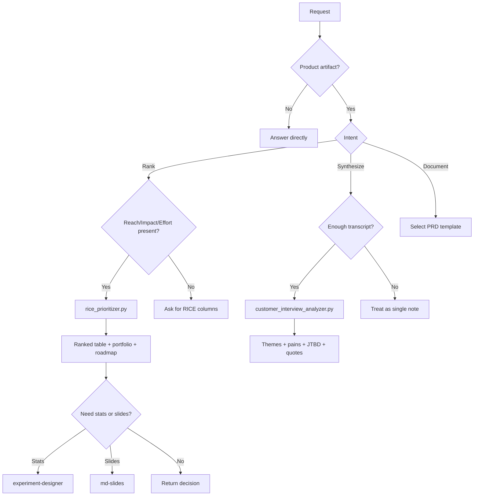

### 1.15 Sequence Diagram

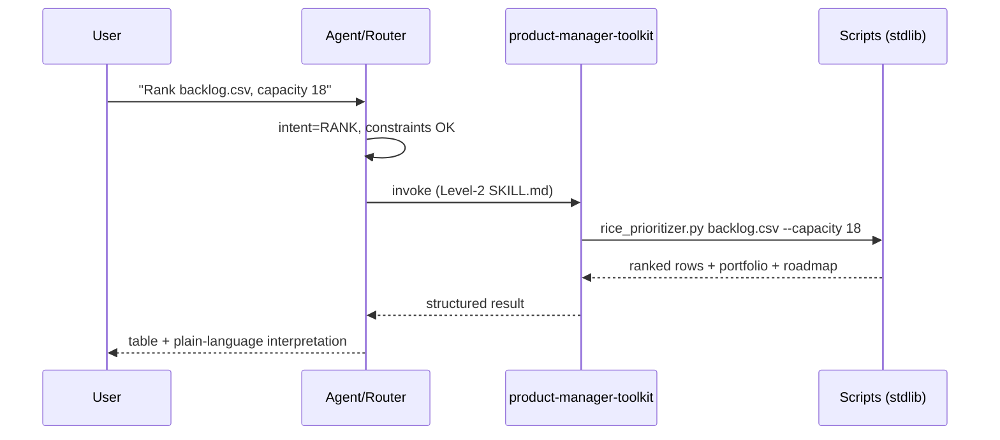

### 1.16 Decision Matrix

| Axis | Score | Why |
|---|---|---|
| Speed | 9 | Pure arithmetic on a CSV; sub-second |
| Accuracy | 8 | Math is exact; accuracy of *decisions* depends on input estimates |
| Cost | 9 | Stdlib, no API/network |
| Complexity | 7 | Two scripts + enums to learn; CSV schema must be right |
| Risk | 8 | Low — worst case is a mis-ranked backlog, not a destructive action |
| Reliability | 9 | Deterministic, stable output contract |

### 1.17 Best Practices

- **Do** validate the CSV enums before running; reject `effort=medium`.
- **Do** run sensitivity analysis ("what if effort is 2× off?") before committing a roadmap.
- **Do** synthesize interviews *first*, then feed emergent opportunities into RICE.
- **Don't** RICE a single item — it's meaningless without a comparison set.
- **Don't** present the score without the assumptions behind it.
- **Tip:** emit `--output json` when the next step is a tracker; `csv` when a human will edit in Sheets.

### 1.18 Common Bugs

- **Triggering too early** — firing on colloquial "prioritize" (day/inbox). Guard with the artifact check.
- **Triggering too late** — user pasted a transcript inline and the router missed it as "just text."
- **Conflict** — both this and `experiment-designer` look plausible for "figure out what to build and prove it"; resolve by *sequencing*, not choosing.
- **Redundant calls** — re-running RICE on unchanged inputs; cache the ranking.
- **Silent distortion** — enum typos accepted → wrong scores with no error.

### 1.19 Summary

- **Purpose:** produce reproducible, auditable product decisions (rankings + research synthesis).
- **Use when:** you have a set to rank, transcripts to synthesize, or a PRD to write.
- **Avoid when:** you need statistical proof (`experiment-designer`), slide rendering (`md-slides`), or you're only "prioritizing" your day.

---
## 2. experiment-designer

> **One-liner:** turns a fuzzy "let's test this" into a defensible experiment — a falsifiable hypothesis, defined metrics, a correctly-powered sample size, and a disciplined read of the result.

### 2.1 Overview

**What it is.** A statistics-with-guardrails skill for product experimentation. It supplies a hypothesis format (If/Then/Because), a metric taxonomy (primary/guardrail/secondary), ICE prioritization, interpretation rules, and one deterministic script: `sample_size_calculator.py`.

**Why it exists.** Teams routinely run **underpowered** tests (too few users → false negatives), peek early, change the treatment mid-flight, or declare victory off a bare p-value. Each of these silently invalidates the result. The skill encodes the statistical hygiene most PMs don't hold in their head.

**What problem it solves.** It converts intuition into a pre-registered, analyzable design and prevents the classic inferential errors that make A/B results untrustworthy.

**Why an agent should use it instead of improvising.** Sample-size math (z-scores, pooled variance, power) is exactly the kind of arithmetic LLMs approximate badly from memory. The script computes it correctly; the SKILL.md supplies the *interpretation* discipline (practical vs statistical significance, CI reading) that stops the agent from over-claiming.

### 2.2 Trigger Conditions

**Fire when the request involves:**
- Planning an A/B or multivariate experiment.
- Writing a testable hypothesis / success criteria.
- Estimating sample size or minimum detectable effect (MDE).
- Prioritizing experiments (ICE).
- Interpreting statistical output for a product decision.

**Strong signals:** words like A/B test, experiment, sample size, statistical significance, p-value, confidence interval, MDE, power, conversion lift, "how many users do I need."

**Do NOT trigger when:**
- The user wants to **rank features**, not test one → `product-manager-toolkit`.
- It's a pure math/stats question unrelated to a product experiment (answer directly if trivial).
- They want the plan **as slides** → design here, render with `md-slides`.
- There is no metric or intervention — nothing to power.

**Edge cases & false positives:**
- "Test this function" — software testing, not statistical experimentation. Do not fire.
- "A/B" used loosely to mean "compare two options" with no metric → clarify before firing.
- Baseline rate given as a percentage (`12`) vs proportion (`0.12`) — the script expects a proportion in (0,1); `12` fails validation.

### 2.3 Decision Tree

```
User request
     │
     ▼
Is this about validating a change with data?
     │
 ┌───┴────┐
 No       Yes
 │         │
 ▼         ▼
Answer   Is there a metric + an intervention?
directly       │
          ┌────┴─────┐
          No         Yes
          │           │
          ▼           ▼
     Ask for      What stage?
     metric   ┌───────┼─────────────┬───────────┐
              ▼       ▼             ▼           ▼
          HYPOTHESIS  SAMPLE SIZE   PRIORITIZE  INTERPRET
              │       │             │           │
              ▼       ▼             ▼           ▼
         If/Then/  sample_size_   ICE score   CI + practical
         Because   calculator.py              significance
```

### 2.4 Internal Logic

1. **Detect intent** — `HYPOTHESIS | POWER/SAMPLE | PRIORITIZE | INTERPRET`.
2. **Check ambiguity** — is "A/B" statistical or colloquial? Is "test" software or experiment?
3. **Verify constraints** — is there a baseline rate and a target effect? Is the baseline a valid proportion?
4. **Compare vs siblings** — ranking many ideas → `product-manager-toolkit`; this skill is for *one* rigorously-tested change.
5. **Decide priority** — usually *downstream* of prioritization (test the winner) and *upstream* of any deck.
6. **Execute** — run `sample_size_calculator.py`; or draft the hypothesis/metrics; or apply interpretation guardrails.
7. **Return** — n/variant, n/total, runtime estimate, plus the caveats (statistical ≠ business significance).

### 2.5 Input

**`sample_size_calculator.py`**
- **Required:** `--baseline-rate <float in (0,1)>` — current conversion/proportion.
- **Required-ish:** `--mde <float>` — minimum detectable effect (must be > 0).
- **Optional:** `--mde-type {absolute,relative}` (default **relative**); `--alpha <float>` (default **0.05**); `--power <float>` (default **0.8**); `--daily-samples <int>` (default **0**, enables a runtime estimate).
- **Validation:** rates must be strictly between 0 and 1; `mde` must be > 0; a target equal to baseline raises "MDE resolves to zero"; alpha/power must be in (0,1).

**Non-script inputs (from the SKILL.md workflow):** the intervention, audience, primary metric, guardrails, and expected minimum effect for the hypothesis and metric-definition steps.

### 2.6 Output

**`sample_size_calculator.py` returns:** `baseline_rate`, `target_rate`, `mde_type`, `alpha`, `power`, `n_per_group`, `n_total`, and (if `--daily-samples` set) `estimated_days`.

**Skill-level outputs:** a written If/Then/Because hypothesis, a metric set (primary/guardrail/secondary), an ICE ranking, and an interpretation verdict comparing the point estimate + CI against a business threshold.

- **Success:** a pre-registered, powered, analyzable design.
- **Failure modes surfaced:** invalid proportions rejected; a tiny relative MDE explodes `n_total` (a signal, not a bug).

### 2.7 Example User Requests

<details><summary><b>10 requests that SHOULD trigger</b></summary>

1. "How many users do I need to detect a 2-point lift from a 10% baseline?" → sample_size
2. "Design an A/B test for the new onboarding flow." → hypothesis + metrics + power
3. "Write a testable hypothesis for the pricing-page change." → If/Then/Because
4. "Is this result significant, or should we keep running?" → interpretation guardrails
5. "What's my MDE if I can only get 5,000 users per arm?" → sample_size (inverted)
6. "Prioritize these 6 experiments." → ICE
7. "How long should this test run at 2,000 signups/day?" → sample_size `--daily-samples`
8. "Our p-value is 0.03 but the lift is tiny — ship it?" → practical vs statistical significance
9. "Set alpha 0.01 and power 0.9 — recompute sample size." → sample_size with flags
10. "Define guardrail metrics for this checkout experiment." → metric taxonomy

</details>

<details><summary><b>10 requests that should NOT trigger (and why)</b></summary>

1. "Rank our roadmap by impact." → prioritization → `product-manager-toolkit`.
2. "Write unit tests for this module." → software testing, not statistics.
3. "Turn my experiment plan into slides." → rendering → `md-slides`.
4. "What's the average of these numbers?" → trivial math; answer directly.
5. "Explain what a p-value is." → definitional; answer directly.
6. "Summarize this research paper." → not experiment design.
7. "Should we build feature X?" → product opinion, no metric/intervention.
8. "Compare React vs Vue." → not an experiment.
9. "Analyze these interview transcripts." → `product-manager-toolkit`.
10. "Estimate our Q4 revenue." → forecasting, not experimentation.

</details>

### 2.8 Comparison

| Instead of… | Use experiment-designer when… | Why |
|---|---|---|
| Guessing sample size | You need a **correctly powered** n | Power math is easy to get wrong by hand/LLM |
| `product-manager-toolkit` | You must **validate one** change, not rank many | Inference ≠ prioritization |
| A bare p-value read | You need **practical-significance** judgment | Significance without effect size misleads |
| A generic calculator | Inputs are **experiment-semantic** (baseline, MDE, power) | Encodes the two-proportion design |
| `md-slides` | You need the **design**, not the **deck** | Upstream of presentation |

### 2.9 Strengths

- **Prevents underpowered tests** — the #1 cause of false negatives.
- **Correct math** — deterministic z-based sample sizing, not an LLM estimate.
- **Interpretation discipline** — forces CI + practical-significance thinking.
- **Runtime planning** — `--daily-samples` turns n into calendar days.
- **Cheap & portable** — stdlib only.

### 2.10 Weaknesses

- **Two-proportion focus** — the script targets conversion-rate tests; continuous-metric or sequential designs need more than this one tool.
- **No peeking protection at runtime** — it advises fixed-horizon design but can't enforce it.
- **Assumes clean instrumentation** — can't detect sample-ratio mismatch for you.
- **Unit traps** — percentage-vs-proportion input errors are common.
- **Not causal beyond the test** — a powered A/B still won't fix a badly chosen metric.

### 2.11 Real-World Examples

<details><summary><b>Conversation A — power a test</b></summary>

- **User →** "Baseline signup is 10%. We think the new CTA adds 2 points. Users?"
- **Assistant →** runs `--baseline-rate 0.10 --mde 0.02 --mde-type absolute` → "3,843/arm, 7,686 total; ~4 days at 2,000/day," plus "confirm 2 points is worth shipping before you commit."
- **Reasoning →** metric + intervention + baseline present → sample-size stage.
- **Skill Used →** experiment-designer (sample_size_calculator)

</details>

<details><summary><b>Conversation B — interpret a result</b></summary>

- **User →** "p = 0.04, lift = 0.3%. Do we ship?"
- **Assistant →** applies guardrails: "Statistically significant, but a 0.3% lift may be below your practical threshold; check the CI width and cost to maintain."
- **Reasoning →** INTERPRET intent; the risk is over-claiming from p alone.
- **Skill Used →** experiment-designer (interpretation guardrails)

</details>

<details><summary><b>Conversation C — correct upstream hand-off</b></summary>

- **User →** "Which experiment should we run first, and how big does it need to be?"
- **Assistant →** ICE-prioritizes the experiments (this skill), then powers the top one with the calculator.
- **Reasoning →** PRIORITIZE (ICE) then POWER — both live in this skill; sequential.
- **Skill Used →** experiment-designer (ICE → sample_size)

</details>

### 2.12 Trigger Confidence

| Confidence | Situation |
|---|---|
| **95–100%** | Explicit sample-size / A/B / significance request with a metric → fire |
| **70–95%** | "Design an experiment for X" with no numbers yet → fire, gather baseline/MDE |
| **40–70%** | "Let's test this" with no metric/intervention → ask one question |
| **< 40%** | "Test this code" / rank-features / trivial math → don't fire |

### 2.13 Priority

- **Runs after** `product-manager-toolkit` (rank, then test the winner).
- **Runs before** `md-slides` (design, then present).
- **Overrides** `product-manager-toolkit` only when the request is genuinely inferential, not comparative.
- **Never runs with** `caveman` during interpretation (compressing statistical caveats risks dangerous over-simplification of a ship/no-ship call).

```
Precedence:  product-manager-toolkit ─► experiment-designer ─► md-slides
             (what to test)             (how to test it)        (share the plan)
```

### 2.14 Flow Diagram

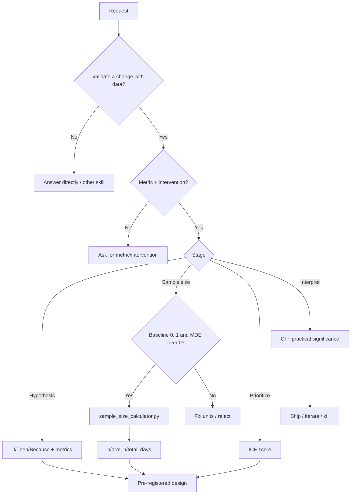

### 2.15 Sequence Diagram

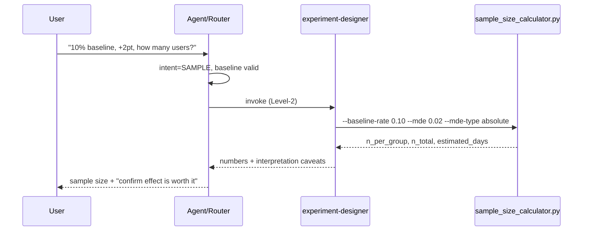

### 2.16 Decision Matrix

| Axis | Score | Why |
|---|---|---|
| Speed | 9 | Closed-form calculation; instant |
| Accuracy | 9 | Statistically correct for two-proportion tests |
| Cost | 9 | Stdlib, no network |
| Complexity | 6 | Requires statistical literacy to supply/read inputs |
| Risk | 7 | Bad inputs → wrong-sized tests → wasted cycles (not destructive) |
| Reliability | 9 | Deterministic; validates its inputs |

### 2.17 Best Practices

- **Do** fix the sample size (or duration) *before* launching; write the stopping rule down.
- **Do** define guardrail metrics up front.
- **Do** compare the CI to a business threshold, not just p to 0.05.
- **Don't** peek and stop early on a spike.
- **Don't** change the treatment mid-test.
- **Tip:** pass the baseline as a proportion (`0.12`), never a percent (`12`).

### 2.18 Common Bugs

- **Triggering too early** — firing on "test this code."
- **Triggering too late** — treating "how many users do I need" as a generic question and skipping the calculator.
- **Conflict** — competing with `product-manager-toolkit` on "figure out and prove"; resolve by sequencing (rank → test).
- **Unit bug** — percent-vs-proportion input silently rejected or mis-scaled.
- **Over-claim loop** — repeatedly re-reading a p-value hoping for significance (peeking).

### 2.19 Summary

- **Purpose:** design and interpret experiments with real statistical rigor.
- **Use when:** you're powering, hypothesizing, prioritizing, or reading one A/B test.
- **Avoid when:** you're ranking many ideas (`product-manager-toolkit`), testing software, or asking a trivial stats question.

---
## 3. md-slides

> **One-liner:** converts a markdown deck into a single self-contained HTML presentation — keyboard navigation, presenter mode, and print-to-PDF — with strict refusal rules that stop it from mangling non-decks.

### 3.1 Overview

**What it is.** A markdown→presentation converter built as a three-stage stdlib pipeline: `slide_splitter.py` → `presenter_notes_parser.py` → `deck_html_renderer.py`. Output is one HTML file that runs in any browser, no server, no framework.

**Why it exists.** People author decks in markdown but need a *presentable* artifact. Existing tools either require heavy installs (reveal.js toolchains) or design apps (Keynote). This skill gives a zero-dependency, shareable single file — plus presenter mode and PDF export for free.

**What problem it solves.** The "I wrote slides in markdown, now what?" gap — and the inverse failure it guards against: turning a long document into a broken 40-line "slide." Its refusal rules are as important as its rendering.

**Why an agent should use it instead of improvising.** Hand-writing a full HTML deck (inline CSS, keyboard handlers, presenter split-view, hash routing, print stylesheet) every time is error-prone and inconsistent. The renderer emits a battle-tested, accessible (`prefers-reduced-motion`, print media) single file, and enforces boundary/quality gates an ad-hoc attempt would skip.

### 3.2 Trigger Conditions

**Fire when:**
- An upstream `markdown-html-orchestrator` classifies the input as **SLIDES**.
- The user runs `/cs:md-slides <path>.md` directly.
- The markdown has **≥ 3 `---` HR lines** *or* **≥ 5 `# ` H1 headings with short bodies** (auto-detect boundary heuristic).

**Strong signals:** explicit "slides / deck / presentation," slide-boundary markers, presenter-notes comments `<!-- notes: ... -->`, a request to "present" or "make a PDF I can flip through."

**Do NOT trigger when:**
- Input is a **long-form spec / continuous document** → route to `md-document`.
- Input is a **code review / diff** → route to `md-review`.
- The request is a **landing page** → that's a different marketing skill.
- The user wants a native `.pptx` / `.pdf` **binary** — md-slides makes *HTML* (PDF only via browser print). For a true PowerPoint, use a dedicated `pptx` skill.

**Edge cases, false positives & refusals (hard rules):**
- **No clear boundaries** → refuse, **exit 6**, route to `md-document`. (Auto mode needs ≥3 HR or ≥5 H1.)
- **Would produce 1 slide** → refuse, **exit 5** ("that's a poster, not a deck").
- **Input < 100 lines** → refuse (shared converter threshold).
- **`--strict-notes` with < 50% notes coverage** → refuse, **exit 7** (not set up for presenter mode).
- **Slide > 40 source lines** → soft-warn (renders, but flags signal-to-noise).

### 3.3 Decision Tree

```
Markdown input
     │
     ▼
Orchestrator class or /cs:md-slides?
     │
 ┌───┴───────────────┐
 SLIDES / explicit    other
 │                     │
 ▼                     ▼
Clear slide          route to
boundaries?      md-document / md-review
 │
 ┌────┴─────┐
 No         Yes
 │           │
 ▼           ▼
Exit 6 →   >= 2 slides?
md-document   │
         ┌────┴────┐
         No        Yes
         │          │
         ▼          ▼
      Exit 5     >= 100 lines?
      (poster)      │
              ┌─────┴─────┐
              No          Yes
              │            │
              ▼            ▼
           refuse      strict-notes on & <50%?
                          │
                    ┌─────┴─────┐
                    Yes         No
                    │            │
                    ▼            ▼
                 Exit 7       RENDER deck.html
```

### 3.4 Internal Logic

1. **Detect intent** — did the orchestrator route SLIDES, or did the user invoke explicitly, or do boundary heuristics match?
2. **Check ambiguity** — deck vs continuous document? The boundary count (HR/H1) is the discriminator.
3. **Verify constraints** — run the refusal gates in order: boundaries → slide count → line count → notes coverage.
4. **Compare vs siblings** — no boundaries → `md-document`; diffs → `md-review`; landing → marketing skill; binary deck → `pptx`.
5. **Decide priority** — this is a *terminal render* stage; it consumes data other skills produce.
6. **Execute** — `slide_splitter.py` → `presenter_notes_parser.py` → `deck_html_renderer.py`.
7. **Return** — one `deck-{slug}.html` with nav + presenter mode + print stylesheet.

### 3.5 Input

- **Primary:** a markdown file with slides separated by `---` HR **or** `# ` H1 headings; optional `<!-- notes: ... -->` presenter-notes blocks per slide.
- **Renderer flags (`deck_html_renderer.py`):** `--slides <json|->` (from the notes parser, or stdin), `--output <path>` (else stdout), `--title "<tab title>"` (default `Deck`), `--syntax` (opt-in Prism.js for code), `--no-config` (skip design-system tokens), `--sample` (emit a demo deck), `--strict-notes` (enforce ≥50% notes coverage).
- **Design tokens:** 12 brand CSS custom properties loaded via `config_loader.py`; `design_style` affects layout density.
- **Validation:** the refusal gates in §3.2 (boundaries, slide count, line count, notes coverage).

### 3.6 Output

- **Artifact:** a single `deck-{slug}.html` (collision suffix `-2`, `-3`, …), all CSS + JS inline; only external is Google Fonts CSS (and opt-in Prism.js with `--syntax`).
- **In the file:** each slide as `<section class="slide">`; keyboard nav (`→`/`Space`/`PgDn` next, `←`/`PgUp` prev, `Home`/`End` jump, `P` presenter, `Esc` exit); URL-hash deep links (`deck.html#5`); progress bar; slide counter; presenter split-view (slide + notes + clock + next preview); `@media print` one-slide-per-page for PDF.
- **Success:** a portable deck that opens anywhere.
- **Failure:** one of the documented non-zero exits (5/6/7) with a routing suggestion.

### 3.7 Example User Requests

<details><summary><b>10 requests that SHOULD trigger</b></summary>

1. "Turn `talk.md` (slides split by `---`) into a browsable HTML deck." → render
2. "Make a presentation from these 8 H1 sections." → H1 boundary mode
3. "I need presenter notes and a clock while I talk." → presenter mode
4. "Give me a deck I can export to PDF by printing." → print stylesheet
5. "`/cs:md-slides deck.md`" → explicit invocation
6. "Build slides with syntax highlighting for the code blocks." → `--syntax`
7. "One HTML file I can email that flips through slides." → single-file output
8. "Deep-link me to slide 5 to share with a colleague." → URL hash
9. "Render this markdown pitch as a keyboard-navigable deck." → render
10. "Make a self-paced HTML slideshow from this outline." → render

</details>

<details><summary><b>10 requests that should NOT trigger (and why)</b></summary>

1. "Format this 5-page spec nicely." → continuous doc → `md-document`.
2. "Render this PR diff with annotations." → `md-review`.
3. "Build a product landing page." → marketing/landing skill.
4. "Make me an editable PowerPoint (.pptx)." → binary format → `pptx` skill.
5. "Here's one paragraph — make a slide." → 1 slide → poster, refuse (exit 5).
6. "Turn this 30-line note into slides." → < 100 lines → refuse.
7. "Summarize this document." → not a rendering task.
8. "Design a logo." → graphic design, not markdown decks.
9. "Convert this to Word." → `docx` skill.
10. "Write the talk content for me." → authoring, not conversion (bring content first).

</details>

### 3.8 Comparison

| Instead of… | Use md-slides when… | Why |
|---|---|---|
| Hand-writing HTML/JS slides | You want a **consistent, accessible** deck | Renderer ships nav + presenter + print, tested |
| `md-document` | Input is **N discrete slides**, not one flow | Boundary count decides |
| `md-review` | You're presenting **prose**, not **diffs** | Different renderer entirely |
| A `pptx` skill | You want a **portable single HTML file**, PDF via print | Different output target (HTML vs binary) |
| Keynote / PowerPoint apps | Content is **markdown-authored** | This is a converter, not a design tool |

### 3.9 Strengths

- **Zero dependency / single file** — trivially shareable, opens in any browser.
- **Presenter mode + print-to-PDF** — real talk affordances for free.
- **Accessible** — honors `prefers-reduced-motion`; print media handled.
- **Strict guardrails** — refuses non-decks instead of producing garbage.
- **Design-system aware** — 12 brand tokens keep decks on-brand.

### 3.10 Weaknesses

- **Not a true `.pptx`/`.pdf`** — PDF only via browser print; no native binary.
- **Boundary-dependent** — bad markdown structure → refusal, not best-effort.
- **Prose decks only** — heavy graphic layouts belong in design tools.
- **Orchestrator coupling** — best behavior assumes upstream routing/config.
- **No content generation** — it converts; it won't write your talk.

### 3.11 Real-World Examples

<details><summary><b>Conversation A — happy path</b></summary>

- **User →** "`launch.md` has 10 slides split by `---`, each with notes. Make a deck I can present and later share as PDF."
- **Assistant →** runs splitter → notes parser → renderer, returns `deck-launch.html` with presenter mode; "press `P` to present, `Cmd+P` to export PDF."
- **Reasoning →** clear boundaries, >100 lines, notes present → all gates pass.
- **Skill Used →** md-slides (full pipeline)

</details>

<details><summary><b>Conversation B — correct refusal</b></summary>

- **User →** "Make slides from this." (pastes a 60-line continuous essay, no boundaries)
- **Assistant →** refuses (exit 6): "No slide boundaries and under 100 lines — this reads as a document. Want me to route it to `md-document` instead?"
- **Reasoning →** boundary + line gates fail; forcing a deck would produce a poster.
- **Skill Used →** none (routed away)

</details>

<details><summary><b>Conversation C — downstream of PM work</b></summary>

- **User →** "Take my RICE ranking and make a stakeholder deck."
- **Assistant →** formats the ranking as a markdown deck, then renders with md-slides.
- **Reasoning →** md-slides is terminal: it renders data `product-manager-toolkit` produced.
- **Skill Used →** product-manager-toolkit → md-slides

</details>

### 3.12 Trigger Confidence

| Confidence | Situation |
|---|---|
| **95–100%** | Orchestrator says SLIDES, or `/cs:md-slides`, or ≥3 HR / ≥5 H1 with short bodies |
| **70–95%** | "Make a presentation" + markdown that *has* boundaries → fire |
| **40–70%** | "Make slides from this" but structure is unclear → check boundaries, maybe clarify |
| **< 40%** | Continuous doc / diff / .pptx / <100 lines → don't fire (or refuse with routing) |

### 3.13 Priority

- **Runs last** in a chain — it's a presentation/render stage.
- **Yields to** `md-document` / `md-review` / `pptx` when the artifact type differs.
- **Runs together with** nothing simultaneously; its three scripts are sequential stages of one pipeline.
- **Compatible with** `caveman`? Only to compress *slide source authoring*, never the rendered notes a presenter reads live.

```
Precedence:  (content skills) ─► md-slides
             produce markdown     render HTML deck  [TERMINAL]
Sibling routing:  no boundaries → md-document | diffs → md-review | binary → pptx
```

### 3.14 Flow Diagram

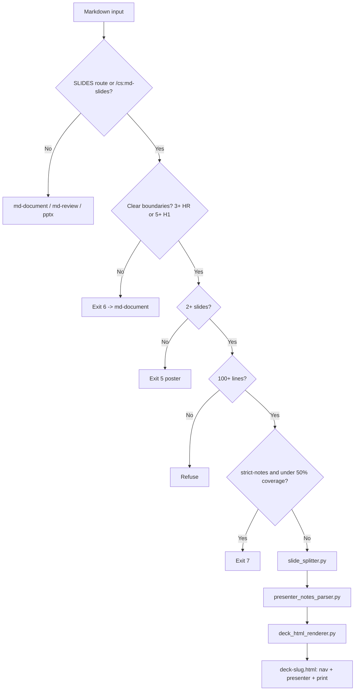

### 3.15 Sequence Diagram

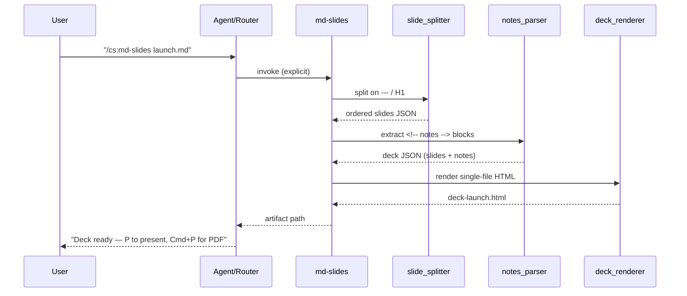

### 3.16 Decision Matrix

| Axis | Score | Why |
|---|---|---|
| Speed | 8 | Three quick stdlib passes over text |
| Accuracy | 9 | Deterministic render; strict gates prevent bad output |
| Cost | 9 | Stdlib; only external is a fonts CSS link |
| Complexity | 6 | Pipeline + flags + boundary rules to understand |
| Risk | 9 | Low — worst case is a refusal with a routing hint |
| Reliability | 9 | Consistent single-file output; well-defined exits |

### 3.17 Best Practices

- **Do** structure source with real boundaries (`---` or H1) before invoking.
- **Do** keep slides under ~40 source lines; split dense ones.
- **Do** add `<!-- notes: -->` if you'll present live.
- **Don't** feed it continuous prose expecting a "best-effort" deck — it will (correctly) refuse.
- **Don't** expect a native `.pptx` — reach for a `pptx` skill if you need binary.
- **Tip:** share `deck.html#N` to drop someone on a specific slide.

### 3.18 Common Bugs

- **Triggering too early** — firing on a continuous doc that lacks boundaries (should route to `md-document`).
- **Triggering too late** — user structured a clear deck but the router read it as generic markdown.
- **Conflict** — ambiguity with `md-document`/`pptx`; resolve via boundary heuristics and output-format intent.
- **Notes-coverage surprise** — `--strict-notes` refuses (exit 7) when the user didn't realize most slides lack notes.
- **Redundant re-render** — regenerating an unchanged deck; reuse the artifact.

### 3.19 Summary

- **Purpose:** turn a markdown deck into a portable, presentable single-file HTML deck (with PDF via print).
- **Use when:** the input has real slide boundaries and enough content, and you want to *present or share* it.
- **Avoid when:** it's a continuous document, a diff, a landing page, or you need a native `.pptx`.

---
## 4. caveman

> **One-liner:** a persistent output-compression *mode* that cuts token usage ~75% by stripping filler, articles, and pleasantries while keeping every technical detail exact — and knows to suspend itself when brevity would be dangerous.

### 4.1 Overview

**What it is.** A cross-cutting **response-style skill** (derived from Matt Pocock's `caveman`, MIT). Unlike the other three, it isn't a task tool — it transforms *how* every subsequent reply is written. It ships helper scripts: `caveman_compressor.py`, `caveman_lint.py`, `token_savings_estimator.py`.

**Why it exists.** LLM prose is padded — pleasantries ("Sure! Happy to help…"), filler ("basically," "just," "actually"), articles, and hedging burn tokens and reader time. In long agent sessions that padding compounds into real cost and latency. Caveman removes it deterministically.

**What problem it solves.** Token/latency/attention waste. It preserves signal (technical terms, code, exact error strings) and discards only noise.

**Why an agent should use it instead of improvising.** "Be terse" as a vague instruction drifts back to verbose within a few turns. Caveman encodes *explicit* drop-rules, a **persistence** contract (stay active until told to stop), and — critically — an **auto-clarity exception** so the agent knows the specific moments (security warnings, destructive confirmations) where it must *not* compress. That safety-aware discipline is exactly what freehand "be brief" lacks.

### 4.2 Trigger Conditions

**Fire when the user says:** "caveman mode," "talk like caveman," "use caveman," "less tokens," "be brief," or invokes `/caveman`.

**Strong signals:** any explicit request for extreme brevity / token savings / terse output; `/caveman`.

**Persistence contract:** once triggered, caveman is **active on every response** — it does **not** revert after many turns and does **not** drift back to filler. It turns off **only** when the user says "stop caveman" or "normal mode."

**Do NOT trigger (or must suspend) when:**
- The user wants *normal* prose, or explicitly asked to stop.
- The current reply is a **security warning**, an **irreversible/destructive-action confirmation**, or a **multi-step sequence where fragment order could be misread** — the **Auto-Clarity Exception** suspends caveman for that content, then resumes.
- The user asks to **clarify** or **repeats** a question (they may have been confused by terseness) — expand, then resume.

**Edge cases & false positives:**
- "Be brief" meaning "short answer, but still normal English" vs. full caveman register — read intent; when unsure, moderate compression beats fragment-speak.
- Applying caveman to code or exact error strings — **never**; those pass through unchanged.
- A one-off "tl;dr" request is *not* a mode switch — summarize once, don't flip persistence on.

### 4.3 Decision Tree

```
Any assistant response
     │
     ▼
Is caveman mode ON? (triggered, not stopped)
     │
 ┌───┴────┐
 No       Yes
 │         │
 ▼         ▼
Normal   Is THIS content safety-critical?
prose    (security / destructive / order-sensitive / user confused)
             │
        ┌────┴────┐
        Yes        No
        │           │
        ▼           ▼
   Suspend →     Is it code or an exact error string?
   full prose        │
   for this     ┌────┴────┐
   part, then   Yes        No
   resume       │           │
                ▼           ▼
            Pass through  Apply drop-rules:
            unchanged     articles/filler/
                          pleasantries/hedging →
                          fragments + arrows
```

### 4.4 Internal Logic

1. **Detect intent** — explicit brevity trigger or `/caveman`? (Mode switch vs one-off summary.)
2. **Check ambiguity** — "be brief" = mode or single short answer? Persistence only on a real switch.
3. **Verify constraints (per response)** — is this turn safety-critical? Is any span code / exact error text?
4. **Compare vs siblings** — caveman is **orthogonal**: it *wraps* other skills' output rather than competing with them.
5. **Decide priority** — style is applied **last**, after content is produced, and is **overridden** by the Auto-Clarity Exception.
6. **Execute** — apply drop-rules (articles, filler, pleasantries, hedging; fragments OK; `X -> Y` causality; abbreviate DB/auth/config/req/res/fn/impl); keep technical terms/code/errors exact.
7. **Return** — compressed text; persist the mode for the next turn.

### 4.5 Input

- **The mode itself:** natural-language trigger phrase or `/caveman`; no arguments.
- **`caveman_compressor.py`:** positional `text` (or `--file <path>`), `--output {text,json}` (default `text`). Runs deterministic drop-rules and reports before/after char and word counts.
- **`token_savings_estimator.py`:** estimates token reduction for a passage.
- **`caveman_lint.py`:** checks output for residual filler (linting the compression).
- **Validation:** none blocking — the compressor always returns *something*; the discipline (what to preserve) lives in the SKILL.md, not the regex.

### 4.6 Output

- **Mode output:** every reply rewritten in terse register — `[thing] [action] [reason]. [next step].` — with technical substance intact.
- **`caveman_compressor.py`:** the compressed string plus a stats block (chars/words before→after, % saved), as text or JSON.
- **Success:** materially fewer tokens, zero loss of technical meaning.
- **Failure modes:** (a) over-compression that harms clarity on complex/ordered steps; (b) the regex compressor mangling phrasing (e.g., clumsily deleting "happy to help") — which is why the *skill* (Claude adopting the voice) is the real mechanism and the script is a rough helper; (c) forgetting to suspend for a safety warning.

### 4.7 Example User Requests

<details><summary><b>10 requests that SHOULD trigger</b></summary>

1. "caveman mode." → switch mode on (persistent)
2. "Talk like a caveman from now on." → mode on
3. "Use caveman for the rest of this session." → mode on
4. "Be brief — I'm burning tokens." → mode on (brevity intent)
5. "`/caveman`" → explicit invocation
6. "Less tokens, keep the technical detail." → mode on
7. "Stop being so wordy, ultra-terse please." → mode on
8. "Compress this paragraph." → `caveman_compressor.py` (one-off)
9. "How much would caveman save on this doc?" → `token_savings_estimator.py`
10. "Lint my terse output for leftover filler." → `caveman_lint.py`

</details>

<details><summary><b>10 requests that should NOT trigger (and why)</b></summary>

1. "Explain this in detail." → wants prose, not compression.
2. "Give me a friendly, thorough walkthrough." → opposite of caveman.
3. "Write a polished blog post." → published prose needs full language.
4. "Draft a customer-facing email." → tone matters; terse register is wrong.
5. "Summarize this once." → one-off tl;dr, not a mode switch (don't flip persistence).
6. "Confirm the DROP TABLE command." → suspend caveman (destructive-action exception).
7. "Walk me through the 8-step migration carefully." → order-sensitive; suspend/expand.
8. "I didn't understand — can you clarify?" → user confused; expand, don't compress.
9. "Normal mode." → this turns caveman *off*.
10. "Explain the security implications." → safety-critical; full clarity.

</details>

### 4.8 Comparison

| Instead of… | Use caveman when… | Why |
|---|---|---|
| Vague "be concise" | You want **persistent, rule-based** terseness | Explicit drop-rules don't drift back to filler |
| Manual editing for length | You want **automatic** compression every turn | Mode persists until explicitly stopped |
| A summarizer | You want the **same answer, fewer tokens**, not a shorter *scope* | Compression ≠ summarization |
| Task skills (PM/exp/slides) | You want to change **how output reads**, not **what task runs** | Orthogonal — caveman wraps them |
| Nothing (full prose) | Cost/latency/attention matter and safety exceptions are handled | Signal kept, noise dropped |

### 4.9 Strengths

- **Deterministic token savings** (~75% on padded prose) with technical fidelity.
- **Persistence** — no drift back to verbosity mid-session.
- **Safety-aware** — the Auto-Clarity Exception suspends compression exactly where terseness is risky.
- **Preserves the sacred** — code blocks and exact error strings pass untouched.
- **Composable** — layers on top of any other skill's output.
- **Tooling** — compressor + estimator + linter to measure and enforce.

### 4.10 Weaknesses

- **Clarity trade-off** — fragments can hurt comprehension on complex/ordered content (hence the exception).
- **Tone-wrong for humans** — never appropriate for customer-facing or published prose.
- **Regex helper is blunt** — the script over-deletes; the real quality comes from the model adopting the voice.
- **Exception discipline is on the agent** — forgetting to suspend for a destructive-op warning is a genuine safety risk.
- **Not a summarizer** — it shortens *wording*, not *scope*; users wanting less content are mis-served.

### 4.11 Real-World Examples

<details><summary><b>Conversation A — mode on</b></summary>

- **User →** "caveman mode. Why is my React component re-rendering?"
- **Assistant →** "Inline obj prop -> new ref each render -> re-render. `useMemo` / stable ref. Fix."
- **Reasoning →** explicit trigger; technical answer preserved, filler dropped; mode now persists.
- **Skill Used →** caveman (mode)

</details>

<details><summary><b>Conversation B — Auto-Clarity Exception</b></summary>

- **User →** (caveman already on) "Delete all rows in `users`."
- **Assistant →** *suspends caveman*: "**Warning:** this permanently deletes every row in `users` and cannot be undone. Verify a backup exists first." then `DROP TABLE`/`DELETE` shown exactly → "Caveman resume."
- **Reasoning →** destructive, irreversible → clarity outranks brevity; resume after.
- **Skill Used →** caveman (exception path)

</details>

<details><summary><b>Conversation C — wraps another skill</b></summary>

- **User →** (caveman on) "Rank these features by RICE."
- **Assistant →** runs `product-manager-toolkit`, then reports the ranking tersely: "Top: Onboarding (RICE 20000). Bottom: Collab (461). 3 quick wins fit Q. Split 'Billing' (XL)."
- **Reasoning →** caveman is orthogonal — the PM skill does the work, caveman styles the report.
- **Skill Used →** product-manager-toolkit + caveman

</details>

### 4.12 Trigger Confidence

| Confidence | Situation |
|---|---|
| **95–100%** | "caveman mode" / `/caveman` / "less tokens" → switch on |
| **70–95%** | "be brief," "stop being wordy" → on, but moderate if human-facing tone implied |
| **40–70%** | "shorter please" — one-off vs mode unclear → clarify or summarize once |
| **< 40%** | Detailed/friendly/published-prose request, or a safety-critical turn → don't compress |

### 4.13 Priority

- **Applied last** — after content is generated, style is the final pass.
- **Orthogonal** — does **not** compete with task skills; it **runs together with** them (wraps their output).
- **Overridden by** the Auto-Clarity Exception (safety/clarity) and by "normal mode."
- **Should never fully apply** during: destructive-action confirmations, security warnings, order-sensitive multi-step instructions, or when a task skill's output is an **audit trail** users must read in full (e.g. RICE assumptions, statistical caveats).

```
Precedence (style layer):
   task skill output ──► [Auto-Clarity check] ──► caveman compress ──► reply
                              │ safety-critical? ──► bypass compression
```

### 4.14 Flow Diagram

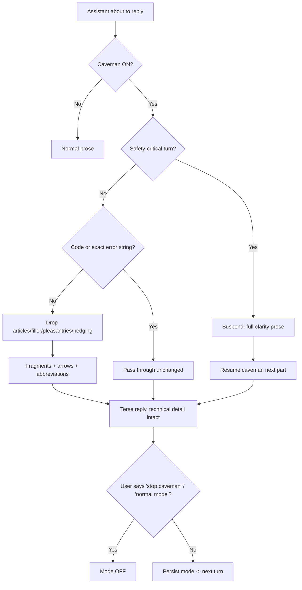

### 4.15 Sequence Diagram

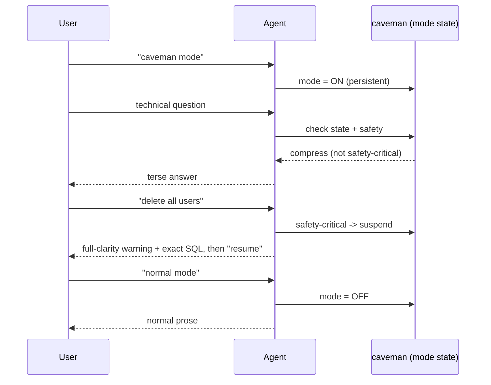

### 4.16 Decision Matrix

| Axis | Score | Why |
|---|---|---|
| Speed | 10 | Pure text transform; negligible overhead, fewer output tokens |
| Accuracy | 7 | Technical fidelity high; the regex helper is blunt, clarity can dip |
| Cost | 10 | *Saves* cost (fewer tokens); stdlib tooling |
| Complexity | 8 | Simple rules, but the exception logic must be honored |
| Risk | 6 | Real risk if a safety warning gets compressed — mitigated by the exception |
| Reliability | 8 | Persistent and deterministic; depends on disciplined exception handling |

### 4.17 Best Practices

- **Do** honor persistence — stay in mode until explicitly told to stop.
- **Do** suspend for security warnings, destructive confirmations, and ordered multi-step instructions.
- **Do** keep code and exact error strings verbatim.
- **Don't** use caveman for customer-facing or published prose.
- **Don't** confuse it with summarization — keep the full scope, cut only wording.
- **Tip:** run `caveman_lint.py` to catch filler that slipped through, and `token_savings_estimator.py` to quantify the win.

### 4.18 Common Bugs

- **Triggering too early** — flipping persistent mode on a one-off "tl;dr."
- **Triggering too late** — user said "less tokens" three turns ago and output is still verbose (persistence not honored).
- **Missed exception** — compressing a `DROP TABLE` warning into a fragment → dangerous ambiguity.
- **Conflict** — over-compressing another skill's audit output (RICE assumptions, statistical caveats) that must be read in full.
- **Register overreach** — applying fragment-speak to prose meant for humans.

### 4.19 Summary

- **Purpose:** a persistent, safety-aware compression mode that keeps technical substance and drops only noise.
- **Use when:** the user asks for terseness/token savings and output is internal/technical.
- **Avoid when:** the content is safety-critical, order-sensitive, customer-facing, or the user actually wants *less scope* (that's summarization).

---
## Complete Skill Comparison Matrix

| Skill | Trigger | Input | Output | Internet | Memory | Risk | Speed | Best For | Avoid When |
|---|---|---|---|---|---|---|---|---|---|
| **product-manager-toolkit** | prioritize / synthesize research / write PRD | feature CSV, interview `.txt` | ranked table + portfolio + roadmap; insight report | No | No | Low | Fast | Reproducible, auditable product decisions | You need statistical proof, or just an opinion on one item |
| **experiment-designer** | A/B design / sample size / interpret result | baseline rate, MDE, alpha, power | n/arm, n/total, runtime; hypothesis; verdict | No | No | Low–Med | Fast | Correctly powered, defensible experiments | You're ranking many ideas, or testing software |
| **md-slides** | SLIDES route / `/cs:md-slides` / boundary heuristic | markdown deck (HR or H1 + notes) | single-file HTML deck (nav + presenter + print-PDF) | No* | No | Low | Fast | Portable, presentable decks from markdown | Continuous docs, diffs, or a native `.pptx` |
| **caveman** | "caveman mode" / "less tokens" / `/caveman` | the mode (or text to compress) | terse, technically-exact output | No | No† | Med | Instant | Cutting token/latency waste in internal/technical replies | Safety-critical, ordered, or customer-facing content |

<sub>*only an external Google Fonts CSS link. †caveman *persists* mode within a session but stores no cross-session memory.</sub>

---

## Skill Interaction Graph

How the four relate — a dependency/flow view. Solid = typical hand-off; dashed = style layer that wraps any output.

```mermaid
flowchart LR
    subgraph Decide
        PM[product-manager-toolkit]
        EX[experiment-designer]
    end
    subgraph Present
        SL[md-slides]
    end
    CV([caveman<br/>style layer]):::style

    PM -->|rank winner| EX
    PM -->|ranking data| SL
    EX -->|experiment plan| SL
    PM -.wrapped by.-> CV
    EX -.wrapped by.-> CV
    SL -.source authoring only.-> CV

    classDef style fill:#eee,stroke:#888,stroke-dasharray:4 4;
```

**Reading it:** `product-manager-toolkit` decides *what* to build → `experiment-designer` proves *whether* it works → `md-slides` *presents* the result. `caveman` sits orthogonally: it restyles any reply, but only touches slide *authoring*, never the live presenter notes, and suspends itself for safety-critical output.

---

## Agent Decision Pipeline

The full path from prompt to executed skill.

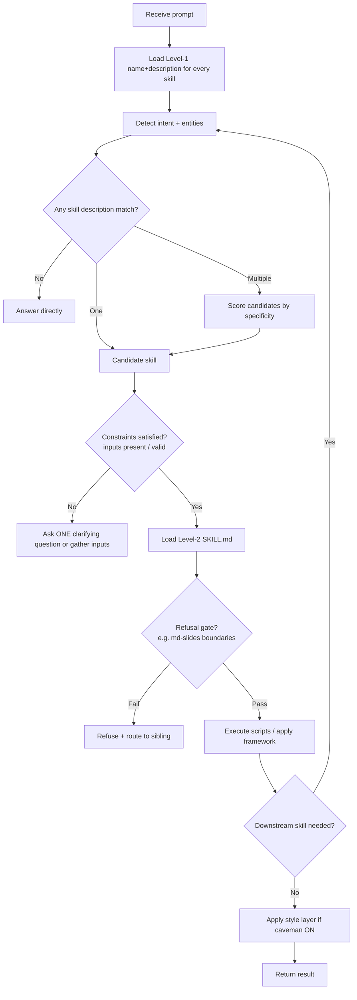

**Stages explained:**
1. **Level-1 scan** — cheap description match is the whole routing surface.
2. **Intent + entities** — verb (rank/test/present/compress) + artifacts (CSV/transcript/markdown/none).
3. **Specificity scoring** — when several match, the *narrowest correct* skill wins (see Hierarchy).
4. **Constraint check** — inputs present and valid, else gather/clarify (don't guess numbers).
5. **Level-2 load + refusal gates** — only now is the full SKILL.md paid for; some skills refuse (md-slides).
6. **Execute → chain** — a skill's output can re-enter the pipeline as the next skill's input.
7. **Style layer last** — caveman is applied after content, subject to its exception.

---

## Trigger Hierarchy

These four rarely *compete* (they occupy different domains), so the hierarchy is about **chain order** and **ambiguity tie-breaks**, not raw dominance.

**Precedence order (who runs first in a chain):**

```
1. product-manager-toolkit   ─ decide WHAT            (upstream)
2. experiment-designer       ─ decide IF IT WORKS
3. md-slides                 ─ PRESENT the result     (terminal render)
4. caveman                   ─ STYLE the reply        (applied last, orthogonal)
```

**Why this ranking:**
- **Decision before validation** — you rank candidates, *then* rigorously test the winner.
- **Content before presentation** — `md-slides` renders data the others produce; it never leads.
- **Task before style** — `caveman` changes wording, not work; it's the final pass.

**Ambiguity tie-breaks (specificity wins):**

| Ambiguous request | Winner | Rule |
|---|---|---|
| "Figure out what to build and prove it" | PM → experiment (chain) | Two intents → sequence, don't pick one |
| "Prioritize these tests" | experiment-designer (ICE) | "tests" = experiments, not features |
| "Make slides from this doc" (no boundaries) | md-document (refuse md-slides) | Boundary heuristic decides |
| "Be brief and rank these" | PM + caveman | Orthogonal style + task compose |
| "Test this" | ask | software vs statistical is unresolved |

**Never-together set:** `caveman` **must not** compress the audit/uncertainty output of `product-manager-toolkit` (RICE assumptions) or `experiment-designer` (statistical caveats), nor a safety warning — clarity outranks brevity.

---

## Common Prompt Patterns

Templates that reliably activate each skill (useful for eval suites and router tests).

<details><summary><b>product-manager-toolkit</b></summary>

- "Rank these {N} features by RICE." / "Prioritize the {quarter} roadmap."
- "We have {capacity} person-months — what fits?"
- "Synthesize these {N} interview transcripts / this user call."
- "What are the top pain points / themes / JTBD here?"
- "Write a {one-page | standard} PRD for {feature}."
- "Give me the RICE scores as {JSON | CSV}."

</details>

<details><summary><b>experiment-designer</b></summary>

- "How many users to detect a {X}% lift from a {Y}% baseline?"
- "Design an A/B test for {change}." / "Write a testable hypothesis for {change}."
- "What's my MDE with {N} users per arm?"
- "How long at {daily} signups/day?"
- "Is p={p} with a {lift} significant — ship it?"
- "Prioritize these experiments (ICE)."

</details>

<details><summary><b>md-slides</b></summary>

- "Turn {file}.md into a browsable HTML deck."
- "Make a presentation from these {H1 | ---}-separated sections."
- "I need presenter notes + a clock while I talk."
- "Give me a deck I can print to PDF."
- "`/cs:md-slides {file}.md`"
- "Deep-link me to slide {N}."

</details>

<details><summary><b>caveman</b></summary>

- "caveman mode." / "`/caveman`" / "talk like a caveman."
- "Be brief — I'm burning tokens." / "less tokens, keep the detail."
- "Compress this paragraph." (one-off via compressor)
- "How much would caveman save on this?" (estimator)
- "stop caveman" / "normal mode" (turns it OFF)

</details>

---

## Skill Taxonomy

Where each skill sits in a capability map, and why.

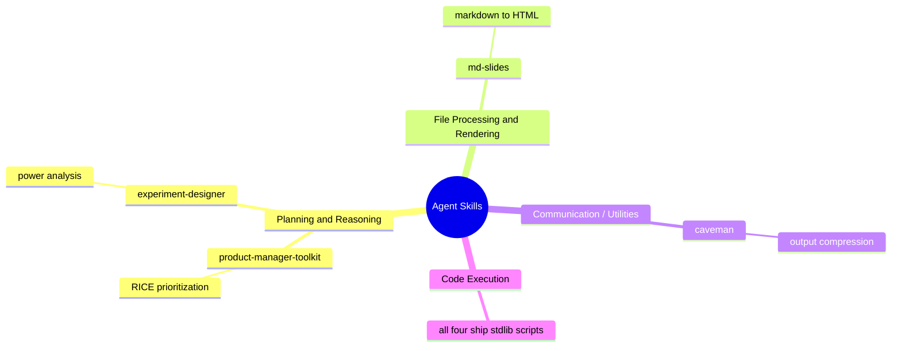

| Category | Skill(s) | Why it belongs |
|---|---|---|
| **Planning & Reasoning** | product-manager-toolkit, experiment-designer | Both turn inputs into *decisions* (a ranking; a ship/no-ship) via explicit frameworks (RICE, power analysis, ICE). |
| **File Processing / Rendering** | md-slides | Transforms one document format (markdown) into another (self-contained HTML); a converter, not a reasoner. |
| **Communication / Utilities** | caveman | Governs *how* the agent talks; a cross-cutting output transform, not a task. |
| **Code Execution** | all four | Each bundles deterministic stdlib scripts — the trait that separates skills from plain prompt snippets. |

> Note the two *axes*: three skills are categorized by **what task** they do (plan / render / style), while **code execution** is a *property* they share. A good router keys on the task category for selection and treats "has scripts" as an implementation detail.

---

## Architecture Overview

How an agent should decide between the five possible responses to any prompt.

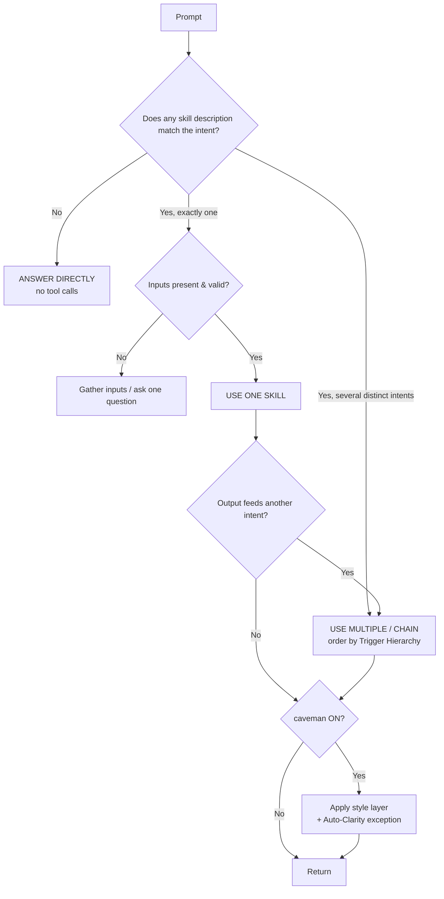

**The five modes, and when each applies:**

1. **Answer directly** — no description matches, or the ask is definitional/trivial ("what is RICE?", "average of these numbers"). *Avoid unnecessary tool calls* — a skill that doesn't change the substance of the answer is pure overhead.
2. **Use one skill** — a single clear intent with satisfiable inputs (rank this CSV; power this test; render this deck).
3. **Use multiple skills** — genuinely separate intents in one request (rank *and* prove; render *and* compress). Compose them.
4. **Chain skills** — the output of one is the input of the next (synthesize interviews → RICE → deck). The pipeline re-enters itself.
5. **Avoid / refuse** — inputs invalid or a refusal gate fails (md-slides on a boundary-less doc) → refuse and route to the right sibling rather than produce garbage.

**Cost discipline.** Every skill invocation pays a Level-2 context cost. The router's default bias is *answer directly*; it escalates to a skill only when the skill materially improves reliability, reproducibility, or correctness over freehand generation. Chaining multiplies cost, so chain only when each stage adds distinct value.

**Design takeaways for a router builder:**
- Route on **Level-1 descriptions**; invest in description quality (front-load triggers, include likely keywords) since that *is* the trigger surface.
- Discriminate on **specificity** — the narrowest correct skill wins ties.
- Enforce **refusal gates** at Level-2 to keep skills from operating out of scope.
- Treat **style** (caveman) as a final orthogonal layer with hard safety exceptions, never a task competitor.
- Prefer **sequencing over selection** when a request carries multiple intents.

---

## Appendix — Licensing & Attribution

- All four skills originate from [`alirezarezvani/claude-skills`](https://github.com/alirezarezvani/claude-skills), **MIT License**. MIT permits use, modification, and redistribution provided the license and copyright notice are retained.
- **`caveman`** is derived from [Matt Pocock's `caveman`](https://github.com/mattpocock/skills) (**MIT**), with the original author and license preserved in its frontmatter; this repo adds compression tooling, references, and a wrapper.
- This document is an **independent analytical description** written for the four skills; it paraphrases behavior for documentation purposes and reproduces no substantial source text.
- Retain the upstream `LICENSE` file when redistributing any of these skills.

<sub>Reference handbook generated for AI-agent skill-selection design. Behavior described reflects each skill's <code>SKILL.md</code> and bundled scripts as analyzed from source.</sub>