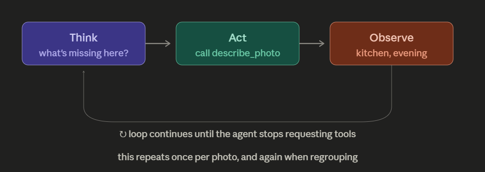

# Star Gazer — Agent Design

**Week 5 — Agentic AI Fundamentals · Day 1 · Agents vs Chatbots**

---

## 1. The scenario

People accumulate tens of thousands of photos. When a memory surfaces and they want to show someone, they scroll — and mostly they give up.

Search solves part of this, but only part. Apple Photos and Google Photos will find "photos from Taif" if you ask. **The catch is that you have to be able to describe what you want before you can look for it.** The memory you're chasing is often exactly the one you can't put into words — you know it exists, you can half-see it, and you have no query that reaches it.

And search depends on annotation. A photo with GPS and a clean timestamp is findable. A screenshot, a forwarded image, a scan of an old print, anything that passed through WhatsApp — those arrive with nothing attached. **The photos most likely to be lost are the ones with the least metadata.** Any system built on EXIF fails hardest exactly where the problem is worst.

Star Gazer treats the collection as a night sky. Each photo is a star. The user moves freely through the space and looks around — no query required.

Two problems have to be solved for that to work:

> **1. What is each photo actually of?**
> **2. Where does each star go?**

Neither can be answered from a file header. Both are the agent's job.

---

## 2. Objective

> Given an unorganised folder of photos — **with or without metadata** — determine what each one depicts, arrange them in 3D so proximity reflects relatedness, and group them into named **constellations** corresponding to coherent memories.

**Success criterion:** a person who has never seen the collection should be able to look at a constellation and guess what its photos share *before* reading the name.

**Hard requirement:** a photo with no timestamp and no GPS must be placed as confidently as one with both. If the system can only handle annotated photos, it has not solved the problem.

---

## 3. Why this needs an agent

**A chatbot cannot do it.** No access to the files, no ability to write positions into a scene.

**A script cannot do it.** Clustering on timestamps and coordinates is arithmetic. It cannot look at a photo and determine it shows a kitchen, and it certainly cannot decide that nine kitchen photos spread across four years are one story worth naming.

**The judgment is irreducible.** "What is this photo about?" has no single correct answer — a photo of a cake at a table with six people is about the cake, or the people, or that birthday, depending on the rest of the collection. Deciding which reading matters *here* requires context the photo doesn't contain.

**The number of steps is unknown in advance.** How much looking, regrouping and revising is needed depends entirely on what this collection turns out to be. If you can draw the flowchart before running it, it isn't an agent.

---

## 4. Tools

| Tool | Type | Signature |
|---|---|---|
| `describe_photo` | **web API (vision)** | `(image) -> {subjects, setting, time_of_day, indoor_outdoor, visible_text, confidence}` |
| `read_photo_metadata` | local | `(folder) -> [ {id, filename, timestamp?, lat?, lon?} ]` |
| `reverse_geocode` | **web API** | `(lat, lon) -> {place, city, country}` |
| `get_collection_summary` | perception | `() -> {count, described, themes_seen, metadata_coverage}` |
| `propose_constellation` | action | `(photo_ids, name, rationale, evidence) -> {accepted, errors}` |
| `get_constellations` | perception | `() -> [ {name, photo_ids, locked} ]` |

`describe_photo` is the primary tool. Everything downstream depends on it, and it is the only tool that works on every photo in the collection regardless of what the camera recorded.

`reverse_geocode` (Nominatim, OpenStreetMap) is secondary — it enriches the subset of photos that carry GPS. Useful, not load-bearing.

**Day 2 uses `describe_photo` only.**

### Notes on the vision call

- Ask for **structured output** with a confidence field per attribute, not free prose. Prose invites embellishment; a schema constrains it.
- **Cache every response to disk keyed by file hash.** One call per photo, ever. Re-runs during development must not re-bill or re-wait.
- Do not request identity. "Two people" is in scope; naming them is not.

### Notes on Nominatim

1 request/second maximum, a `User-Agent` identifying the application, visible ODbL attribution, responses cached. Round coordinates to ~100m and deduplicate before geocoding — 10,000 photos rarely contain more than 100 distinct places.

### Privacy

A real deployment would be sending someone's entire personal photo library to a third-party API. This project uses a synthetic test collection, so nothing sensitive leaves the machine — but the production answer is a local vision model (Ollama with a vision-capable model), and the design should not assume otherwise.

---

## 5. Inputs

- A folder of image files, with arbitrary and mostly absent metadata
- A user instruction (`"organise my sky"`, `"find the ones by the sea"`)
- Persisted memory: named constellations, user corrections, stated preferences, the description cache

---

## 6. Outputs

- **`sky.json`** — every photo's 3D position, constellation membership, and the evidence behind each grouping
- **A rendered 3D sky** — Three.js, free camera, click a star to enlarge
- **A sparse region** — a visually distinct area for photos the agent could not confidently place
- **`trace.log`** — every thought, action and observation

---

## 7. Decision process

### The boundary

| The agent decides | The code decides |
|---|---|
| What each photo is *about* | Calling the vision API, caching, retries |
| Which photos form one memory | Embedding and projecting to 3D coordinates |
| What to name a constellation | Whether a proposed grouping passes validation |
| Which axis matters — theme, place, time, or a mix | EXIF parsing, coordinate dedupe |
| When the evidence is too thin to group at all | Rate limiting |

Anything with a right answer belongs to the code.

### Placement

Once every photo has a description, positions are computed rather than chosen: embed each description, reduce to three dimensions, and spatial proximity *becomes* semantic similarity. The sky is then meaningful at every scale — drift toward a region and the photos grow more alike, without anyone having drawn a boundary.

Constellations are the agent's reading of the dense areas in that space. Placement is deterministic; interpretation is not.

### The ReAct loop

```
Thought:      I know nothing about this collection. Sample before committing to
              any grouping strategy.
Action:       get_collection_summary()
Observation:  312 photos. 0 described. 61 have no GPS, 12 have no usable timestamp.

Thought:      Metadata coverage is poor, so place and date can't carry this.
              Description first, everything else after.
Action:       describe_photo("IMG_0431.jpg")
Observation:  {subjects: [food, table, hands], setting: kitchen, indoor,
               time_of_day: evening, confidence: 0.9}

Thought:      Eleven photos so far read as the same kitchen. Four have GPS and it
              agrees. Seven have none — but the room is the same. Metadata would
              have thrown those seven away.
Action:       propose_constellation([...], "The Hearth",
                                    "Same kitchen, 11 photos, 4 years")
Observation:  accepted

Thought:      These nine share warm light and outdoor settings and nothing else.
              That is a visual coincidence, not a memory. Leave them sparse.
```



The last step is the one that matters. Declining to group is a decision, and an agent that never makes it is broken.

---

## 8. Memory (built Day 3)

- **Conversation memory** — the message history within a session
- **Persistent state** — the description cache, named and renamed constellations, user corrections, preferences, the geocode cache

**Design principle: a human correction outranks a machine grouping, permanently.** An agent that re-scrambles someone's memories after they've fixed them is worse than no agent. Corrected constellations lock and are excluded from regrouping.

---

## 9. Anticipated failure modes (addressed Day 5)

**1. Confabulated coherence.** Shown twelve unrelated photos and asked what they share, an LLM will answer. It will not say "nothing." This is the defining risk of the whole project, and the metaphor is exact: real constellations are unrelated stars at wildly different distances, connected because ancient people wanted a story. The question for Day 5 is whether this agent finds memories or repeats that mistake.
*Test:* feed it deliberately random control groups and require rejection. If it names a constellation for a random sample, the threshold is wrong.

**2. Hallucinated content.** A birthday cake described in a photo containing no cake — and now a memory is filed under an event that never happened. Worse than a wrong search result, because the user may believe it.
*Direction:* constrained schema output with per-field confidence; low-confidence observations may support a grouping but never justify one alone.

**3. Semantic over-merging.** Everything containing sand collapses into "The Beach" — three separate trips across five years flattened into one meaningless blob.
*Direction:* require corroboration across more than one signal, and force a split when internal variance exceeds a threshold.

---

## 10. Scope

**In scope (v1):**
- Vision-derived description of every photo
- Metadata as supporting evidence where present
- Embedding-based placement, agent-named constellations
- Minimal viewer — sprites in Three.js, free camera, click to enlarge
- Synthetic test set of ~300 photos, deliberately including images with no metadata at all

**Out of scope:**
- Face recognition or identity
- A polished gallery UI

The deliverable is the agent that reads and arranges the sky. The viewer only needs to be good enough to show that the arrangement means something.