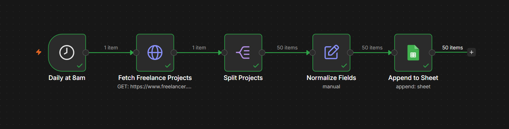
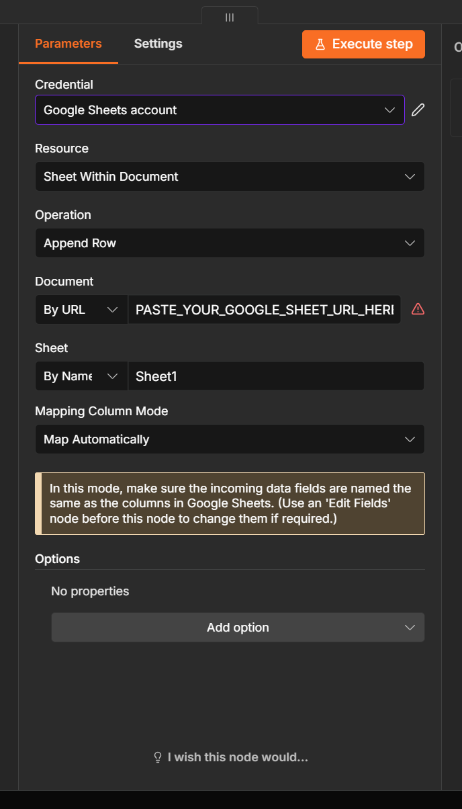
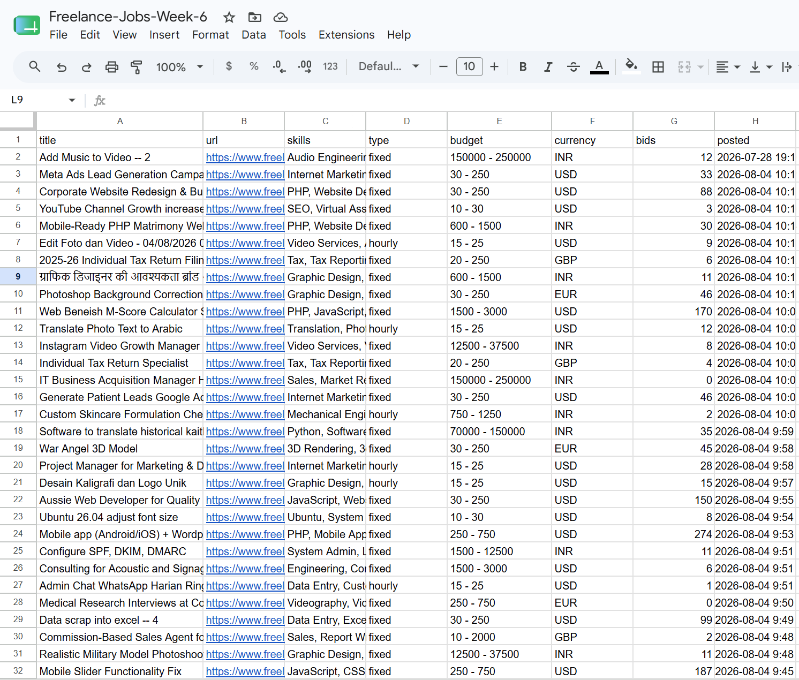
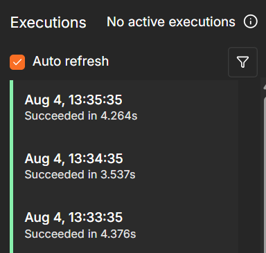
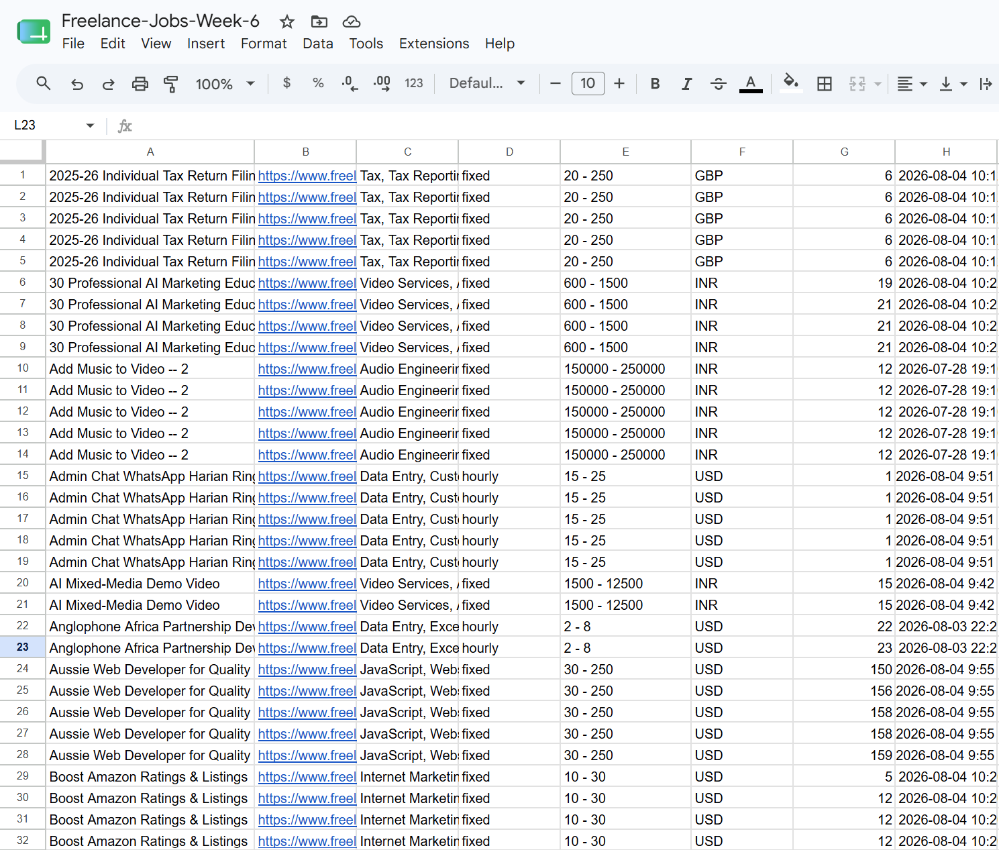

# 📘 Day 1 Report — Automation Foundations & Intro to n8n

**🎯 Focus:** n8n basics — nodes, triggers, scheduling — and designing a multi-step workflow that runs without me

**📝 Assigned task (per the Week 6 plan):** *"Build an n8n workflow that runs automatically on a schedule and performs at least two connected actions."*

**📅 Date:** 2026-08-04

**✅ Status:** Completed

---

## 🗂️ Folder structure

```
📁 Day-1-Automation-Foundations-and-Intro-to-n8n/
├── 📄 DAY1-REPORT.md                    ← this report
└── 📁 Introduction-to-n8n/
    ├── 📄 scheduled-job-fetch.json      ← exported n8n workflow
    └── 📁 screenshots/
        ├── 🖼️ simple-workflow.png
        ├── 🖼️ setting-up-the-sheet-node.png
        ├── 🖼️ automation-every-min-test.png
        ├── 🖼️ output.png
        └── 🖼️ duping-issue.png
```

---

## 🎯 Objective

Learn n8n by building the first real piece of **FreelanceScout** — the Week 6 project, an agent that reads your CV and returns the freelance jobs that match your skills.

Day 1 deliberately builds the **data spine only**: a workflow that wakes itself up on a schedule, pulls live freelance projects from an external API, reshapes them, and files them into a spreadsheet. No AI, no CV — those arrive on Day 3. The point today was to understand nodes, triggers, and how data actually moves between them.

## 🧠 1. What got built

**`scheduled-job-fetch.json`** — a five-node n8n workflow:

```
Schedule Trigger (daily 08:00)
   → HTTP Request   (Freelancer.com API)
   → Split Out      (projects array → one item per project)
   → Edit Fields    (normalize to 8 columns)
   → Google Sheets  (append rows)
```



The task asked for **two** connected actions; this runs **four**. The item counts along the connectors (`1 item → 1 item → 50 items → 50 items → 50 items`) show the Split Out node doing the important work — turning a single API response containing 50 projects into 50 separate items, so the Sheets node writes 50 rows instead of one unreadable blob.

The Google Sheets node was the only one needing credentials — n8n Cloud handles the Google OAuth handshake, so it was one "Sign in with Google" rather than building an OAuth app.



### Columns stored

| Column | Meaning |
|---|---|
| `title` | project title |
| `url` | direct link to the project |
| `skills` | skills the client tagged the project with |
| `type` | `fixed` or `hourly` |
| `budget` | e.g. `250 - 750` |
| `currency` | USD, INR, EUR, GBP… |
| `bids` | how many freelancers have already bid — i.e. competition |
| `posted` | when it went live |

`skills` is the column that matters most later: **Day 3 matches it against the skills extracted from my CV.**

## 🔄 2. The source was wrong, and I changed it mid-build

The workflow was first built against the **Remotive** API — free, no key, easy to start with. It worked on the first run and wrote 31 rows.

Then I actually read the output, and the project premise fell apart: **Remotive is a *remote* job board, not a freelance one.** Remote ≠ freelance. Of the 31 rows returned:

| job_type | count |
|---|---|
| `full_time` | 23 |
| `contract` | 3 |
| `freelance` | 2 |
| `part_time` | 2 |
| *(blank)* | 1 |

Only **5 of 31** were freelance work. Filtering to just those would have left a 5-row product built on a source that is 85% irrelevant to what FreelanceScout is for.

So I replaced the source with the **Freelancer.com public API**, where every listing is a freelance project by definition — **50 of 50 qualify, no filtering needed.** It also returns richer, more useful fields: an explicit skills list per project, budget range, currency, and live bid counts.



Swapping the source also removed a column. The old schema had `company`, which made sense for job listings — but freelance projects are posted by individual **clients**, not employers, so there is no company to store. `budget` and `bids` replaced it as the genuinely useful signals.

**The lesson:** I picked the first API that was free and easy instead of the one that matched the problem, and only caught it by reading real output rather than trusting that it ran without errors.

## 🐛 3. Bug found: bid counts silently turned into 1899 dates

After the source swap, the `bids` column rendered as dates — `1899-12-30`, `1900-01-08`, `1900-03-31` — instead of numbers.

**Cause:** two things stacking.

1. **Stale cell formatting.** In the old Remotive schema, column G held `posted`, a date column. I deleted the rows but not the *formatting*, so column G was still marked "date."
2. **`USER_ENTERED` mode.** By default the Sheets node sends values as though a human typed them, which invites Google to reinterpret them. Google Sheets counts days from 30 Dec 1899 — so a bid count of `0` displays as `1899-12-30` and `91` as `1900-03-31`.

The tell was that the corruption **stopped exactly at row 33** — the old data had ended at row 32, so there was no stale formatting past it.

**Fix:** clearing the stale formatting and setting the column explicitly to **Number** — not "Automatic", which is free to guess wrong again. Setting the node's cell format option to `RAW` (storing values exactly as n8n sends them, with no interpretation) is the belt-and-braces version of the same fix; it turned out not to be needed once the column formatting was corrected.

Worth recording because n8n was never wrong here — it sent correct integers the whole time. The destination corrupted them on arrival, and nothing errored. A workflow that "succeeds" can still produce wrong data.

## ⏰ 4. Proving it actually runs on a schedule

Clicking **Execute Workflow** only proves a workflow *works* — not that it's *scheduled*, which is what the task asks for. That needs the workflow **Published** (this n8n version's name for Activate) and left alone.

I temporarily set the trigger to every minute, published it, and let it run untouched:



Three consecutive runs — 13:33:35, 13:34:35, 13:35:35 — exactly 60 seconds apart, all succeeded, none triggered by me. The trigger was then set back to daily at 08:00.

## 🔁 5. Second finding: duplication across runs

Those repeated runs surfaced the next real problem. Every run appends all 50 current projects, with no memory of what it already stored — so after four runs the sheet held the same projects four and five times over:



The interesting part is that **the duplicates aren't identical.** Look at *Aussie Web Developer for Quality*: `150 → 156 → 158 → 158 → 159` bids across runs. The `bids` field changes minute to minute as freelancers bid.

That rules out the naive fix. Deduping cannot compare whole rows, because no two copies are the same row. It has to key on something **stable** — `url` or `title` — and then decide whether to keep the first copy or overwrite with the freshest bid count.

That is Day 2's problem, and now it's grounded in observed data instead of an assumption.

## 📦 6. Deliverables produced today

1. **`Introduction-to-n8n/scheduled-job-fetch.json`** — the exported workflow, importable into any n8n instance.
2. **`Introduction-to-n8n/jobs-output.csv`** — the actual sheet contents exported, so the output is reviewable without needing access to my Google account. The header row has been restored to line 1 (the sort had left it at line 214), but the data itself is untouched: **all 250 rows are kept**, duplicates included, because that accumulation across repeated scheduled runs is the evidence for the duplication problem described above — and the problem Day 2 exists to fix.
3. **`Introduction-to-n8n/screenshots/`** — canvas, node config, scheduled-execution proof, output, and the duplication issue.
4. **`DAY1-REPORT.md`** — this report.

> **Note on hosting:** Week 6 runs on an n8n Cloud trial. Every workflow is exported to this repo as JSON at the end of each day, so the work survives the trial expiring and can be re-imported into a self-hosted instance for the Week 7 capstone.

> **Attribution:** job data comes from the public Freelancer.com API. The `url` column links back to each original project.

---

## 🎓 Reflection

**Daily Task Completed:** Built a scheduled n8n workflow that pulls 50 live freelance projects from an external API every morning, reshapes them into 8 clean columns, and appends them to Google Sheets — verified running on its own, unattended.

**What I Learned:** How n8n actually moves data between nodes — particularly that an API returning an array is still *one item* until you split it, which is the difference between 50 rows and one unreadable cell. Also that a green checkmark on every node doesn't mean the data is right.

**Challenges Faced:** Three. I built on a remote-jobs API that turned out to be only 15% freelance. Bid counts silently converted into 1899 dates in Google Sheets. And each scheduled run duplicated everything already stored.

**How I Solved Them:** Swapped to the Freelancer.com API, where 100% of listings are freelance projects and the data is richer. Traced the date bug to leftover column formatting combined with `USER_ENTERED` mode, and fixed it by clearing the stale format and pinning the column to Number. Left the duplication unfixed on purpose — it's Day 2's assignment, and I now know from real data that deduping has to key on `url`, not on comparing rows, because bid counts shift between runs.

---

## 🚀 Next steps — Day 2 (Connecting Tools & APIs)

Per the plan: connect two external APIs and exchange data between them. For FreelanceScout that means adding a second freelance source alongside Freelancer.com, merging both feeds, and **deduping on a stable key** so the sheet stops accumulating the same projects — the exact problem this day's scheduled runs exposed.

---

## 📚 References

- **[`Introduction-to-n8n/scheduled-job-fetch.json`](Introduction-to-n8n/scheduled-job-fetch.json)** — the workflow built today
- **[`Introduction-to-n8n/jobs-output.csv`](Introduction-to-n8n/jobs-output.csv)** — the data this workflow actually produced
- **Freelancer.com API** — `https://www.freelancer.com/api/projects/0.1/projects/active/`
- **n8n docs** — Schedule Trigger, Split Out, Edit Fields, Google Sheets nodes
