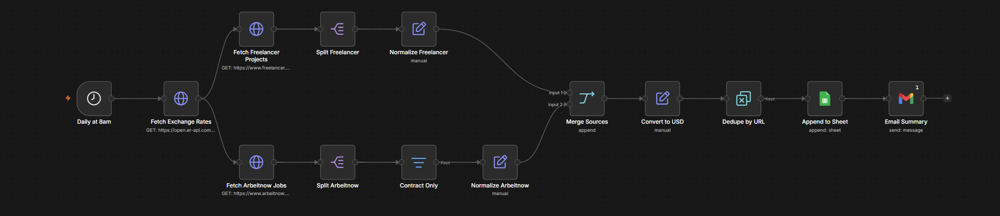
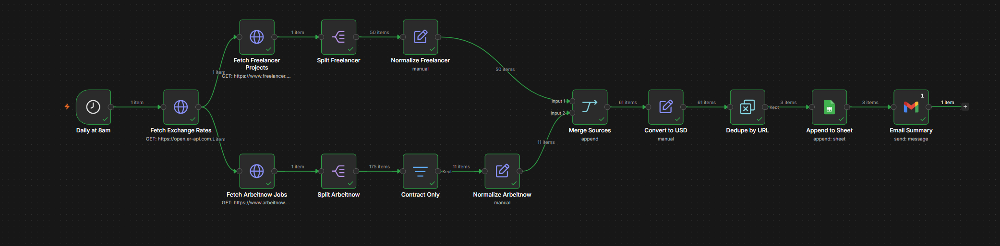
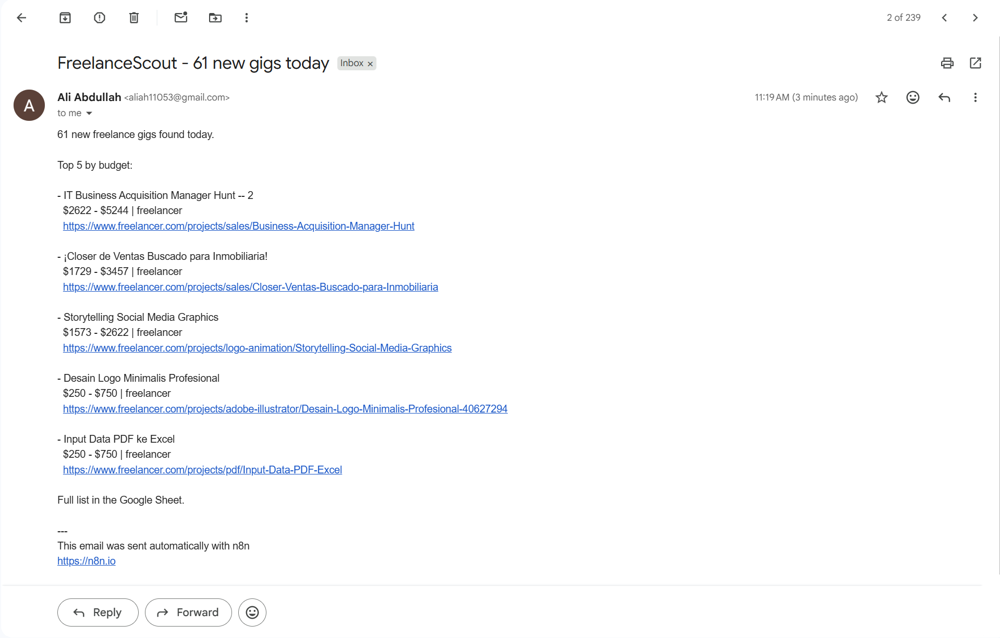

# 📘 Day 2 Report — Connecting Tools & APIs in n8n

**🎯 Focus:** Wiring external services into one workflow — API integration and node-based automation

**📝 Assigned task (per the Week 6 plan):** *"Connect two external APIs inside n8n and exchange data between them successfully."*

**📅 Date:** 2026-08-05

**✅ Status:** Completed

---

## 🗂️ Folder structure

```
📁 Day-2-Connecting-Tools-and-APIs-in-n8n/
├── 📄 DAY2-REPORT.md                       ← this report
└── 📁 Multiple-Connections/
    ├── 📄 multi-api-job-pipeline.json      ← exported n8n workflow
    └── 📁 screenshots/
        ├── 🖼️ workflow.png
        ├── 🖼️ workflow-executed.png
        ├── 🖼️ sheet output.png
        └── 🖼️ gmail-confirm.png
```

---

## 🎯 Objective

The task asks for two external APIs. This workflow connects **three APIs and two tools**, and — more importantly — makes the data genuinely *flow between* them rather than running three fetches side by side.

It also fixes the duplication bug that Day 1's scheduled runs exposed.

## 🔌 1. What connects to what

| # | Service | Kind | Role |
|---|---------|------|------|
| 1 | **Freelancer.com API** | API (HTTP Request) | primary source — 50 live freelance projects |
| 2 | **Arbeitnow API** | API (HTTP Request) | second source — contract roles |
| 3 | **open.er-api.com** | API (HTTP Request) | enrichment — live USD exchange rates |
| 4 | **Google Sheets** | tool (dedicated node) | storage |
| 5 | **Gmail** | tool (dedicated node) | notification |

The day is called *"Connecting tools **and** APIs"*, and those are two different things in n8n: a **tool** is a service with its own dedicated node that handles auth for you (Google Sheets, Gmail), while an **API** is anything you call yourself through the generic HTTP Request node. This workflow uses both kinds.



```
Schedule Trigger
   → Fetch Exchange Rates
        ├→ Freelancer.com → Split → Normalize ─┐
        └→ Arbeitnow → Split → Filter → Normalize ─┤→ Merge
                                                    → Convert to USD
                                                    → Dedupe by URL
                                                    → Google Sheets
                                                    → Gmail
```

## 💱 2. The actual "exchange data between them"

Three parallel fetches stapled together would satisfy the task on a technicality. This does something real: **output from the job APIs is fed into the exchange-rate API's data to produce something neither could produce alone.**

Freelancer.com returns budgets in whatever currency the client posted in:

```
150000 - 250000  INR
    250 -    750  USD
     20 -    250  GBP
    600 -   1500  INR
```

Those numbers are not comparable. Is a ₹150,000 project bigger than a $250 one? You can't tell by looking, and Day 3's ranking step certainly can't.

The rates API is fetched **first**, so every downstream item can reach back into it by currency code and convert:

```javascript
$json.budget_min / $('Fetch Exchange Rates').first().json.rates[$json.currency]
```

That ₹150,000–250,000 project becomes **$1,573 – $2,622**. Every gig now sits on one comparable scale, which is what makes ranking possible at all.



## 🔎 3. Choosing the second source — by testing, not assuming

Day 1's lesson was that picking a source because it's convenient produces the wrong data. So before wiring anything, I tested four candidates against live responses:

| Candidate | Result | Verdict |
|---|---|---|
| **RemoteOK** | 100 jobs — **0** tagged contract or freelance, 0 with salary data | ❌ rejected |
| **Jobicy** | 50 jobs — **50/50 full-time** | ❌ rejected |
| **Remotive** | already rejected on Day 1 (5 freelance of 31) | ❌ rejected |
| **Arbeitnow** | 175 jobs — **11 genuine contract roles** | ⚠️ accepted, with caveats |

Arbeitnow made it in, but honestly: its 11 contract roles skew heavily to one employer and are Germany-focused. It satisfies the task and teaches multi-source merging, but it is not strong job-hunting material.

The wider finding is that **freelance-native job APIs barely exist publicly.** Remote job boards are plentiful; freelance ones are almost all gated (Upwork's API is partner-only, Fiverr has none). Freelancer.com is the exception, which is why it stays the primary source.

## 🐛 4. Bug: one API returning two different shapes for the same field

The contract filter crashed:

```
Conversion error: the object '[object Object]' can't be converted to an array
[condition 0, item 112]
```

Checking the raw response explained it — **Arbeitnow returns `job_types` as an array for 132 of 175 items and as an object for the other 43:**

```json
"job_types": ["Contract"]      ← 132 items
"job_types": {"1": "entry"}    ← 43 items
```

Same endpoint, same field, two incompatible types. An "array contains" test works on most items and throws on the rest, so it only surfaces once you hit item 112.

**Fix** — stop assuming the shape and compare as text instead:

```javascript
{{ JSON.stringify($json.job_types || '') }}   contains   "Contract"
```

`["Contract"]` still matches, `{"1":"entry"}` correctly doesn't, and nothing can throw a type error. This is the kind of thing no API documentation warns you about — you only find it by running against the full dataset rather than the first few records.

## ♻️ 5. Fixing Day 1's duplication bug

Day 1 ended with the sheet accumulating the same projects on every scheduled run — and with the observation that **the duplicates weren't identical**, because bid counts drift between runs (one project went 150 → 156 → 158 → 159). That ruled out comparing whole rows.

The fix is a **Remove Duplicates** node set to *"Remove Items Processed in Previous Executions"*, keyed on `url`:

```
Value to Dedupe On:  {{ $json.url }}
Keep Items Where:    Value Is New
```

n8n remembers every `url` it has already passed through, across executions — so a gig seen yesterday is dropped today even though its bid count changed. `url` works as the key precisely because it's the one field that never changes.


Verified by re-running: the second execution added nothing, which is the correct behaviour rather than a broken workflow.

> **Import note:** the dedupe node imported with an empty key. The parameter is named `dedupeValue` in this n8n version, not `keyValue`, so it silently didn't map and had to be filled in through the UI. Worth knowing that a workflow JSON written for one n8n version can import "successfully" while quietly dropping fields.

## 📧 6. Second tool: the Gmail notification

Storing results in a sheet you have to remember to open isn't really automation. The Gmail node closes the loop with a summary — count of new gigs, and the top five by converted USD budget:



One detail that matters: the Gmail node is set to **Execute Once**. Without it, n8n runs a node once *per item* — 60 gigs would have sent 60 separate emails. Instead it aggregates across all items and sends a single digest.

This also sets up Day 4, whose human-approval checkpoint uses Gmail's send-and-wait — the credential is now already working.

## 🎭 7. A bug that wasn't

A full row of column headers appeared in the middle of the data, at row 59. It looked like the append step had gone wrong mid-write.

It hadn't. **I had sorted the sheet, and the sort range included row 1** — so the header row was treated as data and sorted alphabetically into position, landing between "TIA Portal S7-1200 Programming" and "Unique Brand Name Creation":

```
TIA Portal S7-1200 Programming
title                              ← the header row
Unique Brand Name Creation for F&B
```

Exactly where the word "title" belongs alphabetically.

Recording it because the *reasoning* was the mistake, not the tool: I read row position as evidence about which source wrote what, on a sheet whose rows had been reordered. Freezing the header row (**View → Freeze → 1 row**) stops Google including it in sorts.

## ⚠️ 8. Known limitations

- **Arbeitnow rows have no budget.** That API doesn't publish salary data, so those rows carry `0` budgets and no currency. The `source` column distinguishes them. Normalizing genuinely mismatched schemas into one table means accepting some columns won't apply to every row.
- **Non-English listings pass through.** Roughly 7 of 50 Freelancer projects come back in Spanish, German, Turkish, Chinese, Indonesian or French. The API exposes a reliable `language` field, so filtering is a one-node change — deliberately left out for now, since Day 3's AI ranking will score irrelevant gigs low anyway.

## 📦 9. Deliverables produced today

1. **`Multiple-Connections/multi-api-job-pipeline.json`** — the exported 14-node workflow.
2. **`Multiple-Connections/screenshots/`** — workflow, execution, sheet output, and the confirmed email.
3. **`DAY2-REPORT.md`** — this report.

---

## 🎓 Reflection

**Daily Task Completed:** Connected three external APIs and two tools in a single n8n workflow, with live exchange-rate data genuinely flowing into the job data to convert every budget into comparable USD — then deduped, stored in Google Sheets, and emailed as a digest.

**What I Learned:** That "connecting two APIs" and "exchanging data between them" are different bars, and the second one is the interesting one. Also learned n8n's distinction between a *tool* (dedicated node, handles its own auth) and an *API* (raw HTTP Request), and that the Execute Once setting is the difference between one summary email and sixty.

**Challenges Faced:** The contract filter crashed on item 112 because Arbeitnow returns `job_types` as an array for some records and an object for others. The dedupe node imported with an empty key field. And a header row appeared mid-data in the sheet, which looked like a write bug.

**How I Solved Them:** Made the filter type-agnostic by stringifying the field before comparing, so neither shape can throw. Filled the dedupe key manually after finding the parameter is called `dedupeValue` in this n8n version. And the header row turned out to be my own doing — I had sorted the sheet including row 1, so the header sorted alphabetically into the middle of the data.

---

## 🚀 Next steps — Day 3 (AI Workflows & Chaining Agents)

Per the plan: multiple LLM steps processing data sequentially before producing a final output. This is where FreelanceScout stops being a job scraper and starts being an agent — reading my CV, extracting a skill profile, scoring each gig against it, and returning the top matches. The `skills` column collected over Days 1–2 is what those steps run against.

---

## 📚 References

- **[`Multiple-Connections/multi-api-job-pipeline.json`](Multiple-Connections/multi-api-job-pipeline.json)** — the workflow built today
- **[`../Day-1-Automation-Foundations-and-Intro-to-n8n/DAY1-REPORT.md`](../Day-1-Automation-Foundations-and-Intro-to-n8n/DAY1-REPORT.md)** — Day 1, where the duplication bug was found
- **Freelancer.com API** — `https://www.freelancer.com/api/projects/0.1/projects/active/`
- **Arbeitnow API** — `https://www.arbeitnow.com/api/job-board-api`
- **ExchangeRate API** — `https://open.er-api.com/v6/latest/USD`
