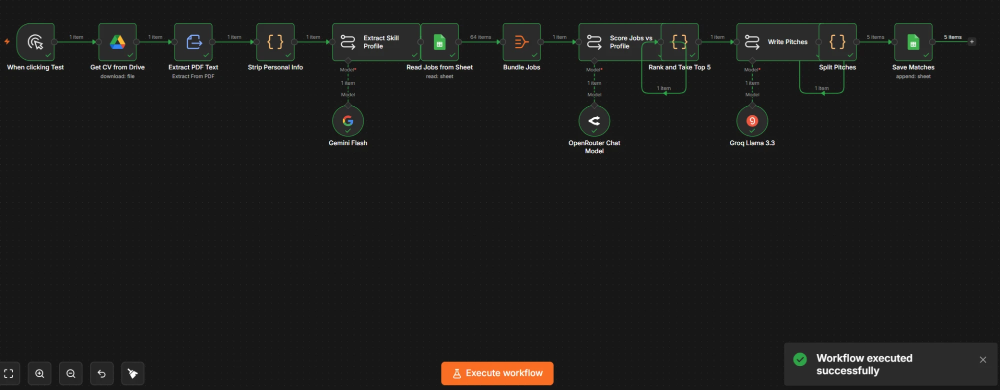
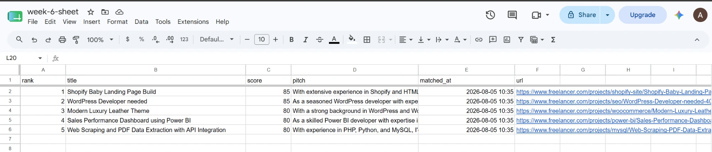

# 📘 Day 3 Report — AI Workflows & Chaining Agents

**🎯 Focus:** Chaining multiple LLM steps so each one consumes the last one's output

**📝 Assigned task (per the Week 6 plan):** *"Create an AI workflow where multiple LLM steps process data sequentially before producing a final output."*

**📅 Date:** 2026-08-05

**✅ Status:** Completed

---

## 🗂️ Folder structure

```
📁 Day-3-AI-Workflows-and-Chaining-Agents/
├── 📄 DAY3-REPORT.md                    ← this report
└── 📁 Multiple-LLMs/
    ├── 📄 cv-matching-chain.json        ← exported n8n workflow
    ├── 📄 synthetic-cv.pdf              ← test fixture (fully fictional)
    └── 📁 screenshots/
        ├── 🖼️ workflow-executed.png
        └── 🖼️ matches-output.png
```

---

## 🎯 Objective

This is the day FreelanceScout stops being a job scraper and becomes the thing it was meant to be: **give it a CV, get back the freelance gigs that actually fit.**

Days 1–2 collected 64 gigs into a spreadsheet. Day 3 reads a CV, works out what that person is good at, scores every gig against it, and writes a tailored pitch for the best five — across **three chained LLM steps using three different models**.

## 🔗 1. The chain

```
CV in Google Drive
  → Extract PDF Text
  → Strip Personal Info
  → [LLM 1 · Gemini 2.0 Flash]      CV text  →  structured skill profile
  → Read 64 jobs from Google Sheet
  → Bundle into one payload
  → [LLM 2 · DeepSeek via OpenRouter]  profile + jobs  →  score 0-100 + reasoning
  → Rank, take top 5
  → [LLM 3 · Llama 3.3 70B on Groq]    profile + top 5  →  tailored pitch each
  → Save to "Matches" tab
```



The item counts along the canvas tell the story: `1 → 64 → 1 → 1 → 5 → 5`. One CV in, 64 gigs read, bundled into a single scoring call, ranked down to 5, five pitches out.

Each LLM step genuinely depends on the one before it. LLM 2 cannot score without LLM 1's profile; LLM 3 cannot write pitches without LLM 2's ranking. That sequential dependency is what the task asks for — not three models called in parallel.

### Why three different models

| Step | Model | Why this one |
|---|---|---|
| Skill extraction | **Gemini 2.0 Flash** | Everything downstream depends on this returning clean, schema-correct JSON from messy PDF text. Gemini is the most reliable of the three at schema-following. |
| Scoring 64 gigs | **DeepSeek** (via OpenRouter) | The heaviest reasoning step — judging fit and justifying it. |
| Writing pitches | **Llama 3.3 70B** (Groq) | Pure generation, no reasoning load. Groq is the fastest inference available. |

### A deliberate choice: no AI Agent node

The day's activity description mentions n8n's **AI Agent** node. I used **Basic LLM Chain** nodes instead, and that was intentional.

An Agent exists to run a tool-calling loop — deciding *which* tool to invoke and *when*, iterating until done. None of these three steps need that. Each is a single deterministic transformation: known input, known output shape, one call. Wrapping them in Agents would add a reasoning loop with nothing to reason about, and make the workflow slower and harder to debug for appearance's sake.

The task itself asks for *"multiple LLM steps process data sequentially"* — which is exactly what a chain of Basic LLM Chain nodes is.

## 🔒 2. Privacy: the CV is the input, and CVs are personal data

This step sends a document containing a name, email, phone number and full employment history to three third-party APIs. Two decisions followed from that.

**A fully synthetic CV.** `synthetic-cv.pdf` is an invented person — "Marcus Silva", a freelance web/e-commerce developer in Lisbon. Employers, clients, projects and certifications are all fabricated. Nothing real leaves the workflow, and it's safe to commit to a public repo, which a real CV would not be.

The first draft of this fixture mirrored my own skill profile with only the name changed. That was rejected on review — the project names alone made it identifiable, which defeats the point. It was rebuilt as a genuinely different person in a different field.

**A PII-stripping node.** `Strip Personal Info` removes emails, phone numbers and URLs from the extracted text before it reaches any model:

```javascript
raw.replace(/[\w.+-]+@[\w-]+\.[\w.]+/g, '[email removed]')
   .replace(/\+?\d[\d\s().-]{7,}\d/g, '[phone removed]')
   .replace(/\b(?:https?:\/\/|www\.)\S+/gi, '[link removed]')
```

Redundant for a fake CV — but Week 7 runs a **real** CV through this same chain, and contact details contribute nothing to skill matching anyway. Better to have it already working than to add it once it matters.

### Choosing a fixture that can actually fail the test

The synthetic CV was built so match quality is **measurable rather than eyeballed**. Marcus is a WordPress/Shopify/PHP developer, and the collected gigs contain a clean split:

| Should rank high | Should rank near zero |
|---|---|
| WordPress Developer needed | 40 Romantic Voice Samples |
| Shopify Baby Landing Page Build | Cartoon 2D Kids Animation |
| Sales Performance Dashboard (Power BI) | Roof Waterproofing CAD Detailing |
| Web Scraping and PDF Data Extraction | Amharic to English Legal Translation |

A test with a predicted wrong answer is worth far more than "the output looks reasonable."

## ✅ 3. Results



| Rank | Gig | Score | Correct? |
|---|---|:---:|---|
| 1 | Shopify Baby Landing Page Build | 85 | ✅ core skill |
| 2 | WordPress Developer needed | 85 | ✅ core skill |
| 3 | Modern Luxury Leather Theme (WooCommerce) | 80 | ✅ core skill |
| 4 | Sales Performance Dashboard using Power BI | 80 | ✅ in CV, plus a project |
| 5 | Web Scraping and PDF Data Extraction with API | 80 | ✅ two of his projects |

**Five out of five correct, out of 64 candidates** — most of which were irrelevant. Nothing from voice acting, animation, CAD or translation reached the top 5.

**The anti-fabrication guardrail held.** Every skill claimed across the five pitches — Shopify, HTML, PHP, CSS, WordPress, WooCommerce, Power BI, SQL, Python, MySQL — appears in the CV. Nothing was invented.

That was checked rather than assumed, because Week 5 ended with an agent confidently claiming work it had not done. The prompts carry explicit guardrails from that lesson: LLM 1 is told to only list skills literally present in the CV, LLM 2 that a gig requiring absent skills *must* score below 20, LLM 3 never to invent experience.

## ⚠️ 4. Where it falls short: the pitches are generic

The matching is strong. The writing is not, and it would be dishonest to present the day as a clean win.

Reading the five pitches side by side:

- *"…will enable me to deliver a high-quality solution that meets your requirements"* appears in **three of five** — exactly the filler the prompt banned
- Every pitch follows an identical skeleton: *"With experience in X, I'd start by… I'd then focus on… My core skills will enable me to…"*
- **Not one references an actual project.** The multi-currency Shopify storefront, the scraper covering eleven supplier sites, the invoice tool at ~95% accuracy across forty vendor formats — none of it appears

Those are the strongest things on the CV. Pitch #5 tells a client Marcus knows Python; the CV could have told them he has built precisely this twice.

**The cause is a design flaw in the chain, not a model failure.** LLM 1's output schema extracts `core_skills`, `secondary_skills` and `domains` — but not projects. LLM 3 only ever receives that profile, so it never sees the project history. It wrote the best pitch available from what it was handed.

**Logged, not fixed.** Day 3's task is satisfied, and the fix belongs in the Week 7 capstone where pitch quality actually matters: add `notable_projects` to LLM 1's schema, require LLM 3 to cite one specific past project per pitch, and ban the filler phrasing explicitly.

## 🐛 5. Three things that went wrong getting here

**DeepSeek had no free tier.** Secondary sources reported a 5M-token signup grant. The account dashboard said otherwise — $0.00 balance, 0 requests, `Insufficient Balance` on the first call. Switched to **OpenRouter**, which serves DeepSeek models free, keeping the three-model design intact.

**OpenRouter then rejected the request over token reservation:**

```
You requested up to 65536 tokens, but can only afford 25000
```

Not a refusal of the request — a refusal of the *reservation*. The model's default `max_tokens` is 65536, and OpenRouter reserves credit for the worst case. Capping `maxTokens` at **4096** fixed it, comfortably above the ~3,000 tokens the scoring output actually needs.

**Imported dropdown values were labels, not selections.** The Google Drive and Sheets nodes displayed the right filenames after import but carried no underlying file ID — the same failure as Day 2's dedupe key, which imported with an empty value because the parameter is named `dedupeValue` in this n8n version rather than `keyValue`. **Working rule now: after importing a workflow, re-select every dropdown instead of trusting the text inside it.**

## 📦 6. Deliverables produced today

1. **`Multiple-LLMs/cv-matching-chain.json`** — the 15-node, three-model workflow.
2. **`Multiple-LLMs/synthetic-cv.pdf`** — the fully fictional test CV.
3. **`Multiple-LLMs/top-5-matches.csv`** — the ranked matches and full pitch text, so the output can be read and judged directly rather than taken on trust from a screenshot.
4. **`Multiple-LLMs/screenshots/`** — successful execution and the ranked output.
5. **`DAY3-REPORT.md`** — this report.

---

## 🎓 Reflection

**Daily Task Completed:** Built an AI workflow chaining three LLM steps across three different models — Gemini extracts a skill profile from a CV, DeepSeek scores 64 freelance gigs against it with reasoning, and Llama 3.3 on Groq writes a tailored pitch for the top five. Each step consumes the previous one's output.

**What I Learned:** That a chain running green tells you nothing about whether it's right. The workflow succeeded end to end on the first clean run, and the matching was genuinely correct — but the pitches were shallow, and only reading the output revealed it. I also learned to design a test that can *fail*: building the fixture as someone whose correct and incorrect matches I could predict in advance turned "looks reasonable" into a real pass/fail.

**Challenges Faced:** DeepSeek's advertised free tier didn't exist on my account. OpenRouter then rejected the call over a token *reservation* rather than actual usage. Imported dropdown fields looked configured but carried no underlying IDs. And the pitch step produced accurate but repetitive, generic writing.

**How I Solved Them:** Routed DeepSeek through OpenRouter, which serves it free, so the three-model design survived. Capped `maxTokens` at 4096 once I read the error properly — it was about the reservation, not the request. Re-selected every dropdown from scratch after import, which is now a standing rule. The pitch weakness I diagnosed to its cause — LLM 1's schema never extracted projects, so LLM 3 couldn't cite them — and logged it as a Week 7 fix rather than patching it on a day whose task was already met.

---

## 🚀 Next steps — Day 4 (Error Handling & Human-in-the-Loop)

Per the plan: add error handling and a human approval step, then test both success and failure. This chain has three external LLM calls, a Drive download and two Sheets operations — six things that can fail, currently with no handling at all. Day 4 adds retries and error branches, plus a Gmail approval checkpoint so nothing is acted on until a human says yes.

That checkpoint is also the direct answer to Week 5's closing finding: an agent that confidently reported work it had not done. An external human gate does not rely on the model's self-report.

---

## 📚 References

- **[`Multiple-LLMs/cv-matching-chain.json`](Multiple-LLMs/cv-matching-chain.json)** — the workflow built today
- **[`Multiple-LLMs/synthetic-cv.pdf`](Multiple-LLMs/synthetic-cv.pdf)** — the test fixture
- **[`Multiple-LLMs/top-5-matches.csv`](Multiple-LLMs/top-5-matches.csv)** — the ranked output and full pitch text
- **[`../Day-2-Connecting-Tools-and-APIs-in-n8n/DAY2-REPORT.md`](../Day-2-Connecting-Tools-and-APIs-in-n8n/DAY2-REPORT.md)** — Day 2, which collected the jobs scored here
- Google Gemini API · OpenRouter · Groq
