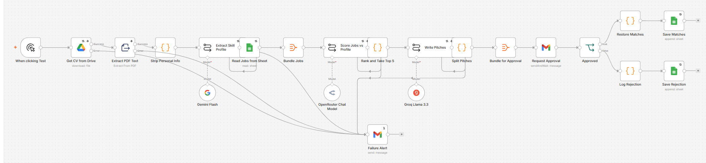
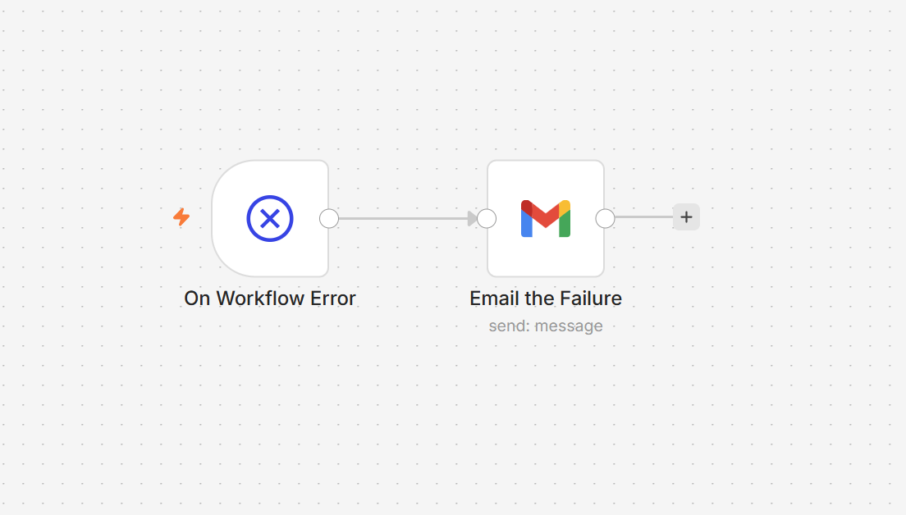
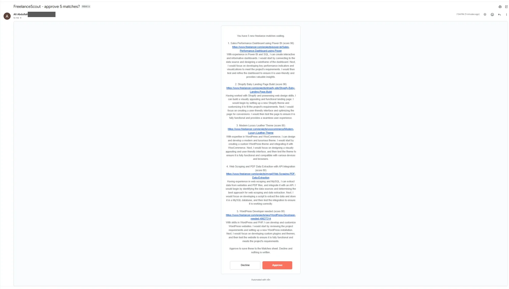
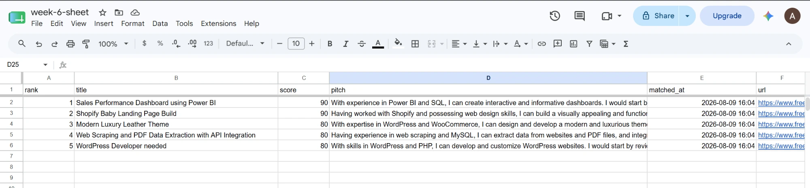
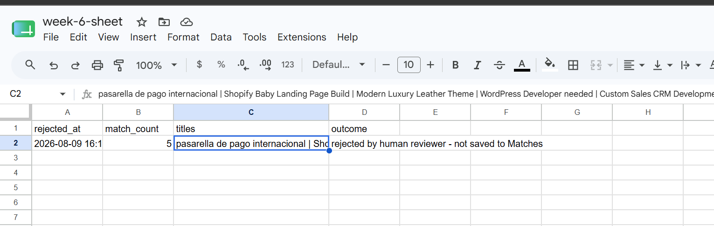
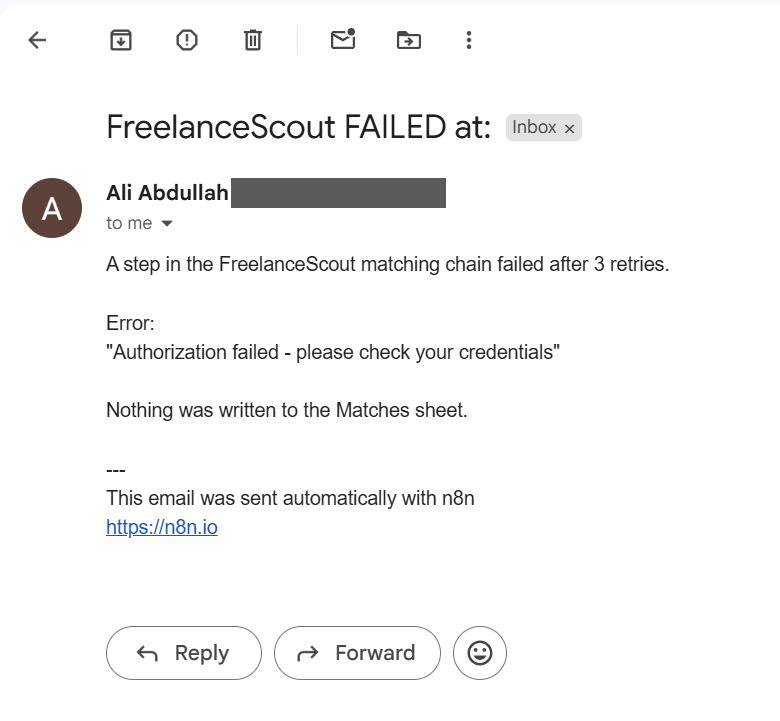
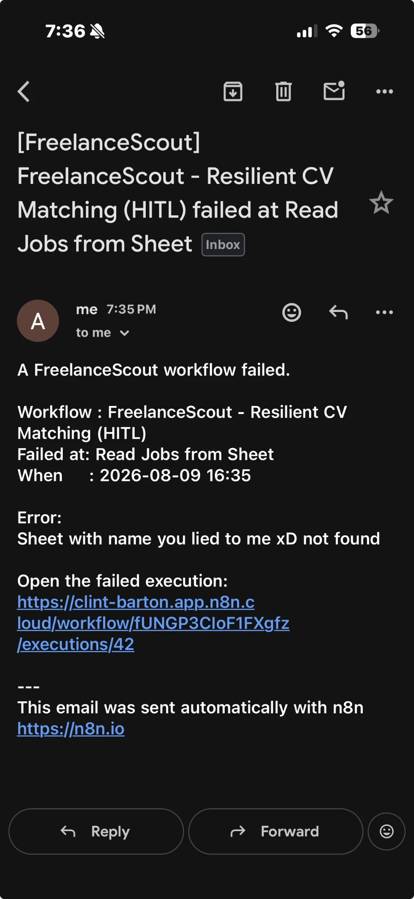

# 📘 Day 4 Report — Error Handling & Human-in-the-Loop

**🎯 Focus:** Making an existing workflow survive failure, and putting a human in front of the irreversible step

**📝 Assigned task (per the Week 6 plan):** *"Add error handling and a human approval step to an existing workflow, then test both success and failure scenarios."*

**📅 Date:** 2026-08-09

**✅ Status:** Completed

---

## 🗂️ Folder structure

```
📁 Day-4-Error-Handling-and-Human-in-The-Loop/
├── 📄 DAY4-REPORT.md                          ← this report
└── 📁 Error-Handling/
    ├── 📄 resilient-cv-matching-hitl.json     ← main workflow (22 nodes)
    ├── 📄 error-handler.json                  ← separate error-trigger workflow
    └── 📁 screenshots/
        ├── 🖼️ main-workflow.png
        ├── 🖼️ error-workflow.png
        ├── 🖼️ approval-email.webp
        ├── 🖼️ matches-approved.webp
        ├── 🖼️ rejection-logged.png
        ├── 🖼️ failure-alert.png
        └── 🖼️ error-handler-email.webp
```

---

## 🎯 Objective

Day 3's chain worked, but it was fragile and unsupervised. Six things in it can fail — a Drive download, three LLM calls, two Sheets operations — and none of them were handled. Worse, it wrote to the sheet with no one checking what it had decided.

Day 4 fixes both: **three layers of failure handling**, and a **human approval gate** in front of the only step that changes anything.

## 🛡️ 1. Three layers, because one is not enough

| Layer | Applied to | What it catches |
|---|---|---|
| **1 · Retries** (3×, 2s apart) | Drive, all 3 LLM calls, both Sheets writes | transient failures — rate limits, timeouts, blips |
| **2 · Error branches** | Drive, PDF extract, all 3 LLM calls | genuine failures at steps I *expected* could fail |
| **3 · Error Trigger workflow** | the entire workflow | everything I **didn't** anticipate |

The layering matters. Retries alone would hide nothing but also fix nothing permanent. Error branches only cover failures you thought of in advance. Layer 3 exists precisely because **real failures rarely happen where you expected them** — and in testing, that turned out to be literally true.

Nodes with an error branch route their failure to a **Failure Alert** email instead of dying silently. Nodes without one crash the workflow, which is what invokes the separate error-handler workflow.



Layer 3 lives in a **separate workflow** — it has to, since an Error Trigger fires *because* a workflow failed, so it cannot sit inside the one that failed. It's linked by name under `Settings → Error Workflow`, not by any visible connection:



One practical trap: **the error handler must be published before it can be selected.** Until it is, n8n lists it in the dropdown but greys it out with a warning icon and no explanation.

## 🚦 2. The human gate

```
Split Pitches → Bundle for Approval → Gmail: Send and Wait
                                            │
                          approved ─────────┴───────── declined
                              ↓                            ↓
                     Restore Matches                 Log Rejection
                              ↓                            ↓
                        Matches tab                  Rejected tab
```

The email lists all five matches with scores, links and full pitch text, then Approve / Decline buttons. The workflow **pauses mid-execution** and resumes only when a button is clicked.



Nothing reaches the Matches sheet without a click. That is the point: **an approval step that writes either way is not a gate, it's a notification.**

This is also the direct answer to Week 5's closing finding, where an agent confidently reported work it hadn't done and only an external check caught it. A human gate doesn't rely on the model's self-report.

> **Infrastructure note:** `Send and Wait` pauses the execution and resumes via a link in the email, which needs a publicly reachable URL. n8n Cloud provides one. This is the one feature this week that would **not** work on a laptop-hosted instance without a tunnel — worth remembering for Week 7, where the plan is self-hosted.

## 🧪 3. The four tests

| # | Test | Expected | Result |
|:-:|---|---|:-:|
| 1 | Run → **Approve** | 5 rows in Matches | ✅ |
| 2 | Run → **Decline** | 1 row in Rejected, **Matches unchanged** | ✅ |
| 3 | Break the Groq API key | 3 retries → Failure Alert email, nothing written | ✅ |
| 4 | Point Sheets at a non-existent tab | whole workflow crashes → Error Handler fires | ✅ |

### Test 1 — approve



Five rows written. Ranking held: Power BI 90, Shopify 90, then WooCommerce, web scraping and WordPress at 80 — all squarely in the test CV's field.

### Test 2 — decline



One row in `Rejected` recording the timestamp, the count, the titles and the outcome — and **Matches stayed at exactly 5 rows.** That unchanged count is the real assertion; the Rejected row only proves the branch ran, not that the gate held.

### Test 3 — API failure



One character changed in the Groq key. The chain ran normally until `Write Pitches`, retried three times, then routed to the Failure Alert with `Authorization failed - please check your credentials`. Nothing written to either sheet.

### Test 4 — unhandled failure



`Read Jobs from Sheet` pointed at a tab that doesn't exist. That node has retries but no error branch, so the failure escaped the workflow entirely — which is exactly what the error-handler workflow exists for. The email names the real workflow, the real node, and links to the failed execution.

## 🕵️ 4. The test that almost passed dishonestly

Test 4 initially "passed" — an email arrived. Reading it revealed:

```
Workflow : Example Workflow
Failed at: Node With Error
Error    : Example Error Message
```

That is **n8n's built-in placeholder data**, injected when you run an Error Trigger workflow *manually* so you can test the downstream nodes. No real failure produced it. The email proved the Gmail node and expressions were wired correctly — and proved nothing at all about whether the handler actually fires.

**The cause:** n8n only invokes the error workflow for **production executions** — runs started by a schedule, webhook or form. A manual "Execute Workflow" never triggers it. The main workflow had a Manual Trigger, so it was structurally incapable of producing a real production failure.

**The fix:** temporarily swapped the Manual Trigger for a Schedule Trigger on a 1-minute interval, published the workflow, left the sheet name broken, and waited for it to fail on its own. That produced the genuine email above — real workflow name, real node, and a real Google API error reading `Sheet with name ... not found`.

Recording this because the placeholder email was *convincing*. It arrived, it was formatted correctly, it came from the right workflow. Accepting it would have put "error workflow verified" in this report on the strength of dummy text — the exact failure mode Week 5 ended on, repeated by me instead of by a model.

## 🐛 5. A real bug the error handling caught on its first run

Before any of the deliberate tests, the first genuine run failed:

```
Scoring step did not return valid JSON. First 300 chars: ...
```

The token usage explained it:

```
completionTokens : 4096   ← exactly the cap
promptTokens     : 4977
```

With 64 jobs to score — each needing a URL, title, score and reason — the model hit the 4,096-token ceiling **mid-array** and stopped. The JSON had no closing bracket.

**What makes this worth recording:** the API call *succeeded*. OpenRouter returned HTTP 200 with a well-formed response. No node went red, no retry was triggered, nothing in n8n considered this a failure. The only reason it was caught is that the Code node validates the JSON and refuses to pass malformed data downstream.

Without that guard, a truncated array would have flowed on and silently lost most of the scored jobs. **Raising `maxTokens` to 8192 fixed it** — but the lesson is that this was Day 4's premise proving itself before the planned tests even started: the failures that matter are the ones that don't announce themselves.

## 🎲 6. Observation: the ranking is not deterministic

Tests 1 and 2 ran the same CV against the same 64 jobs. The top 5 differed:

```
Run 1:  Power BI · Shopify Baby · Luxury Leather · Web Scraping · WordPress Dev
Run 2:  pasarella de pago · Shopify Baby · Luxury Leather · WordPress Dev · Custom Sales CRM
```

Two of five positions changed. Both sets are defensible — a payment-gateway integration and a CRM build are legitimate matches for this profile — so this is variance, not error.

But it matters for the real product: running daily, gigs would appear and disappear from the shortlist with no change in the underlying data. Logged for Week 7, where the fix is pinning temperature to 0 and/or scoring in smaller deterministic batches.

## ⚠️ 7. Known limitations

- **The Failure Alert subject line renders empty** after the colon. My expression assumed `$json.error` was an object with `.message`; it arrives as a plain string. The body is correct — only the subject is affected. Fix: `{{ String($json.error?.message ?? $json.error ?? 'unknown step').slice(0,60) }}`
- **Error branches all converge on one alert node**, so the email says a step failed but not which one. Fine at this size, would need per-branch context in a larger workflow.
- **No timeout handling.** A hung LLM call would sit until n8n's default timeout rather than failing fast.

## 📦 8. Deliverables produced today

1. **`Error-Handling/resilient-cv-matching-hitl.json`** — 22-node workflow with retries, error branches and the approval gate.
2. **`Error-Handling/error-handler.json`** — the separate Error Trigger workflow.
3. **`Error-Handling/screenshots/`** — all four tests plus the approval email.
4. **`DAY4-REPORT.md`** — this report.

---

## 🎓 Reflection

**Daily Task Completed:** Added three layers of error handling — retries, error branches, and a separate Error Trigger workflow — plus a Gmail approval gate to the Day 3 matching chain, then tested all four paths: approve, decline, a handled API failure, and an unhandled crash.

**What I Learned:** That the failures worth guarding against are the ones that don't look like failures. My first real run returned HTTP 200 with a perfectly valid response that happened to be truncated mid-JSON — nothing in n8n flagged it, and only a validation guard caught it. I also learned n8n only triggers error workflows for production executions, not manual runs, which meant my first "successful" test of the error handler was n8n's own placeholder data.

**Challenges Faced:** The scoring step silently truncated at its token ceiling and returned invalid JSON. The error workflow couldn't be selected in Settings until it was published. Test 4 appeared to pass on dummy data. And n8n wouldn't let me publish the workflow to produce a real production failure, because a Manual Trigger doesn't require publishing.

**How I Solved Them:** Read the token usage rather than guessing — `completionTokens: 4096` against a 4096 cap is unambiguous — and raised the limit to 8192. Published the error handler so it became selectable. And for test 4, rather than accept the placeholder email, I temporarily swapped in a Schedule Trigger, published the workflow, and let it fail on its own schedule to produce a genuine failure. That three-minute detour is the difference between the report being true and being plausible.

---

## 🚀 Next steps — Day 5 (Build an Automation)

Per the plan: an end-to-end automation that receives a document, summarises it with AI, stores the result, and sends a notification. FreelanceScout already does all four — the remaining piece is the **front door**: replacing the manual trigger with a form that accepts a CV upload, so the whole thing runs from a document arriving rather than from me clicking Execute.

---

## 📚 References

- **[`Error-Handling/resilient-cv-matching-hitl.json`](Error-Handling/resilient-cv-matching-hitl.json)** — the main workflow
- **[`Error-Handling/error-handler.json`](Error-Handling/error-handler.json)** — the error-trigger workflow
- **[`../Day-3-AI-Workflows-and-Chaining-Agents/DAY3-REPORT.md`](../Day-3-AI-Workflows-and-Chaining-Agents/DAY3-REPORT.md)** — Day 3, the chain this hardens
