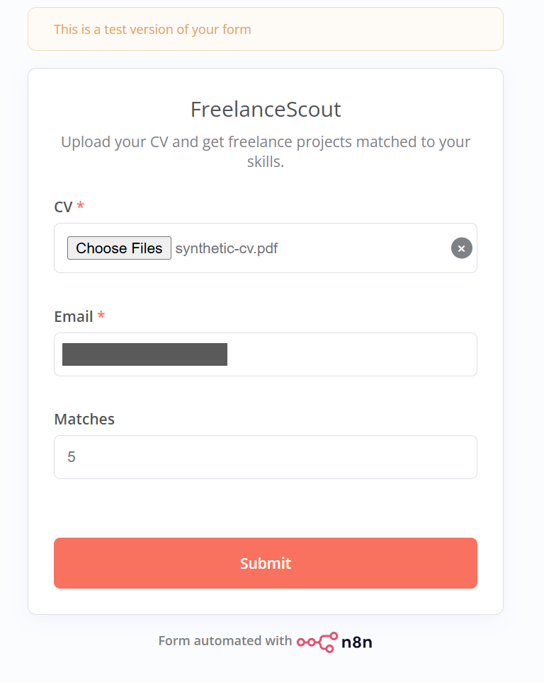
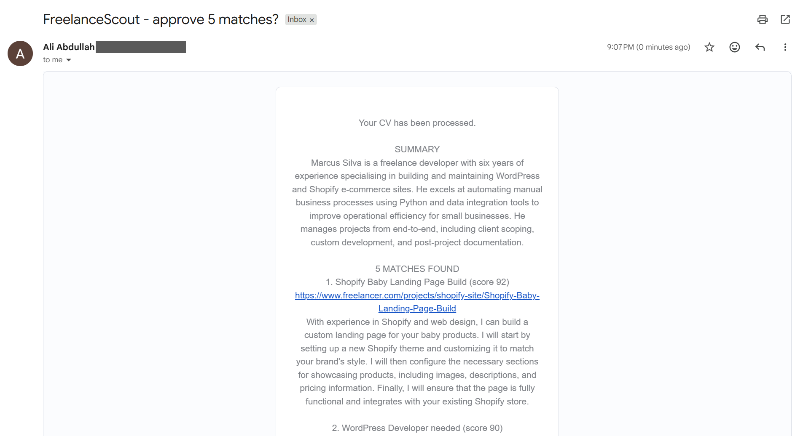
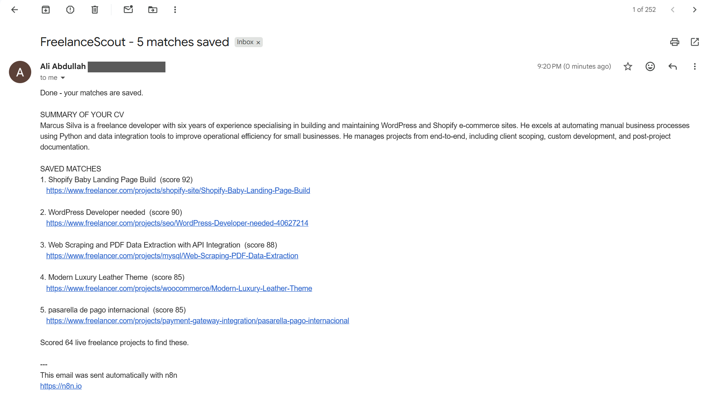

# 📘 Day 5 Report — Build an Automation (End-to-End)

**🎯 Focus:** One automation, front to back — a document arrives, AI processes it, results are stored, the user is notified

**📝 Assigned task (per the Week 6 plan):** *"Build an end-to-end automation that receives a document, summarizes it using AI, stores the result, and sends a notification."*

**📅 Date:** 2026-08-09

**✅ Status:** Completed

---

## 🗂️ Folder structure

```
📁 Day-5-Build-an-Automation/
├── 📄 DAY5-REPORT.md                            ← this report
└── 📁 Automatication/
    ├── 📄 freelancescout-end-to-end.json        ← the 23-node workflow
    └── 📁 screenshots/
        ├── 🖼️ test.png            the upload form
        ├── 🖼️ approve.png         approval email with the AI summary
        └── 🖼️ summary-email.png   final notification
```

---

## 🎯 Objective

Four days of pieces, joined into one thing a person can actually use.

Until today FreelanceScout needed *me* — a CV placed in Drive by hand, a button clicked in the editor. Day 5 removes the operator entirely: **someone uploads a CV on a web page and everything else happens on its own.**

## ✅ 1. Every clause of the task, mapped to a node

| Task requirement | Node | What it does |
|---|---|---|
| **receives a document** | `CV Upload Form` | n8n Form Trigger — public page, PDF upload |
| **summarizes it using AI** | `Summarize and Profile CV` | Gemini — plain-English summary + structured skill profile |
| **stores the result** | `Save Matches` | Google Sheets |
| **sends a notification** | `Send Results` | Gmail — summary and saved matches |

23 nodes, three LLM providers, two Google services, and the error handling and approval gate carried over from Day 4.

```
CV Upload Form (PDF + email + how many matches)
   → Extract PDF Text → Strip Personal Info
   → [Gemini]      summarize + build skill profile
   → Parse Profile (validate the JSON)
   → read 64 jobs → bundle
   → [DeepSeek]    score every job 0-100
   → rank, take top K
   → [Groq]        write a pitch for each
   → approval gate ──┬─ approved → Save Matches → Send Results
                     └─ declined → Save Rejection
```

## 🚪 2. The front door



Three fields: the CV, an email address, and how many matches you want. n8n generates the page and hosts it — there is no separate front-end to build or deploy.

Two decisions worth explaining:

**The email comes from the form, not from the workflow.** Every previous day had my address hardcoded into the Gmail nodes. Now the approval email, the results email and the failure alert all go to whoever submitted the form. That makes it a *product* rather than a thing wired to one inbox — and as a side effect the workflow JSON contains no personal data at all, so it's safe to publish.

**The user picks how many matches**, clamped between 1 and 10 in code. Trusting a form field to be sane is how you end up asking an LLM for 900 results because somebody held down a key.

> n8n exposes two URLs for a form trigger — a **test** URL that runs once for debugging, and a **production** URL that works whenever the workflow is published. The screenshot above shows the test view, identifiable by the banner at the top.

## 🧠 3. The AI summary

The rubric asks the automation to *summarise* the document. Days 3–4 extracted a structured skill profile, which is a summary in the machine sense but not one a person would read. Day 5 has the same LLM call also produce plain English:

> *"Marcus Silva is a freelance developer with six years of experience specialising in building and maintaining WordPress and Shopify e-commerce sites. He excels at automating manual business processes using Python and data integration tools to improve operational efficiency for small businesses. He manages projects from end-to-end, including client scoping, custom development, and post-project documentation."*

That is an accurate reading of the test CV, and — checked against the source — invents nothing. It also does real work downstream: it's what makes both emails intelligible at a glance.

A new **`Parse Profile`** node validates that JSON before anything else uses it. Same pattern as the scoring guard, added for the same reason: Day 4 proved an LLM can return a perfectly valid HTTP 200 containing unusable output.

## 📬 4. Running end to end



Upload → summary → 64 jobs scored → top 5 with pitches → approval email. No editor, no button.



Approve, and the matches save and the results email arrives:

| Rank | Match | Score |
|:-:|---|:-:|
| 1 | Shopify Baby Landing Page Build | 92 |
| 2 | WordPress Developer needed | 90 |
| 3 | Web Scraping and PDF Data Extraction with API Integration | 88 |
| 4 | Modern Luxury Leather Theme (WooCommerce) | 85 |
| 5 | pasarella de pago internacional (payment gateway) | 85 |

**Five out of five in the test CV's actual field**, selected from 64 live projects. Nothing from voice acting, animation, CAD or translation — the categories that should score near zero, and did.

Scores also came out higher and better separated than Day 4's run (92–85 versus a flat 90–80), which is consistent with the profile being richer now that it carries a summary as well as a skill list.

## 🔒 5. Privacy carried through

- **The synthetic CV** is still the input — an invented person, so nothing real reaches Gemini, OpenRouter or Groq.
- **`Strip Personal Info`** removes emails, phone numbers and URLs from the CV text before any model sees it. Redundant for a fake CV; necessary the moment a real one is used, which is Week 7.
- **No hardcoded address** anywhere in the workflow, because the form supplies it.
- **Screenshots redacted** — the submitter's email is blacked out in all three.

## ⚠️ 6. Known limitations

- **The pitches are still generic.** Same issue found on Day 3 and deliberately left: `Summarize and Profile CV` doesn't extract past *projects*, so the pitch step can't cite them. Logged for Week 7 rather than patched on a day whose task is already met.
- **Ranking is not deterministic.** Day 4 showed two of five matches changing between identical runs. Still true.
- **One shared job pool.** Every submitter would be scored against the same sheet of 64 jobs collected by the Day 1–2 workflow. Fine for one user; a real multi-user version needs the fetch to run per request or far more frequently.
- **The approval gate assumes the submitter and the approver are the same person.** True for personal use, wrong for anything shared.

## 📦 7. Deliverables produced today

1. **`Automatication/freelancescout-end-to-end.json`** — the complete 23-node automation.
2. **`Automatication/screenshots/`** — the form, the approval email, the final notification.
3. **`DAY5-REPORT.md`** — this report.

---

## 🎓 Reflection

**Daily Task Completed:** Built the end-to-end automation — a public form receives a CV, Gemini summarises it and extracts a skill profile, DeepSeek scores 64 live freelance projects against it, Groq writes pitches for the top five, a human approves, results are stored in Google Sheets and emailed back. It runs from an upload with no operator involved.

**What I Learned:** That "end to end" is mostly about removing yourself. The AI work was already done on Day 3 — what made this a product was a front door, a notification, and taking the email address from the user instead of hardcoding mine. I also learned n8n hosts the form itself, so a working upload page cost one node rather than a front-end.

**Challenges Faced:** The uploaded file arrives separately from the form's text fields and is labelled with the field name, so the PDF extractor pointed at nothing until it was told to look for `CV`. Form triggers also only serve their public page once the workflow is published, which isn't obvious from the editor.

**How I Solved Them:** Set the extractor's input binary field to match the form field exactly, and published the workflow before opening the form URL. Both are small, but both silently produce a form that looks fine and does nothing — the same class of problem as the imported dropdowns earlier in the week: something that appears configured but isn't.

---

## 🏁 Week 6 complete — and what carries into Week 7

Five days, one project, each day building on the last rather than starting over:

| Day | Added |
|:-:|---|
| 1 | scheduled collection into a sheet |
| 2 | a second source, currency conversion, deduplication, email |
| 3 | three chained LLM steps — CV to ranked matches |
| 4 | retries, error branches, an error workflow, human approval |
| 5 | a public form, an AI summary, and the whole thing joined up |

**Week 7's capstone** extends this rather than replacing it: CV *review and optimisation* inserted before the matching step, and WhatsApp replacing the form and email as the interface. Both are node changes, not rebuilds — the reason the stages were kept separable from Day 1.

A running list of the pitfalls found this week — generic pitches, non-deterministic ranking, imported fields that drop silently, LLM output-token ceilings, the weak second job source — is carried forward to be fixed properly in the capstone rather than patched here.

---

## 📚 References

- **[`Automatication/freelancescout-end-to-end.json`](Automatication/freelancescout-end-to-end.json)** — the workflow built today
- **[`../Day-4-Error-Handling-and-Human-in-The-Loop/DAY4-REPORT.md`](../Day-4-Error-Handling-and-Human-in-The-Loop/DAY4-REPORT.md)** — Day 4, whose error handling and approval gate this inherits
- Google Gemini · OpenRouter (DeepSeek) · Groq (Llama 3.3) · Google Sheets · Gmail
