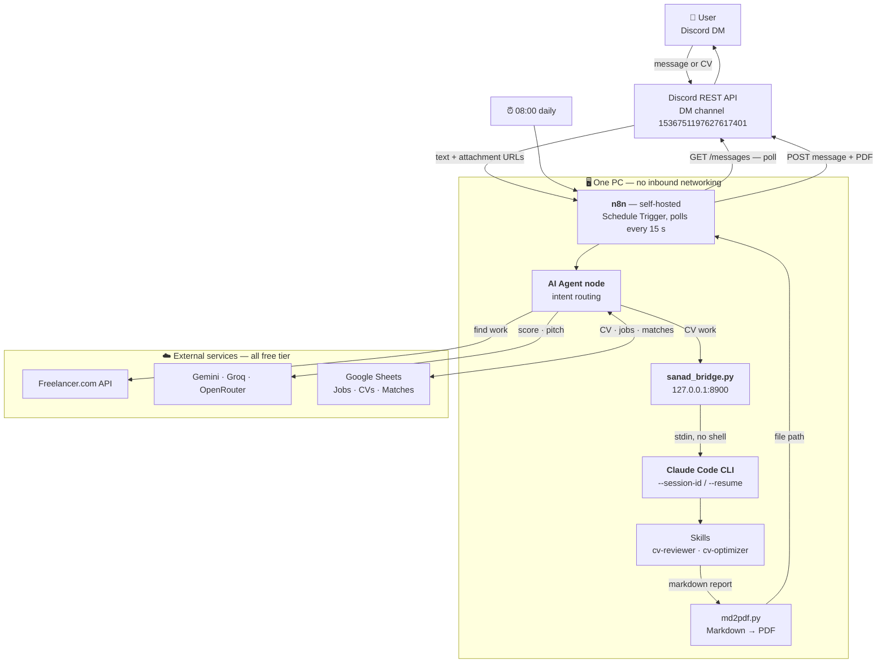

# 🏗️ Sanad — Architecture

**Date:** 2026-08-11 (Day 1) · **Status:** Locked · **Open unknowns:** **none** — the last one (R-1, n8n → bridge) was [verified on 2026-08-12](RISKS.md)

> Parent documents: [../PROJECT-PLAN.md](../PROJECT-PLAN.md) · [../REQUIREMENTS.md](../REQUIREMENTS.md)

---

## 1. 🗺️ The whole system



### The two rules that shape everything

**1. No inbound networking.** Discord is *polled*, never pushed to. Every connection is outbound from the PC. That removes the public URL, the tunnel, the VPS and the certificate — and it is why the whole system runs on one laptop with nothing exposed.

**2. n8n is a thin pipe.** Claude Code owns the conversation. It asks the intake questions, holds the session, and chains `cv-reviewer` into `cv-optimizer` itself. n8n moves text and files between Discord and the bridge.

This second rule was a *finding*, not a design choice: during testing the reviewer skill ended its report by offering the optimizer, unprompted. Orchestrating that from n8n would have meant re-implementing a conversation that already existed for free.

---

## 2. 🧩 Components and what each one owns

| Component | Owns | Deliberately does **not** own |
|---|---|---|
| **Discord** | The interface — messages, attachments, delivery | Any logic |
| **n8n** | Polling, deduplication, file transfer, scheduling, the job pipeline | The conversation |
| **AI Agent node** | Deciding what each message *means* and which tool to call | Doing the work itself |
| **`sanad_bridge.py`** | Turning an HTTP call into a Claude Code run; mapping `session_id` → conversation | Any Sanad logic — it is transport, nothing more |
| **Claude Code + skills** | The CV conversation: intake, review, rewrite, chaining | Job matching, Discord, storage |
| **`md2pdf.py`** | Markdown → PDF | Content |
| **Google Sheets** | Durable state — the CV, the job pool, sent matches | Logic |
| **Gemini / Groq / OpenRouter** | Profiling, scoring, pitch writing | Conversation state |

The bridge being *only* transport is what makes it swappable. If Claude Code disappeared tomorrow, the bridge changes and nothing else does.

---

## 3. 🔌 The bridge — API contract

`sanad_bridge.py`, Python standard library only, listening on `127.0.0.1:8900`.

```
GET  /health
  → {"ok": true, "claude": "<path>", "version": "..."}

POST /claude
  body: {"session_id": "<uuid>", "prompt": "...", "cwd": "<optional dir>"}
  → {"ok": true, "session_id": "...", "resumed": true|false, "output": "..."}
  → on failure: HTTP 500, {"ok": false, "error": "..."}
```

Three design decisions worth stating:

**The prompt is piped on stdin**, never placed on a command line. `subprocess.run(..., shell=False)` — so no shell ever parses it. This is the specific problem that killed n8n's Execute Command node, and the reason the bridge exists.

**The executable is located, not assumed.** `shutil.which("claude")` first, then known install paths. n8n's child processes do not reliably inherit the user's `PATH`.

**Session existence is detected, not tracked.** Claude Code writes each transcript to `~/.claude/projects/**/<session-id>.jsonl`. The bridge checks for that file and chooses `--session-id` (create) or `--resume` (continue) accordingly. It holds no state of its own, so restarting it loses nothing.

The timeout is **600 s**, because a full `cv-reviewer` run genuinely takes minutes.

---

## 4. 🔄 Flow A — a CV arrives

The core round trip. Note that **each poll is a separate n8n execution** — nothing is held in n8n memory between messages. Continuity comes entirely from `session_id`.

```
 ┌──────────────────────────────────────────────────────────────────┐
 │  every 15 s                                                      │
 └──────────────────────────────────────────────────────────────────┘
        │
        ▼
  Poll Discord ── GET /channels/{id}/messages?after={last_seen_id}
        │
        ├─ no new messages ──► stop
        │
        ▼
  New message
        │
        ├─ has a PDF attachment? ──► download ──► extract text
        │
        ▼
  ┌───────────────────────┐
  │   AI AGENT — intent   │
  └───────────────────────┘
        │
        ├─ "greeting, first ever"  ──► welcome message ──────────────┐
        ├─ "CV upload"             ──► bridge ──► cv-reviewer        │
        ├─ "answer to a question"  ──► bridge (same session_id)      │
        ├─ "yes, fix it"           ──► bridge ──► cv-optimizer       │
        ├─ "find me work"          ──► job pipeline (Flow B)         │
        └─ "a question about you"  ──► answer directly ──────────────┤
                                                                     │
        ▼                                                            │
  POST /claude  {session_id, prompt}                                 │
        │                                                            │
        ▼                                                            │
  Claude Code ──► skill runs ──► markdown out                        │
        │                                                            │
        ├─ report? ──► md2pdf.py ──► sanad-review.pdf                │
        │                                                            │
        ▼                                                            │
  Save CV to the CVs sheet                                           │
        │                                                            │
        ▼                                                            ▼
  POST to Discord ── summary text + PDF attachment ──────────────► User
```

**Deduplication** uses Discord's `after={message_id}` parameter plus the last-seen ID kept in the `CVs` sheet. Without it, a 15-second poll replies to the same message four times a minute (FR-4).

---

## 5. 🔍 Flow B — job matching

Ported from Week 6's FreelanceScout, now invoked as a **tool the agent calls** rather than as a form submission. Four carry-over fixes are applied during the port.

```
  Agent decides: "the user wants work"
        │
        ▼
  Load CV profile from the CVs sheet
        │
        ▼
  Freelancer.com API ── active projects
        │
        ▼
  Filter: language == English            ◄── fix, carry-over §5
        │
  Filter: not already sent               ◄── the Matches sheet
        │
        ▼
  [Gemini]  profile the CV
            schema now includes notable_projects   ◄── fix, carry-over §1
        │
        ▼
  Validate JSON  ── guard against a truncated 200  ◄── carry-over §8
        │
        ▼
  [OpenRouter]  score every job 0–100
                maxTokens 4096, temperature pinned ◄── fixes §3, §6
        │
        ▼
  Rank ── take top 5
        │
        ▼
  [Groq]  write a pitch per job
          must cite one real past project
          filler phrasing banned              ◄── fix, carry-over §1
        │
        ▼
  Save to the Matches sheet
        │
        ▼
  Discord ── 5 jobs, each with a link and a pitch
```

---

## 6. ⏰ Flow C — the daily digest

The feature that makes Sanad an automation rather than a chatbot. Same pipeline, different trigger, and a *different shape of output* — one job, not five.

```
  ⏰ Schedule Trigger — 08:00 daily
        │
        ▼
  Load CV profile from the CVs sheet
        │
        ├─ no CV yet? ──► stay silent, do not nag
        │
        ▼
  Fetch → filter English → drop everything already in Matches
        │
        ├─ nothing left ──► "Nothing new today 🌙"  ──► Discord
        │
        ▼
  Score → take the single best
        │
        ▼
  Write one pitch
        │
        ▼
  Record it in Matches (so tomorrow can't repeat it)
        │
        ▼
  Discord DM ── one job, unprompted
```

Two behaviours are deliberate: **it never repeats a job**, because the `Matches` sheet is checked before scoring rather than after (FR-31); and **it speaks when it has nothing to say** (FR-32), because a digest that goes silent is indistinguishable from a digest that is broken.

---

## 7. 🗄️ Data model

Three sheets. Reduced from Week 6's larger model because Sanad is single-user — no `Users` tab, no per-user state, no cadence storage.

### `Jobs` — the pool *(Week 6 schema, unchanged)*

| Column | Notes |
|---|---|
| `job_id` | Freelancer project ID — the deduplication key |
| `title`, `description` | as returned |
| `budget_min`, `budget_max`, `currency` | **the only genuinely objective axis** |
| `skills` | tags from the API |
| `url` | the link the user actually clicks |
| `language` | used by the English filter |
| `fetched_at` | timestamp |

### `CVs` — the memory

| Column | Notes |
|---|---|
| `cv_text` | extracted plain text of the current CV |
| `profile_json` | structured profile, now including `notable_projects` |
| `review_score` | latest `cv-reviewer` score |
| `session_id` | the Claude Code session UUID |
| `last_seen_message_id` | Discord deduplication cursor |
| `updated_at` | timestamp |

One row, overwritten. It exists so that FR-29 holds: kill n8n and the bridge, come back, and Sanad still knows the CV.

### `Matches` — what has been sent

| Column | Notes |
|---|---|
| `job_id` | joins to `Jobs` |
| `score`, `pitch` | the LLM output |
| `source` | `on-request` or `daily` |
| `sent_at` | timestamp |

This sheet is what stops the daily digest repeating itself.

---

## 8. 🔗 Session continuity — the mechanism

The single most important detail in the design, because without it the intake questions cannot work.

Every 15-second poll is **a brand-new n8n execution** with no memory of the last one. But `cv-reviewer` asks questions and waits for answers — an inherently multi-turn conversation.

The resolution:

```
Message 1  ──►  session_id = <uuid>   ──►  bridge: --session-id <uuid>   ──►  new session
Message 2  ──►  session_id = <uuid>   ──►  bridge: --resume <uuid>       ──►  full history
Message 3  ──►  session_id = <uuid>   ──►  bridge: --resume <uuid>       ──►  full history
```

The UUID is generated by n8n on first contact and stored in the `CVs` sheet. Claude Code holds the actual transcript on disk. **n8n stores a pointer; Claude Code stores the conversation.**

Verified across genuinely separate processes on 2026-08-10 — a two-turn conversation over HTTP kept its memory.

---

## 9. ❌ Rejected alternatives, with reasons

Recording *why not* is as much a part of the design as the design.

| Rejected | Reason |
|---|---|
| **Anthropic API** | The account's ~$100 balance is **product** credit (Claude Code / claude.ai), not API credit. A real call returns `credit balance is too low`. Scoping to a cheaper model doesn't help. A subscription never grants API access |
| **A Claude Skill called directly from n8n** | No node exists, and the Skills API needs paid API credit. Hence the CLI |
| **n8n Execute Command** | Disabled by default in n8n 2.x, and broken even when enabled: it spawns `{shell: true, detached: true}` → `cmd.exe /d /s /c "..."`, which mangles quoted arguments. `echo` worked; no external executable did. A no-argument `.cmd` wrapper also failed. **Replaced by the bridge** |
| **pandoc** | Requires a multi-GB LaTeX install for PDF output. **Replaced by `md2pdf.py`** (reportlab only) |
| **WhatsApp** | The 24-hour messaging window turns an unprompted daily digest into a paid, pre-approved template message. Discord has no such restriction |
| **Telegram** | Would have worked; Discord chosen so the project differs from what classmates are building |
| **Upwork** | API is partner-gated with no public access; scraping breaks the ToS |
| **Arbeitnow as a second source** | Week 6 measured it: ~11 contract roles, Germany-skewed, mostly one employer, no budget data |
| **n8n Cloud** | Blocks host access entirely, and cannot reach a localhost bridge. Self-hosting is **required, not preferred** |
| **Docker for n8n** | Native npm install chosen for direct host access during development. Note the bridge is HTTP, so a containerised n8n would still work via `host.docker.internal:8900` |

---

## 10. 🧱 Why the architecture survives its own failure modes

| If this breaks | What happens | Why it isn't fatal |
|---|---|---|
| Claude Code hits a usage limit | CV review stops | Job matching runs on Gemini/Groq/OpenRouter and is unaffected. Skill outputs are pinned in n8n for downstream testing |
| The bridge crashes | CV work stops | It is stateless — restart it and sessions resume from disk. No data lost |
| n8n restarts | The current turn is lost | The CV and the cursor are in Sheets, not in n8n memory |
| Discord rate-limits | Replies are delayed | Polling backs off; no message is lost, since the cursor only advances on success |
| n8n forces Docker in a future release | Nothing | The bridge is reached over HTTP — the URL changes, the design doesn't |
