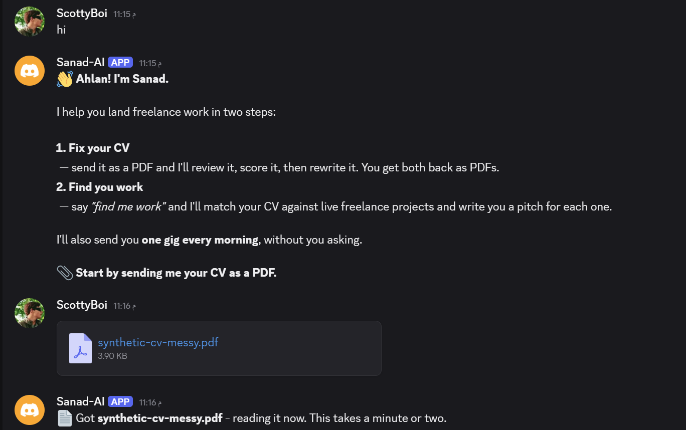
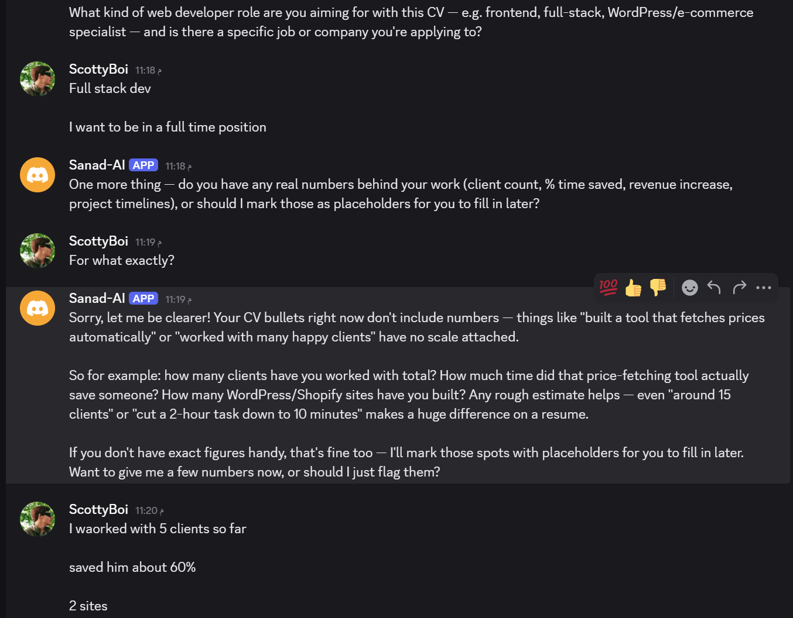
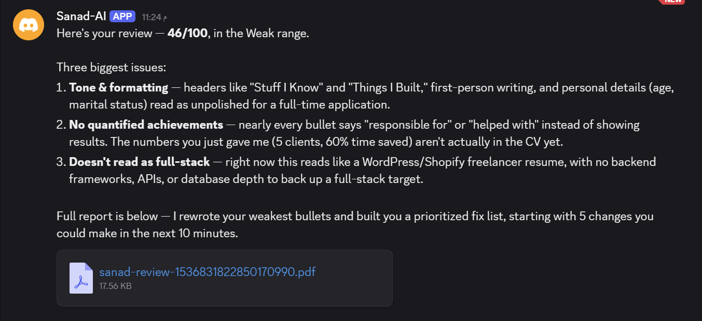

# 📘 Day 2 Report — Build Core

**🎯 Focus:** Close the last unknown, then get one complete round trip working — CV in a Discord DM, review PDF back

**📝 Assigned task:** *Build the core of the capstone.*

**📅 Date:** 2026-08-12

**✅ Status:** Completed — Day 2's definition of done met in full

---

## 🗂️ Folder structure

```
📁 Day-2-Build-Core/
├── 📄 DAY2-REPORT.md                          ← this report
└── 📁 Core-Loop/
    ├── 📄 r1-bridge-check.json                the 30-second test that closed the last unknown
    ├── 📄 sanad-poll-loop.json                the core workflow — 18 nodes
    ├── 📁 input/
    │   └── 📄 synthetic-cv-messy.pdf          the demo CV, scores 46/100
    ├── 📁 output/
    │   └── 📄 sanad-review-...pdf             what Sanad sent back — 5 pages
    └── 📁 screenshots/
        ├── 🖼️ 1.png    welcome + CV upload + acknowledgement
        ├── 🖼️ 2.png    the intake conversation
        └── 🖼️ 3.png    the review and the attached PDF
```

---

## 🎯 Objective

Day 1 ended with one unverified link and a plan. Day 2 had to close that link and then prove the whole idea works at least once:

> **Send the messy fixture CV as a Discord DM, answer the intake questions in chat, and get the summary and the review PDF back in the same conversation.**

That happened. It also took **four separate bugs** to get there, and those are the interesting part of the day.

---

## ✅ 1. R-1 — the last unknown, closed first

Day 1's risk register had exactly one unverified link: could n8n's HTTP Request node actually reach `sanad_bridge.py`? Everything else had been tested. The plan said test it before building anything, so that's what happened.

I made the test prove more than it needed to. Connectivity alone would have left the *real* dependency untested — `cv-reviewer` asks questions across separate Discord messages, and every poll is a separate n8n execution. So the workflow does two turns:

```
Manual Trigger → New Session ID → Bridge Turn 1 → Bridge Turn 2 → Verdict
                 (fresh UUID)     "remember 7"    "what number?"   PASS/FAIL
```

| Check | Result | Proves |
|---|:-:|---|
| Turn 1 returns `ok:true` | ✅ | the HTTP Request node reaches the bridge — R-1 itself |
| Turn 1 returns `resumed:false` | ✅ | a new session was created |
| Turn 2 returns `resumed:true` | ✅ | the bridge chose `--resume` over `--session-id` |
| Turn 2's output contains `7` | ✅ | **session memory survives two separate n8n calls** |

`R1_RESULT: PASS`, session `5e4523b5-f981-47ad-892b-9cc54aa1a97f`.

The UUID is generated fresh per run by a Code node, so a leftover session can't produce a false pass — a hardcoded UUID would have passed for the wrong reason on the second run.

**The file-drop fallback was never built. No unknowns remain in the architecture.**

---

## 🔁 2. The conversation loop

```
Every 15s → Get Messages → Pick New Messages → First Contact?
                           (claim the message)   ├── true → Send Welcome
                                                 └── false → Is CV Upload?
                                                              ├── yes → Fetch CV → Start Review → Call Claude
                                                              └── no  → Continue Chat → Call Claude
                                                                                          ↓
                                                                                    Parse Output
                                                                                          ↓
                                                                                 Review Finished?
                                                                                   ├── yes → Make PDF → Download PDF → Send Review + PDF
                                                                                   └── no  → Send Chat Reply
```

Three details that took real thought:

**Snowflake IDs compare as `BigInt`, never as strings.** Discord message IDs are 19-digit numeric strings. Lexical comparison works right up until a digit-length boundary, then silently breaks.

**Sanad's own messages are filtered by `author.bot`.** Without it, the bot reads its own reply, answers it, reads that, and answers again — every 15 seconds, forever.

**The first run takes only the newest message.** Publishing the workflow otherwise makes Sanad reply to the entire DM history at once.

**The welcome is canned, not generated.** It fires only when it's genuinely the first message *and* there's no CV attached — so if someone's opening move is dropping a CV, it reviews instead of greeting them and ignoring the file. An earlier version let Claude improvise the welcome; it wrote a good one, but it cost a 30-second model call to say a fixed thing.

---

## 🐛 3. Four bugs, and what each one taught

This is the actual work of the day. Every one of these was found by reading an error, not by guessing.

### 3.1 n8n won't touch the filesystem

Execution 81 died at `Save CV to Disk`:

```
NodeApiError: Access to the file is not allowed.
```

n8n 2.x blocks the Read/Write File node from arbitrary paths. The return leg (`Read PDF`) would have hit the identical wall.

I could have set `N8N_RESTRICT_FILE_ACCESS_TO`, but that's an environment variable every user of this repo would also have to set. Instead **the bridge took over all filesystem access** — which is what [ARCHITECTURE.md](../Day-1-Project-Planning/Plan-and-Require/Additional-Info/ARCHITECTURE.md) already said it was for. Two endpoints were added:

| Endpoint | Purpose |
|---|---|
| `POST /fetch` | downloads the Discord attachment straight to the workspace |
| `GET /file?name=` | serves a generated PDF back so n8n can attach it |

n8n now speaks nothing but HTTP. **Zero `readWriteFile` nodes remain.** This is the same reasoning that killed Execute Command on Day 1, and it survives n8n's move to Docker — a container can't see the host filesystem, but it can still make an HTTP call.

> Path traversal is blocked and tested: `GET /file?name=../../../Windows/win.ini` returns 404.

### 3.2 An HTTP node overwrites `$json`

Execution 116, three seconds in:

```
NodeOperationError: Invalid URL: /claude. URL must start with "http" or "https".
```

`Send Ack` sat between `Start Review` and `Call Claude`. An HTTP node replaces `$json` with its own response, so Discord's message object arrived where my data should have been, `$json.bridge` was undefined, and the URL evaluated to a bare `/claude`.

**Fix:** the ack became a *side branch* — `Start Review` fans out to both `Send Ack` and `Call Claude`, so `Call Claude` gets the real data.

> The lesson generalises: in n8n, anything downstream of an HTTP node must reference `$('Node Name')` explicitly rather than trusting `$json`.

### 3.3 Claude Code is sandboxed to its working directory

The chain finally ran green, and Sanad replied with this:

> *"my current session is sandboxed to the Core-Loop project folder, and the CV lives in a different directory that this session doesn't have access to."*

A clear, honest error — from the model, not from a stack trace. Claude Code scopes file access to its working directory, and the bridge was inheriting whatever directory it happened to be launched from.

**Fix, in two layers:** n8n now passes `cwd` explicitly, *and* the bridge defaults to the workspace when nothing is sent. Either alone would have worked; both means it can't regress depending on how the bridge is started.

### 3.4 The one that mattered — overlapping executions

The run "worked", and produced this:

- **five** *"Got synthetic-cv-messy.pdf"* acknowledgements
- **five different** intake questions
- one complete review, arriving before the others

The cursor lived in n8n's **workflow static data**, which is only written when an execution *finishes*. A CV review takes **1–3 minutes**. The poll fires every **15 seconds**. So while run #1 sat inside `Call Claude`, roughly a dozen more polls started, each read a cursor that hadn't moved yet, and each concluded the CV was new.

**FR-4 held for fast messages and collapsed for slow ones** — the failure mode only appears once the work takes longer than the poll interval, which is exactly the case that matters.

n8n cannot fix this itself: the state is only durable *after* the slow work. So the cursor moved into the bridge, where it can be written **before** the slow work, synchronously, under a lock:

```
POST /claim {message_id}
  → {"claimed": true}   exactly one caller ever wins
  → {"claimed": false}  every overlapping poll stops dead
```

Verified directly against the bridge:

| Test | Result |
|---|:-:|
| same ID claimed 3× (simulating overlapping polls) | ✅ first wins, other two rejected |
| an older ID | ✅ rejected |
| a newer ID | ✅ accepted |

The Claude **session ID** moved to the same store, which fixed a second problem for free: static data isn't persisted on *manual* runs either, so multi-turn conversations were impossible to test without publishing. Now they aren't.

That state file is also the beginning of **FR-29** (*"remembers your CV between sessions"*). It survives restarts of both n8n and the bridge. Day 3 moves it to the `CVs` sheet, but the mechanism is proven.

### 3.5 A fifth bug the state file exposed

After the successful run, the state file read:

```
"cv_path": "...\Some-important-files\workspacecv-1536830640287260835.pdf"
```

`workspacecv` — the separator was gone, lost through the escaping chain. **The review only worked by luck**, because Claude Code was already `cwd`'d into the workspace and found the file by name.

**Fix:** n8n stopped constructing the path at all. `POST /fetch` already returns the real absolute path it wrote to, so that's now the single source of truth.

> Worth stating plainly: this bug passed its test. A green run is not proof of correctness — it was only caught by reading state that nothing was asserting on.

---

## 🎬 4. The run



`hi` → the welcome, instantly. Then the CV, then the acknowledgement. **One** ack — the overlap bug is dead.



The skill asks its questions one at a time. Then something I hadn't planned to test: I answered *"For what exactly?"* — Sanad explained what it meant by numbers, gave examples, offered to use placeholders instead, and **then returned to the intake question it was in the middle of**. That's FR-6 (*answers a question mid-flow without derailing*), demonstrated by accident.



**46/100**, three named problems, and the full report attached as a PDF.

Verified from disk rather than trusting the green checkmarks:

| Check | Result |
|---|---|
| PDF pages | 5 |
| Text extracted | 14,564 characters |
| Score | **46/100** — matches the documented fixture baseline exactly |
| `===SUMMARY===` / `===REPORT===` markers leaked into the PDF | none |

The score matching Day 1's recorded baseline of 46/100 matters: the skill behaves the same through Discord and the bridge as it did when run by hand.

---

## ✅ 5. Requirements cleared

| ID | Requirement | Evidence |
|---|---|---|
| **FR-1** | receives DMs | poll picked up every message |
| **FR-2** | replies in the DM | ✅ |
| **FR-3** | welcome on first contact | fired on `hi`, instantly, no model call |
| **FR-4** | processed exactly once | one ack, one question at a time — **including while a 3-minute job was running** |
| **FR-6** | answers a question without derailing | the *"For what exactly?"* exchange |
| **FR-7** | state survives across messages | four separate messages, one conversation |
| **FR-8** | PDF downloaded and read | 3.90 KB attachment → text |
| **FR-9** | `cv-reviewer` runs | 46/100 with category breakdown |
| **FR-10** | intake questions in the DM, answers used | the report says *"the numbers you just gave me (5 clients, 60% time saved) aren't actually in the CV yet"* |
| **FR-11** | summary in chat **+** full report as PDF | both delivered |

FR-10's acceptance test was *"the answer changes the report"* — the review quoting my own answers back at me is that, precisely.

---

## 🧭 6. Decisions worth defending

**The CV is passed as a file path, not extracted text.** Day 1's testing proved the skill reads a PDF directly, and its own `extract_text.py` is better at it than n8n's extractor. Passing text would also have thrown away layout, which the ATS section of the review depends on.

**The AI Agent node was deferred to Day 3.** Day 2's plan listed it, but right now there is exactly one destination — Claude Code. Routing with one exit is theatre. It earns its place tomorrow when *"find me work"* has to diverge to the job pipeline instead.

**The bridge owns every side effect.** Files, state, and the model call all go through it. n8n polls, branches and formats. That boundary wasn't planned this sharply on Day 1 — it was forced by §3.1 and §3.4, and the design is better for it.

**A delimiter decides when the review is finished.** Claude emits `===SUMMARY===` / `===REPORT===` only when it's done asking questions. n8n checks for the marker: present → build a PDF, absent → post as chat. One branch handles both the intake conversation and the final delivery, with no state machine tracking which question we're on.

---

## ⚠️ 7. Known limitations

- **Only the newest message per poll is processed.** Two messages inside the same 15-second window means the older one is skipped, not queued. Fine for one person typing; documented rather than hidden.
- **The bridge is a single point of failure.** It now owns state, files and the model call. It's stateless in memory and restartable — state lives on disk — but if it's down, nothing works.
- **State is a JSON file, not the `CVs` sheet yet.** FR-29 is mechanically proven but not yet where the architecture says it belongs. Day 3.
- **No AI Agent node yet**, so FR-5 is still open.
- **The review takes 1–3 minutes.** The acknowledgement exists so the wait doesn't look like a crash.
- ~~**`sanad_bridge.py` still lives under a gitignored folder.**~~ ✅ **Fixed the same day** — see §8.5. The application moved to a tracked `sanad/` folder.

---

## 📦 8. Deliverables

1. **`Core-Loop/r1-bridge-check.json`** — the test that closed the last unknown
2. **`Core-Loop/sanad-poll-loop.json`** — the core workflow, 18 nodes
3. **`sanad_bridge.py` extended** from 2 endpoints to 7 — `/health`, `/file`, `/state` (GET); `/claude`, `/md2pdf`, `/fetch`, `/claim`, `/state` (POST)
4. **`Core-Loop/output/`** — the actual 5-page review Sanad produced
5. **The application moved into version control** — see below

### 8.5 The app is now a tracked folder

Until today the bridge, the PDF writer, the two skills, the fixtures and the launch scripts all sat under a **gitignored** folder. `sanad_bridge.py` had quietly become the most important file in the project — it owns state, files and every model call — and it was not in the repo.

```
Week-7-Capstone-Project/
├── sanad/                       ← the application, tracked (38 files)
│   ├── bridge/    sanad_bridge.py · md2pdf.py
│   ├── skills/    cv-reviewer/ · cv-optimizer/
│   ├── fixtures/  the messy and polished CVs
│   └── scripts/   start-sanad.bat · stop-sanad.bat
├── Day-1-… → Day-5-…            ← reports, workflows, screenshots per day
└── Some-important-files/        ← still ignored: handoff notes, superseded scaffolding
```

The split is deliberate: **the day folders are the coursework record, `sanad/` is the thing that runs.** A supervisor should find the working application in one place, not reassemble it from five day folders.

Moving it broke three things, all found by testing rather than assumption:

1. **`start-sanad.bat` assumed the bridge sat beside it.** Now resolves `..\bridge\sanad_bridge.py`, with the existence check updated so it fails loudly instead of starting nothing.
2. **The bridge derives its workspace from `__file__`**, so the workspace silently moved too. Better home, but it needed a new `.gitignore` rule — otherwise the next uploaded CV would have been committed.
3. **The workflow's `Config` node had the old path hardcoded**, and it is passed to Claude Code as `cwd`. Updated — this is exactly the failure from §3.3, which would have reappeared verbatim.

Re-verified after the move: `start-sanad.bat` brings the bridge up, `/health` finds Claude Code, `/md2pdf` → `/file` round-trips byte-for-byte, `/claim` works, and `git check-ignore` confirms `sanad/workspace/` is excluded.

6. **`Core-Loop/screenshots/`** — the run, end to end

---

## 🚀 9. What Day 3 opens with

1. `cv-optimizer` chained after the review → optimised CV + change report, both as PDFs
2. Move state from `state.json` into the `CVs` sheet — FR-29 properly
3. The **AI Agent node**, now that *"find me work"* gives it a second destination — FR-5
4. Port Week 6's job matching as a sub-workflow, applying the carry-over fixes
5. The daily 08:00 digest
