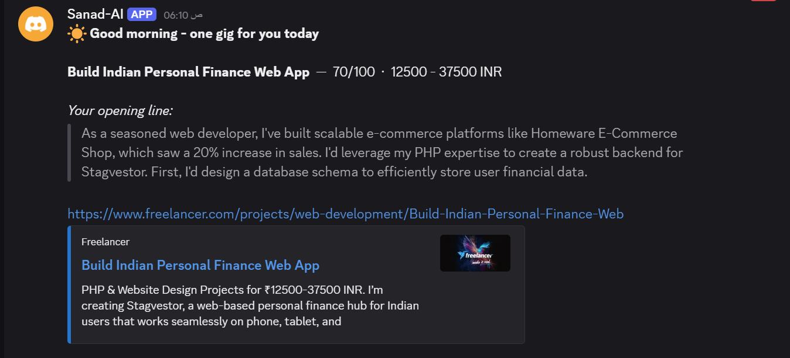
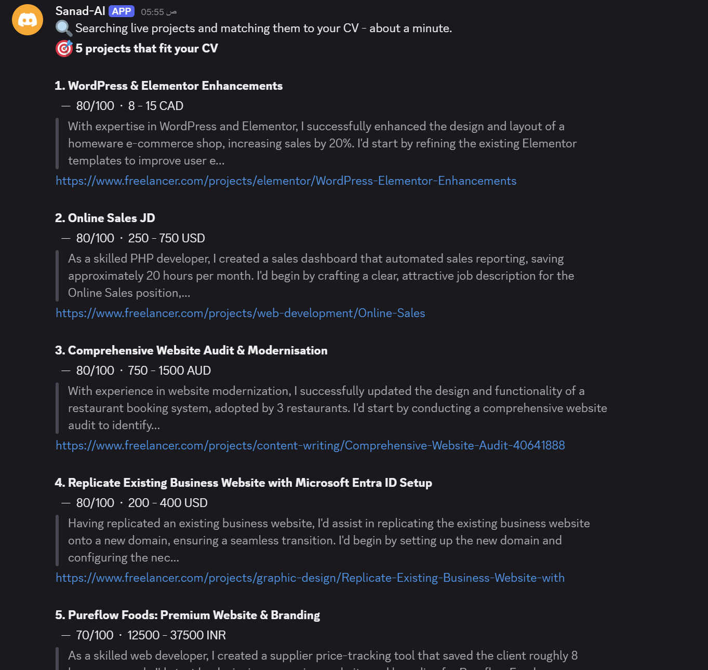
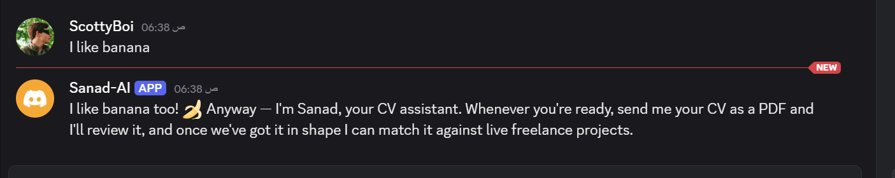
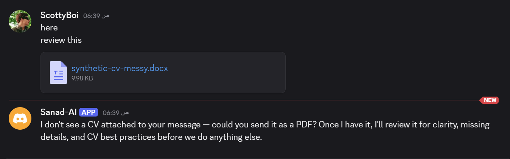

# 📘 Day 4 Report — Testing and Evaluation

**🎯 Focus:** Stop building. Measure whether the thing actually works, and put numbers on the claims

**📝 Assigned task:** *Test and evaluate the application.*

**📅 Date:** 2026-08-12

**✅ Status:** Core evaluation complete — the headline claim is proven. Three items deliberately left open, listed in §7

---

## 🗂️ Folder structure

```
📁 Day-4-Testing-and-Evalualation/
├── 📄 DAY4-REPORT.md                        ← this report
└── 📁 Testing/
    ├── 📄 fr15-test.py                      the rewrite-vs-original harness
    ├── 📄 fr15-rewrite-vs-original.json     4 controlled runs, full output
    ├── 📄 match-quality-test.py             mines every match from n8n's database
    ├── 📄 match-quality-results.txt         citation rate + score distribution
    └── 📁 screenshots/
        ├── 🖼️ 1.png    the daily digest arriving unprompted
        ├── 🖼️ 2.png    five matches with scores, budgets and pitches
        ├── 🖼️ 3.png    off-topic message routed correctly
        └── 🖼️ 4.png    a .docx handled without crashing
```

---

## 🎯 Objective

Three days of building produced a system that worked **every time it was run**. That is not the same as knowing it works.

Everything up to now was a smoke test: one CV, one happy path, one observation per behaviour. Day 4's job was to replace *"it worked when I ran it"* with numbers — starting with the one claim the entire project rests on and has never checked.

---

## 🏆 1. FR-15 — does the rewrite actually make the CV better?

**The most important question in the capstone, and until today it was an assumption.**

Earlier runs produced scores of 46, 49 and 40, but they are not comparable to each other: each used a different target role and different intake answers. To isolate the document as the only variable, everything else was pinned:

- same reviewer skill
- same stated target — *full-stack web developer, junior-to-mid, in-house, via ATS*
- **no intake questions** — proceed on stated assumptions
- score-only output

### Results

| Document | Score | Band |
|---|:-:|---|
| Original messy fixture | **42** | Weak |
| Original messy fixture *(second run)* | **42** | Weak |
| **Sanad's rewrite of it** | **73** | Adequate |
| Hand-written "polished" fixture | **75** | Strong |

### 📈 **+31 points — and within 2 points of a professionally written CV of the same person.**

That is the result the project exists to produce. Same facts, same person, same reviewer — the only thing that changed is that Sanad rewrote it.

### Three findings underneath the headline

**1. The reviewer is deterministic on the overall score.** 42 twice, identical. This corrects a working assumption: the earlier 46/49/40 spread was **not** model noise, it was different inputs. Hold role and answers constant and the score does not move. R-4's non-determinism applies to *job ranking*, not to CV scoring — a distinction that matters for the write-up.

**2. The polished fixture scored 75 here, not its documented 85 — and that is the reviewer working correctly.** This run forced the target to *junior-mid in-house full-stack*; that CV is a **freelance e-commerce specialist's** CV. The mismatch cost it ten points. Same document, different target, different score — evidence the reviewer scores against the stated goal rather than just rewarding polish.

**3. The remaining problems changed category.**

| Original's top 3 | The rewrite's top 3 |
|---|---|
| zero quantification anywhere | unfilled `[Add phone number]` placeholders |
| non-standard headers, ATS mis-parse risk | thin evidence of *custom* full-stack work |
| age / marital status / unprofessional email | inconsistent date formatting |

The original's problems were **presentation**. The rewrite's are **substance and unfinished fields** — things no rewrite could honestly fix without Marcus supplying a phone number or actually having backend experience. That is the correct place for a rewrite to stop, and it is what "never invent" looks like from the outside.

---

## 📊 2. Match quality — rates, not anecdotes

Day 3 produced single observations: *"5 of 5 cited a project"*, *"4 of 5 scored 80"*. One observation is not a rate. `match-quality-test.py` walks every Job Matching execution in n8n's database and counts.

**Across 3 runs and 11 matches:**

| Metric | Week 6 | Sanad |
|---|:-:|:-:|
| Pitches citing a **real past project** | **0 / 5** | **10 / 11 (91%)** |
| Pitches containing banned filler | **3 / 5 (60%)** | **0 / 11** |
| Pitches missing entirely | — | **0 / 11** |

Carry-over fix #1 is not just applied, it is **measured**. Week 6's pitches said *"deliver a high-quality solution that meets your requirements"*; these say *"I've built scalable e-commerce platforms like **Homeware E-Commerce Shop**, which saw a 20% increase in sales."*

### The score compression is real

```
 90 : #        (1)
 85 : ##       (2)
 80 : ######   (6)   ← 55% of every match ever scored
 70 : ##       (2)
```

**Four distinct values across 11 matches, all multiples of five, more than half at exactly 80.**

So "top 5, ranked" is partly an illusion: six of eleven matches were **tied**, and their displayed order came from the sort, not from a real quality difference.

The cause is visible in the prompt. It gives the model four bands — 80-100, 50-79, 20-49, 0-19 — and the model anchors to the boundary of whichever band it picks. **It is scoring categorically while being asked for a continuous number.** That is a prompt-design flaw, not a model failure, and it is the single most actionable finding of the day.

### The salvage path has already earned its place

Execution 832 carries `response_was_truncated: true` and still returned **5/5 pitches citing projects, 0 missing**. Groq's output was cut off mid-JSON in a real run and the parser recovered every complete pitch. That path was written on Day 3 and tested offline; this is it working in production.

---

## 🧪 3. Failure paths



**The digest, unprompted.** One gig, a score, a budget, an opening line citing a real project, and a link. Nobody asked for it.



**Five matches on request.** Same pipeline, different shape.



**Off-topic input.** `I like banana` was routed to **chat**, not to the job search, and answered with a joke before steering back to purpose. FR-5 (correct branch) and FR-6 (answers without derailing) in one exchange — and the router did it with no keyword matching.



**Wrong file type.** A `.docx` produced *"I don't see a CV attached to your message — could you send it as a PDF?"* No crash, no silent drop, and the user is given the exact next action.

**It is not perfect and was deliberately left.** A file *was* attached — just not one Sanad can read. The cause is in `Pick New Messages`, which filters attachments to `.pdf` and so makes "wrong type" indistinguishable from "nothing attached" downstream. The fix was written and then **reverted**, because Day 4 is for measuring and the failure degrades usefully: the user re-exports as PDF and continues. Logged in §6 rather than hidden.

---

## 🔁 4. What the measurements changed

Three beliefs held on Day 3 did not survive contact with data:

| Believed | Actually |
|---|---|
| CV scores drift between runs (46, 49, 40) | **Deterministic.** Those were different inputs, not noise |
| "4 of 5 tied at 80" was one odd run | **55% of all matches score exactly 80.** A systemic prompt-design flaw |
| The pitch-citation fix worked (5/5, once) | **91% across 11 matches** — holds up, with one real failure |

The third is the useful shape of an honest result: the fix works, and it is **not** 100%. One pitch in eleven opened *"Having replicated an existing business website…"*, a claim absent from the CV, citing no named project. The guard flagged it; the prompt did not prevent it.

---

## ✅ 5. Requirements verified today

| ID | Requirement | Evidence |
|---|---|---|
| **FR-15** | the optimised CV outscores the original | **42 → 73**, four controlled runs |
| **FR-22** | pitches cite a real project, no filler | **91%** citation, **0%** banned phrases, n=11 |
| **FR-5** | agent routes correctly, no keyword matching | off-topic message reached chat, not job search |
| **FR-6** | answers without derailing | the banana exchange |
| **FR-8** | unsupported input handled | `.docx` degrades with an actionable message |
| **FR-30** | one unseen gig, unprompted | digest delivered |
| **FR-32** | says so when there is nothing | empty branch built; not yet triggered live |

---

## ⚠️ 6. Known limitations — measured, not guessed

1. **Score compression.** 55% of matches score exactly 80. Ranking within the top five is close to arbitrary. **Fix identified:** stop giving the model bands to anchor to, or score on sub-criteria and compute the total.
2. **Pitch invention, ~9%.** One in eleven pitches claimed experience not in the CV. Same failure mode as the CV rewrite on Day 3, in a different component. The flag reports it; the prompt does not stop it.
3. **Currencies are not normalised.** One result set contained CAD, USD, AUD and INR. Budgets cannot be compared, which undermines *money* as the one genuinely objective axis. Week 6 normalised to USD; the port dropped it.
4. **The scorer is generous.** A *job-description writing* task scored 80/100 against a web developer's CV.
5. **Non-PDF attachments** report as "no attachment". Degrades usefully; fix written and reverted, see §3.
6. **The reviewer scores against the stated target**, so scores are only comparable when the target is held constant. Not a defect — but any score quoted without its target is meaningless.

---

## 🚧 7. What was NOT tested, and why

Stating this plainly is part of the result.

- **Job-ranking determinism.** R-4 predicts two of five matches move between identical runs. **Methodologically blocked:** `Drop Already Sent` removes previously-sent jobs, and the Freelancer pool changes between calls, so two consecutive runs never see the same input. A real test needs a frozen job pool — Week 6 had one, this build does not. **Recorded as unmeasured rather than guessed.**
- **R-14, error handling on a published trigger.** Not attempted. Manual runs inject placeholder data that looks like a pass, so this needs a deliberate production failure.
- **Bridge down mid-review.** Requires killing an in-flight run; skipped by choice.
- **The polished fixture end to end through Discord.** It was scored directly (75), but never sent as a chat conversation.
- **The demo recording (R-3).** The highest-impact item in the risk register. Day 5's first task, and it must happen before the live demo.

---

## 📦 8. Deliverables

1. **`Testing/fr15-test.py`** + **`fr15-rewrite-vs-original.json`** — the headline number, reproducible rather than asserted
2. **`Testing/match-quality-test.py`** + **`match-quality-results.txt`** — citation rate and score distribution from real executions
3. **`Testing/screenshots/`** — digest, matches, off-topic routing, wrong file type

---

## 🚀 9. Day 5

1. **Record the demo first.** R-3 — the live demo depends on the laptop, Discord, Claude Code, the Freelancer API and three LLM providers all working simultaneously
2. `SETUP.md` — reproducible from a clean machine
3. `WEEK7-README.md` and the write-up, carrying §6 and §7 forward honestly
4. Replace the hardcoded channel ID, sheet ID and Windows paths with placeholders
5. Live demo

**The one-line version:** *Sanad takes a CV from 42/100 to 73/100 — two points off a professionally written version of the same person — then matches it against live freelance work with pitches that cite real projects 91% of the time.*
